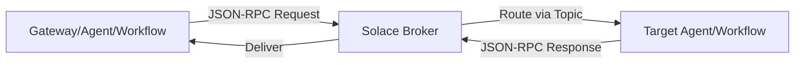

## Overview

The **Agent-to-Agent (A2A) Protocol** enables agents, workflows, and gateways to communicate using a standardized message format built on **JSON-RPC 2.0**. This page documents the complete message structure.

## Protocol Architecture



## JSON-RPC Envelope

All A2A messages use JSON-RPC 2.0 envelope:

### Request Format

```json
{
  "jsonrpc": "2.0",
  "id": "req_abc123",
  "method": "tasks/send",
  "params": {
    // Method-specific parameters
  }
}
```

<ParamField path="jsonrpc" type="string" required>
  Protocol version. Always `"2.0"`.
</ParamField>

<ParamField path="id" type="string | integer" required>
  Unique request identifier. Used to correlate requests with responses.
  
  Typically a UUID or task ID.
</ParamField>

<ParamField path="method" type="string" required>
  RPC method name. Supported methods:
  - `"tasks/send"`: Send a message to create/update a task
  - `"tasks/send-streaming"`: Send a streaming message
  - `"tasks/cancel"`: Cancel a task
</ParamField>

<ParamField path="params" type="object" required>
  Method-specific parameters (see below).
</ParamField>

### Response Format

#### Success Response

```json
{
  "jsonrpc": "2.0",
  "id": "req_abc123",
  "result": {
    // Method-specific result
  }
}
```

<ParamField path="result" type="object" required>
  Method-specific result payload (Task, TaskStatusUpdateEvent, etc.).
</ParamField>

#### Error Response

```json
{
  "jsonrpc": "2.0",
  "id": "req_abc123",
  "error": {
    "code": -32603,
    "message": "Internal error",
    "data": {
      "details": "Additional error context"
    }
  }
}
```

<ParamField path="error.code" type="integer" required>
  JSON-RPC error code:
  - `-32700`: Parse error
  - `-32600`: Invalid request
  - `-32601`: Method not found
  - `-32602`: Invalid params
  - `-32603`: Internal error
</ParamField>

<ParamField path="error.message" type="string" required>
  Human-readable error message.
</ParamField>

<ParamField path="error.data" type="any">
  Optional additional error context.
</ParamField>

## Message Object

The core message structure used in task communication:

```json
{
  "role": "user",
  "parts": [
    {
      "text": "Process this order"
    },
    {
      "data": {
        "order_id": "ORD-123",
        "items": [{"sku": "ITEM-1", "quantity": 2}]
      }
    },
    {
      "file": {
        "uri": "artifact://session_123/order.pdf",
        "name": "order.pdf",
        "mime_type": "application/pdf"
      }
    }
  ],
  "message_id": "msg_xyz789",
  "task_id": "task_abc123",
  "context_id": "session_456",
  "kind": "message",
  "metadata": {
    "source": "gateway",
    "timestamp": "2024-03-04T12:00:00Z"
  }
}
```

<ParamField path="role" type="string" required>
  Message role:
  - `"user"`: Message from user/client
  - `"agent"`: Message from agent/workflow
</ParamField>

<ParamField path="parts" type="array" required>
  Array of message parts (text, data, or file). At least one part required.
</ParamField>

<ParamField path="message_id" type="string" required>
  Unique message identifier (typically UUID).
</ParamField>

<ParamField path="task_id" type="string">
  Associated task ID for this message.
</ParamField>

<ParamField path="context_id" type="string">
  Session/context ID for conversation continuity.
</ParamField>

<ParamField path="kind" type="string" default="message">
  Message kind. Always `"message"` for standard messages.
</ParamField>

<ParamField path="metadata" type="object">
  Optional metadata for additional context.
</ParamField>

## Message Parts

Messages contain one or more **parts** representing different content types:

### Text Part

Plain text content:

```json
{
  "text": "Please validate this order",
  "metadata": {
    "language": "en"
  }
}
```

<ParamField path="text" type="string" required>
  Text content.
</ParamField>

<ParamField path="metadata" type="object">
  Optional part-specific metadata.
</ParamField>

### Data Part

Structured JSON data:

```json
{
  "data": {
    "order_id": "ORD-123",
    "customer_id": "CUST-456",
    "items": [
      {"sku": "ITEM-1", "quantity": 2, "price": 50.00}
    ]
  },
  "metadata": {
    "schema": "order_v1",
    "validated": true
  }
}
```

<ParamField path="data" type="object" required>
  Structured JSON data object.
</ParamField>

<ParamField path="metadata" type="object">
  Optional metadata (schema info, validation status, etc.).
</ParamField>

### File Part

File content or reference:

#### File with URI (Reference)

```json
{
  "file": {
    "uri": "artifact://session_123/report.pdf",
    "name": "report.pdf",
    "mime_type": "application/pdf"
  },
  "metadata": {
    "size_bytes": 102400,
    "version": 3
  }
}
```

#### File with Bytes (Embedded)

```json
{
  "file": {
    "bytes": "<base64-encoded-content>",
    "name": "image.png",
    "mime_type": "image/png"
  }
}
```

<ParamField path="file.uri" type="string">
  URI reference to file (artifact:// protocol for artifact service).
  
  **Use this for large files** to avoid message bloat.
</ParamField>

<ParamField path="file.bytes" type="string">
  Base64-encoded file content.
  
  **Use this for small files** (under 100KB) or inline content.
</ParamField>

<ParamField path="file.name" type="string">
  Original filename.
</ParamField>

<ParamField path="file.mime_type" type="string">
  MIME type (e.g., `"application/pdf"`, `"image/png"`).
</ParamField>

## Task Object

Represents an ongoing task:

```json
{
  "id": "task_abc123",
  "context_id": "session_456",
  "status": {
    "state": "working",
    "message": {
      "role": "agent",
      "parts": [
        {"text": "Processing your request..."}
      ]
    },
    "timestamp": "2024-03-04T12:00:00Z"
  },
  "history": [
    // Previous messages
  ],
  "artifacts": [
    {
      "id": "artifact_xyz",
      "name": "result.json",
      "uri": "artifact://session_456/result.json",
      "mime_type": "application/json"
    }
  ],
  "kind": "task",
  "metadata": {
    "agent_name": "OrderProcessor",
    "workflow_name": "OrderWorkflow"
  }
}
```

<ParamField path="id" type="string" required>
  Unique task identifier.
</ParamField>

<ParamField path="context_id" type="string" required>
  Session/context ID for this task.
</ParamField>

<ParamField path="status" type="object" required>
  Current task status (see below).
</ParamField>

<ParamField path="history" type="array">
  Array of previous messages in this task.
</ParamField>

<ParamField path="artifacts" type="array">
  Array of artifacts produced by this task.
</ParamField>

<ParamField path="kind" type="string" default="task">
  Object kind. Always `"task"`.
</ParamField>

<ParamField path="metadata" type="object">
  Additional task metadata.
</ParamField>

### Task Status

```json
{
  "state": "working",
  "message": {
    // Optional status message
  },
  "timestamp": "2024-03-04T12:00:00Z"
}
```

<ParamField path="state" type="string" required>
  Task state:
  - `"submitted"`: Task accepted, not yet started
  - `"working"`: Task in progress
  - `"completed"`: Task completed successfully
  - `"failed"`: Task failed with error
  - `"canceled"`: Task was cancelled
</ParamField>

<ParamField path="message" type="object">
  Optional message providing status details.
</ParamField>

<ParamField path="timestamp" type="string" required>
  ISO 8601 timestamp of status update.
</ParamField>

## Artifact Object

```json
{
  "id": "artifact_xyz789",
  "name": "validation_result.json",
  "uri": "artifact://session_456/validation_result.json",
  "mime_type": "application/json",
  "inline_data": {
    "data": "<base64-encoded-content>"
  },
  "metadata": {
    "schema": {"type": "object"},
    "version": 2,
    "source": "agent"
  }
}
```

<ParamField path="id" type="string">
  Unique artifact identifier.
</ParamField>

<ParamField path="name" type="string" required>
  Artifact filename.
</ParamField>

<ParamField path="uri" type="string">
  Artifact URI (artifact:// protocol).
</ParamField>

<ParamField path="mime_type" type="string">
  MIME type of the artifact.
</ParamField>

<ParamField path="inline_data" type="object">
  Optional embedded artifact content (base64-encoded).
</ParamField>

<ParamField path="metadata" type="object">
  Artifact metadata (schema, version, source, etc.).
</ParamField>

## Helper Functions

The SAM SDK provides helper functions for message manipulation:

### Creating Messages

```python
from solace_agent_mesh.common import a2a

# Create text message
message = a2a.create_agent_text_message(
    text="Processing complete",
    task_id="task_123",
    context_id="session_456"
)

# Create data message
message = a2a.create_agent_data_message(
    data={"result": "success", "count": 42},
    task_id="task_123",
    context_id="session_456"
)

# Create multi-part message
message = a2a.create_agent_parts_message(
    parts=[
        a2a.create_text_part("Here are the results:"),
        a2a.create_data_part({"items": [1, 2, 3]}),
        a2a.create_file_part_from_uri(
            uri="artifact://session/file.pdf",
            name="file.pdf",
            mime_type="application/pdf"
        )
    ],
    task_id="task_123",
    context_id="session_456"
)
```

**Source:** `src/solace_agent_mesh/common/a2a/message.py:23-115`

### Extracting Content

```python
# Get text from message
text = a2a.get_text_from_message(message)

# Get data parts
data_parts = a2a.get_data_parts_from_message(message)
for part in data_parts:
    data = a2a.get_data_from_data_part(part)
    print(data)

# Get file parts
file_parts = a2a.get_file_parts_from_message(message)
for part in file_parts:
    uri = a2a.get_uri_from_file_part(part)
    bytes_content = a2a.get_bytes_from_file_part(part)
```

**Source:** `src/solace_agent_mesh/common/a2a/message.py:193-308`

### Creating Tasks

```python
# Create initial task
task = a2a.create_initial_task(
    task_id="task_123",
    context_id="session_456",
    agent_name="MyAgent"
)

# Create final task
final_task = a2a.create_final_task(
    task_id="task_123",
    context_id="session_456",
    final_status=a2a.create_task_status(
        state=TaskState.completed,
        message=a2a.create_agent_text_message("Done!")
    ),
    artifacts=[...],
    metadata={"agent_name": "MyAgent"}
)
```

**Source:** `src/solace_agent_mesh/common/a2a/task.py:18-95`

## Topic Structure

A2A messages are routed via Solace topics:

### Topic Format

```
{namespace}/a2a/v1/{component}/{direction}/{target}/{task_id}
```

**Examples:**

```
# Agent request topic
production/a2a/v1/agent/request/OrderValidator

# Gateway response topic
production/a2a/v1/gateway/response/gw_123/task_abc

# Agent status topic
production/a2a/v1/agent/status/WorkflowOrchestrator/task_xyz

# Discovery topic
production/a2a/v1/discovery/agentcards
```

### Helper Functions

```python
# Get agent request topic
topic = a2a.get_agent_request_topic(
    namespace="production",
    agent_name="OrderValidator"
)
# => "production/a2a/v1/agent/request/OrderValidator"

# Get gateway response topic
topic = a2a.get_gateway_response_topic(
    namespace="production",
    gateway_id="gw_123",
    task_id="task_abc"
)
# => "production/a2a/v1/gateway/response/gw_123/task_abc"

# Get discovery subscription topic (wildcard)
topic = a2a.get_discovery_subscription_topic(namespace="production")
# => "production/a2a/v1/discovery/>"
```

**Source:** `src/solace_agent_mesh/common/a2a/protocol.py:34-216`

## Message Flow Example

### Gateway to Agent Request

```
Topic: production/a2a/v1/agent/request/OrderValidator

Payload:
{
  "jsonrpc": "2.0",
  "id": "req_123",
  "method": "tasks/send",
  "params": {
    "message": {
      "role": "user",
      "parts": [
        {"text": "Validate this order"},
        {"data": {"order_id": "ORD-123"}}
      ],
      "message_id": "msg_abc",
      "context_id": "session_456",
      "kind": "message"
    }
  }
}
```

### Agent to Gateway Response

```
Topic: production/a2a/v1/gateway/response/gw_123/task_abc

Payload:
{
  "jsonrpc": "2.0",
  "id": "req_123",
  "result": {
    "id": "task_abc",
    "context_id": "session_456",
    "status": {
      "state": "completed",
      "message": {
        "role": "agent",
        "parts": [
          {"text": "Order validated successfully"},
          {"data": {"valid": true, "order_id": "ORD-123"}}
        ]
      },
      "timestamp": "2024-03-04T12:00:00Z"
    },
    "kind": "task",
    "metadata": {"agent_name": "OrderValidator"}
  }
}
```

## Next Steps

<CardGroup cols={2}>
  <Card title="Task Invocation" icon="paper-plane" href="/api/a2a/task-invocation">
    Learn how to invoke agents and workflows
  </Card>
  <Card title="Agent Discovery" icon="satellite-dish" href="/api/a2a/agent-discovery">
    Understand agent card publishing and discovery
  </Card>
</CardGroup>