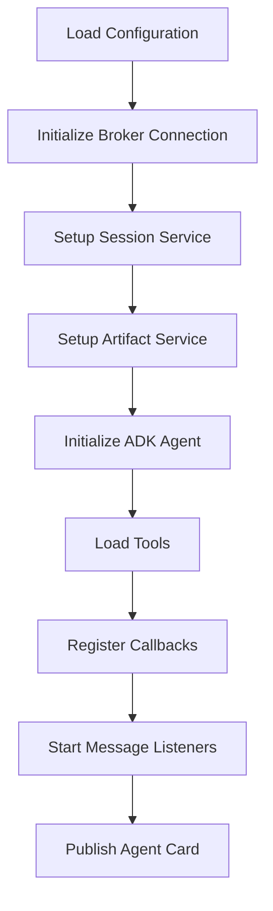
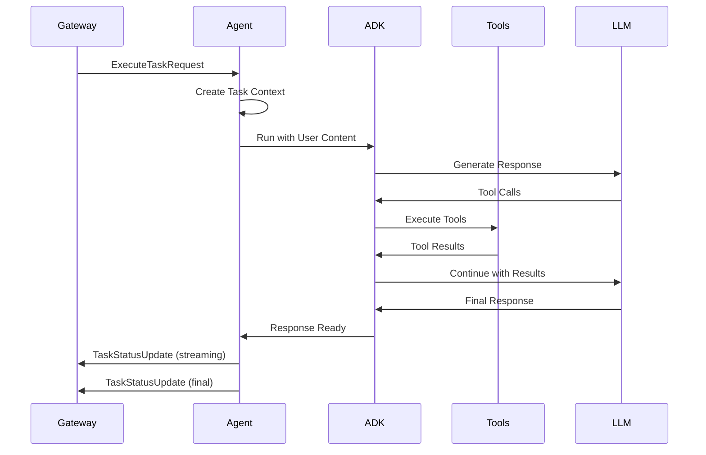

## Overview

Solace Agent Mesh agents follow a structured lifecycle from initialization through execution to shutdown. Understanding this lifecycle is essential for building robust agents and custom extensions.

## Lifecycle Phases

### 1. Initialization Phase

When an agent starts, the following initialization sequence occurs:



#### Configuration Loading

The agent loads its YAML configuration and validates all required parameters:

```python
from solace_agent_mesh.agent.sac.app import SamAgentApp

# Configuration is loaded automatically from YAML
app = SamAgentApp(app_config)
```

#### Service Initialization

The agent initializes core services in order:

1. **Broker Connection**: Establishes connection to Solace message broker
2. **Session Service**: Initializes conversation history storage
3. **Artifact Service**: Sets up file/artifact storage backend
4. **ADK Agent**: Creates the Google ADK agent instance

```python
# These are handled automatically by the framework
component.session_service  # Initialized session service
component.artifact_service  # Initialized artifact service
component.adk_agent  # ADK agent instance
```

#### Tool Registration

Tools are loaded and registered with the ADK agent:

```python
# Built-in tools are automatically registered
# MCP tools are loaded from configured servers
# Custom tools can be registered programmatically
```

### 2. Running Phase

During normal operation, the agent processes incoming requests:

#### Message Reception

The agent listens for A2A protocol messages on its request topic:

```
Topic: a2a/<namespace>/agent/<agent_name>/request
```

#### Request Processing Flow



#### Task Execution

Each incoming request creates a task execution context:

```python
class TaskExecutionContext:
    task_id: str
    session: ADKSession
    a2a_context: Dict[str, Any]
    is_paused: bool
    produced_artifacts: Dict[str, int]
    active_peer_sub_tasks: Dict[str, Any]
```

#### ADK Runner Execution

The core execution loop is handled by the ADK runner:

```python
async def run_adk_async_task(
    component: SamAgentComponent,
    task_context: TaskExecutionContext,
    adk_session: ADKSession,
    adk_content: Content,
    run_config: RunConfig,
    a2a_context: Dict[str, Any],
) -> bool:
    """
    Runs the ADK agent asynchronously.
    
    Returns:
        bool: True if task is paused for long-running operation
    """
    async for event in component.runner.run_async(
        session=adk_session,
        content=adk_content,
        config=run_config,
    ):
        # Process streaming events
        await process_event(event)
```

### 3. Callback Execution

Callbacks intercept and modify agent behavior at key points:

#### Before Model Call

```python
def repair_history_callback(
    callback_context: CallbackContext,
    llm_request: LlmRequest
) -> Optional[LlmResponse]:
    """
    Called before sending request to LLM.
    Can modify history or inject context.
    """
    # Repair any dangling tool calls
    # Add dynamic instructions
    return None  # Continue to LLM
```

#### After Model Call

```python
async def process_artifact_blocks_callback(
    callback_context: CallbackContext,
    llm_response: LlmResponse,
    host_component: SamAgentComponent,
) -> Optional[LlmResponse]:
    """
    Called after receiving LLM response.
    Processes artifact blocks and streaming content.
    """
    # Parse fenced artifact blocks
    # Save artifacts
    # Stream to client
    return None  # Return modified response
```

#### Tool Execution

```python
async def manage_large_mcp_tool_responses_callback(
    tool: BaseTool,
    args: Dict[str, Any],
    tool_context: ToolContext,
    tool_response: Any,
    host_component: SamAgentComponent,
) -> Optional[Dict[str, Any]]:
    """
    Called after tool execution.
    Handles large responses and artifact creation.
    """
    if response_too_large(tool_response):
        artifact = save_as_artifact(tool_response)
        return {"artifact_reference": artifact}
    return tool_response
```

### 4. Context Window Management

The agent automatically manages context window limits:

#### Auto-Summarization

When context limit is reached, the agent automatically summarizes old messages:

```python
async def _create_compaction_event(
    component: SamAgentComponent,
    session: ADKSession,
    compaction_threshold: float = 0.25,
) -> tuple[int, str]:
    """
    Summarizes oldest 25% of conversation history.
    Returns (events_compacted, summary_text)
    """
    # Calculate target compaction size
    # Find user turn boundary
    # Use LLM to summarize events
    # Persist compaction event
    # Reload session with filtered events
```

#### Progressive Summarization

Each new summary incorporates the previous summary, keeping context bounded:

```
Turn 1-10 → Summary A (1000 tokens)
Turn 11-20 → Summary B (1000 tokens) = Summarize(Summary A + Turn 11-20)
Turn 21-30 → Summary C (1000 tokens) = Summarize(Summary B + Turn 21-30)
```

### 5. Finalization Phase

After task completion or on error, the agent finalizes the task:

```python
async def finalize_task_with_cleanup(
    component: SamAgentComponent,
    a2a_context: Dict[str, Any],
    is_paused: bool,
    exception: Optional[Exception] = None,
):
    """
    Finalize task execution and cleanup resources.
    """
    logical_task_id = a2a_context.get("logical_task_id")
    
    # Flush streaming buffer
    task_context.flush_streaming_buffer()
    
    # Send final status update
    if exception:
        send_error_response(exception)
    else:
        send_success_response()
    
    # Cleanup task context
    component.active_tasks.pop(logical_task_id)
```

### 6. Shutdown Phase

When the agent receives a shutdown signal:

```python
class SamAgentComponent:
    async def shutdown(self):
        """
        Graceful shutdown sequence.
        """
        # Stop accepting new requests
        self.shutdown_event.set()
        
        # Wait for active tasks to complete (with timeout)
        await self._wait_for_active_tasks(timeout=30)
        
        # Cancel remaining tasks
        await self._cancel_remaining_tasks()
        
        # Cleanup resources
        await self.session_service.shutdown()
        await self.artifact_service.shutdown()
        
        # Close broker connection
        await self.broker_connection.disconnect()
```

## Error Handling

### Context Limit Errors

When the LLM returns a context limit error:

```python
try:
    response = await adk_agent.run(content)
except BadRequestError as e:
    if _is_context_limit_error(e):
        # Automatic retry with summarization
        await _create_compaction_event(session)
        reloaded_session = await session_service.get_session(session.id)
        response = await adk_agent.run(content)  # Retry
```

### Task Cancellation

When a task is cancelled:

```python
except TaskCancelledError as e:
    # Propagate to peer sub-tasks
    for sub_task_id in task_context.active_peer_sub_tasks:
        send_cancel_request(sub_task_id)
    
    # Send cancellation response
    send_task_cancelled_response()
```

### LLM Call Limit Exceeded

```python
except LlmCallsLimitExceededError as e:
    # Max iterations reached
    send_error_response(
        "Maximum LLM call limit exceeded. Task may be too complex."
    )
```

## Session Management

### Persistent Sessions

For conversational agents:

```python
session_service:
  type: "database"
  default_behavior: "PERSISTENT"
```

Sessions maintain conversation history across requests using the same `session_id`.

### Run-Based Sessions

For stateless agents:

```python
session_service:
  type: "memory"
  default_behavior: "RUN_BASED"
```

Each request is independent with no history.

## Performance Considerations

### Parallel Task Execution

Agents can handle multiple concurrent requests:

```python
component.active_tasks: Dict[str, TaskExecutionContext]
component.active_tasks_lock: asyncio.Lock
```

### Streaming Optimization

Streaming responses reduce latency:

```python
# Stream partial responses to client
for chunk in llm_response.stream():
    await send_streaming_chunk(chunk)
```

### Resource Cleanup

Proper cleanup prevents memory leaks:

```python
try:
    await execute_task()
finally:
    # Always cleanup
    task_context.cleanup()
    component.active_tasks.pop(task_id)
```

## Monitoring and Debugging

### Lifecycle Logging

Each phase logs detailed information:

```python
log.info("%s Starting task %s", component.log_identifier, task_id)
log.debug("%s Session events: %d", log_identifier, len(session.events))
log.warning("%s Context limit reached, compacting...", log_identifier)
```

### Task State Inspection

```python
# Check active tasks
with component.active_tasks_lock:
    task_context = component.active_tasks.get(task_id)
    print(f"Task paused: {task_context.is_paused}")
    print(f"Produced artifacts: {task_context.produced_artifacts}")
```

## See Also

- [Agent Configuration](/api/agent/configuration) - Configure agent behavior
- [Agent Callbacks](/api/agent/callbacks) - Customize lifecycle with callbacks
- [Tool Development](/api/agent/tools) - Create tools that integrate with lifecycle