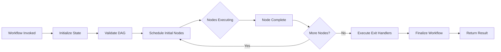

## Overview

Solace Agent Mesh executes workflows using a **DAG (Directed Acyclic Graph) executor** that coordinates agent invocations based on node dependencies. This page explains the execution model.

## Execution Lifecycle



### 1. Workflow Invocation

Workflows are invoked like agents via the A2A protocol:

```json
{
  "method": "tasks/send",
  "params": {
    "message": {
      "role": "user",
      "parts": [
        {
          "text": "Process this order"
        },
        {
          "data": {
            "order_id": "ORD-123",
            "customer_id": "CUST-456",
            "items": [
              {"sku": "ITEM-1", "quantity": 2, "price": 50.00}
            ],
            "shipping_priority": "express"
          }
        }
      ]
    }
  }
}
```

See [Task Invocation](/api/a2a/task-invocation) for details.

### 2. State Initialization

The workflow executor creates an execution context:

```python
WorkflowExecutionContext:
  - workflow_task_id: str          # Unique execution ID
  - workflow_state: WorkflowExecutionState
  - a2a_context: dict             # A2A session info
  - cancelled: bool               # Cancellation flag
```

```python
WorkflowExecutionState:
  - execution_id: str
  - node_outputs: dict            # Cached node results
  - completed_nodes: dict         # Node ID -> artifact name
  - pending_nodes: list           # Currently executing
  - skipped_nodes: dict           # Conditionally skipped
  - active_branches: dict         # Map/loop tracking
  - error_state: dict             # Failure info
  - metadata: dict                # Extensible state
```

### 3. DAG Validation

Before execution, the DAG is validated for:

- **Cycle detection**: No circular dependencies
- **Reference validation**: All `depends_on` references exist
- **Reachability**: All nodes are reachable from entry points
- **Control flow consistency**: Switch/map/loop targets have proper dependencies

### 4. Node Scheduling

The DAG executor uses **topological scheduling**:

```python
def get_next_nodes(workflow_state) -> List[str]:
    """Get nodes whose dependencies are all complete."""
    completed = set(workflow_state.completed_nodes.keys())
    next_nodes = []
    
    for node_id, deps in dependencies.items():
        if node_id in completed or node_id in pending_nodes:
            continue
        
        # Check if all dependencies are satisfied
        if all(dep in completed for dep in deps):
            next_nodes.append(node_id)
    
    return next_nodes
```

**Implicit Parallelism:** Multiple nodes with satisfied dependencies execute in parallel automatically.

### 5. Node Execution

Each node type has specific execution logic:

#### Agent/Workflow Nodes

1. Generate unique `sub_task_id`
2. Resolve input templates
3. Publish `WorkflowNodeExecutionStartData` event
4. Invoke agent via A2A (see [Task Invocation](/api/a2a/task-invocation))
5. Register timeout handler
6. Wait for response asynchronously

#### Switch Nodes

1. Evaluate cases in order
2. Select first matching branch
3. Skip all non-selected branches
4. Mark switch node complete
5. Continue execution

#### Map Nodes

1. Resolve `items` array
2. Create iteration state for each item
3. Launch iterations up to `concurrency_limit`
4. Execute inner node for each item with `_map_item` and `_map_index`
5. Track completion and launch remaining iterations
6. Mark map complete when all items finish

#### Loop Nodes

1. Check iteration count against `max_iterations`
2. Evaluate condition (skip on first iteration)
3. If continue, execute inner node with `_loop_iteration`
4. Wait for completion
5. Re-execute loop node to check condition again
6. Mark loop complete when condition false or max iterations reached

### 6. Node Completion Handling

When a node completes:

```python
async def handle_node_completion(
    workflow_context,
    sub_task_id,
    result: StructuredInvocationResult
):
    # 1. Find node ID from sub_task_id
    node_id = workflow_context.get_node_id_for_sub_task(sub_task_id)
    
    # 2. Check result status
    if result.status == "error":
        # Fail workflow
        await finalize_workflow_failure(workflow_context, error)
        return
    
    # 3. Load and cache output artifact
    artifact_data = await load_node_output(
        result.output_artifact_ref.name,
        result.output_artifact_ref.version
    )
    workflow_state.node_outputs[node_id] = {"output": artifact_data}
    
    # 4. Mark node complete
    workflow_state.completed_nodes[node_id] = artifact_name
    workflow_state.pending_nodes.remove(node_id)
    
    # 5. Publish result event
    await publish_workflow_event(
        WorkflowNodeExecutionResultData(
            node_id=node_id,
            status="success",
            output_artifact_ref=result.output_artifact_ref
        )
    )
    
    # 6. Continue workflow execution
    await execute_workflow(workflow_state, workflow_context)
```

### 7. Exit Handlers

Before finalization, exit handlers execute based on outcome:

```yaml
on_exit:
  always: cleanup           # Always runs
  on_success: notify_success # Only on success
  on_failure: send_alert    # Only on failure
  on_cancel: rollback       # Only on cancellation
```

Exit handlers have access to workflow status:

```yaml
- id: error_handler
  type: agent
  agent_name: "ErrorNotifier"
  input:
    status: "{{workflow.status}}"         # "success" | "failure" | "cancelled"
    error_message: "{{workflow.error.message}}"
    failed_node: "{{workflow.error.node_id}}"
```

### 8. Workflow Finalization

#### Success Finalization

```python
async def finalize_workflow_success(workflow_context):
    # 1. Execute exit handlers
    await execute_exit_handlers(workflow_context, "success")
    
    # 2. Construct final output using output_mapping
    final_output = await construct_final_output(workflow_context)
    
    # 3. Save output artifact
    output_artifact_name = f"{workflow_name}_{uuid}_result.json"
    artifact_version = await save_artifact(
        filename=output_artifact_name,
        content=final_output,
        metadata={"workflow_name": workflow_name}
    )
    
    # 4. Publish completion event
    await publish_workflow_event(
        WorkflowExecutionResultData(
            type="workflow_execution_result",
            status="success",
            workflow_output=final_output
        )
    )
    
    # 5. Create final task response
    final_task = create_final_task(
        task_id=workflow_task_id,
        context_id=session_id,
        final_status=create_task_status(
            state=TaskState.completed,
            message=create_agent_parts_message([
                create_data_part(StructuredInvocationResult(
                    status="success",
                    output_artifact_ref=ArtifactRef(
                        name=output_artifact_name,
                        version=artifact_version
                    )
                )),
                create_text_part("Workflow completed successfully")
            ])
        ),
        metadata={
            "workflow_name": workflow_name,
            "output": final_output,
            "produced_artifacts": [{"filename": ..., "version": ...}]
        }
    )
    
    # 6. Publish to reply topic
    publish_a2a_message(final_task, topic=reply_topic)
    
    # 7. Cleanup state
    await cleanup_workflow_state(workflow_context)
```

#### Failure Finalization

Similar to success, but with error artifact and `TaskState.failed`.

## Template Resolution

Template expressions are resolved dynamically during execution:

```python
def resolve_value(value_def, workflow_state):
    # Handle template string: "{{...}}"
    if isinstance(value_def, str) and value_def.startswith("{{"):
        return resolve_template(value_def, workflow_state)
    
    # Handle operators: {"coalesce": [...]}
    if isinstance(value_def, dict) and len(value_def) == 1:
        op = next(iter(value_def))
        if op == "coalesce":
            for arg in value_def[op]:
                resolved = resolve_value(arg, workflow_state)
                if resolved is not None:
                    return resolved
        elif op == "concat":
            return "".join(str(resolve_value(arg, workflow_state)) 
                          for arg in value_def[op])
    
    # Handle nested structures recursively
    if isinstance(value_def, dict):
        return {k: resolve_value(v, workflow_state) for k, v in value_def.items()}
    if isinstance(value_def, list):
        return [resolve_value(item, workflow_state) for item in value_def]
    
    # Return literal
    return value_def
```

### Template Path Resolution

```python
def resolve_template(template: str, workflow_state):
    # Extract path: {{node_id.output.field}}
    path = extract_path(template)  # "node_id.output.field"
    parts = path.split(".")
    
    # Workflow input
    if parts[0] == "workflow" and parts[1] == "input":
        data = workflow_state.node_outputs["workflow_input"]["output"]
        for part in parts[2:]:
            data = data[part]
        return data
    
    # Node output
    node_id = parts[0]
    if node_id not in workflow_state.node_outputs:
        return None  # Allow graceful handling
    
    data = workflow_state.node_outputs[node_id]
    for part in parts[1:]:
        data = data[part]
    
    return data
```

## State Persistence

Workflow state is persisted to the session service:

```python
async def update_workflow_state(workflow_context, workflow_state):
    session = await session_service.get_session(
        app_name=workflow_name,
        user_id=user_id,
        session_id=session_id
    )
    
    session.state["workflow_execution"] = workflow_state.model_dump()
    # Session service auto-persists
```

This enables:
- **Resumption** after component restart
- **Debugging** via state inspection
- **Audit trail** of execution history

## Cancellation

Workflows support graceful cancellation:

```json
{
  "method": "tasks/cancel",
  "params": {
    "id": "workflow_task_id"
  }
}
```

```python
async def handle_cancel_request(workflow_task_id):
    # 1. Mark workflow as cancelled
    workflow_context.cancel()
    
    # 2. Send cancel requests to active nodes
    for sub_task_id in workflow_context.get_all_sub_task_ids():
        await send_cancel_request(sub_task_id)
    
    # 3. Wait for graceful shutdown (with timeout)
    await asyncio.wait_for(
        wait_for_active_nodes(),
        timeout=node_cancellation_timeout_seconds
    )
    
    # 4. Execute exit handlers
    await execute_exit_handlers(workflow_context, "cancelled")
    
    # 5. Finalize with cancelled state
    await finalize_workflow_cancelled(workflow_context)
```

## Events and Observability

Workflows publish structured events for observability:

### Workflow Events

**WorkflowExecutionStartData**
```json
{
  "type": "workflow_execution_start",
  "workflow_name": "OrderProcessing",
  "workflow_version": "1.0.0",
  "execution_id": "exec_abc123"
}
```

**WorkflowNodeExecutionStartData**
```json
{
  "type": "workflow_node_execution_start",
  "node_id": "validate_order",
  "node_type": "agent",
  "agent_name": "OrderValidator",
  "sub_task_id": "wf_exec_abc123_validate_order_xyz",
  "parallel_group_id": "implicit_parallel_abc",
  "iteration_index": 0
}
```

**WorkflowNodeExecutionResultData**
```json
{
  "type": "workflow_node_execution_result",
  "node_id": "validate_order",
  "status": "success",
  "output_artifact_ref": {
    "name": "validation_result.json",
    "version": 1
  }
}
```

**WorkflowMapProgressData**
```json
{
  "type": "workflow_map_progress",
  "node_id": "process_items",
  "total_items": 10,
  "completed_items": 7,
  "status": "in-progress"
}
```

**WorkflowExecutionResultData**
```json
{
  "type": "workflow_execution_result",
  "status": "success",
  "workflow_output": {
    "order_id": "ORD-123",
    "status": "completed",
    "total": 125.50
  }
}
```

### Event Streaming

Events are published via A2A status updates:

```
Topic: {namespace}/a2a/v1/gateway/status/{gateway_id}/{task_id}
Payload: TaskStatusUpdateEvent {
  task_id: "workflow_task_id",
  status: {
    state: "working",
    message: {
      role: "agent",
      parts: [{
        data: { /* WorkflowNodeExecutionStartData */ }
      }]
    }
  },
  final: false
}
```

See [Streaming](/api/a2a/streaming) for details.

## Error Handling

### Node Failure

When a node fails:

```python
if result.status == "error":
    # Set error state
    workflow_state.error_state = {
        "failed_node_id": node_id,
        "failure_reason": "node_execution_failed",
        "error_message": result.error_message,
        "timestamp": datetime.now(timezone.utc).isoformat()
    }
    
    # Fail entire workflow (if fail_fast=true)
    await finalize_workflow_failure(
        workflow_context,
        WorkflowNodeFailureError(node_id, result.error_message)
    )
```

### Timeout Handling

Nodes have configurable timeouts:

```yaml
nodes:
  - id: slow_task
    type: agent
    agent_name: "SlowAgent"
    timeout: "10m"  # Override default
```

Timeout implementation:
```python
# Register timeout handler
cache_service.set_data_with_ttl(
    key=sub_task_id,
    data=workflow_task_id,
    ttl_seconds=timeout_seconds,
    on_expire=handle_cache_expiry_event
)

# On expiry
async def handle_cache_expiry_event(cache_data):
    result = StructuredInvocationResult(
        status="error",
        error_message=f"Agent timed out after {timeout_seconds} seconds"
    )
    await handle_node_completion(workflow_context, sub_task_id, result)
```

## Performance Considerations

### Artifact Caching

Node outputs are cached in workflow state to avoid repeated loading:

```python
workflow_state.node_outputs[node_id] = {"output": artifact_data}
```

### Concurrency Control

Map nodes support concurrency limits:

```yaml
- id: process_many_items
  type: map
  items: "{{workflow.input.items}}"  # 1000 items
  node: process_item
  concurrency_limit: 10  # Only 10 in parallel
```

### State Persistence

State is persisted after each node completion to enable resumption.

## Next Steps

<CardGroup cols={2}>
  <Card title="A2A Task Invocation" icon="paper-plane" href="/api/a2a/task-invocation">
    Learn how workflows are invoked via A2A protocol
  </Card>
  <Card title="A2A Streaming" icon="stream" href="/api/a2a/streaming">
    Understand workflow event streaming
  </Card>
</CardGroup>