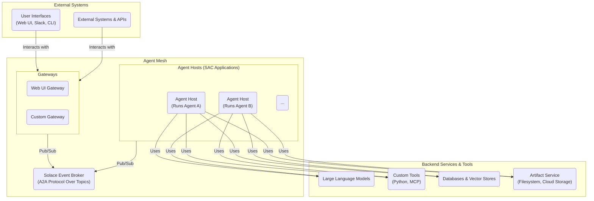
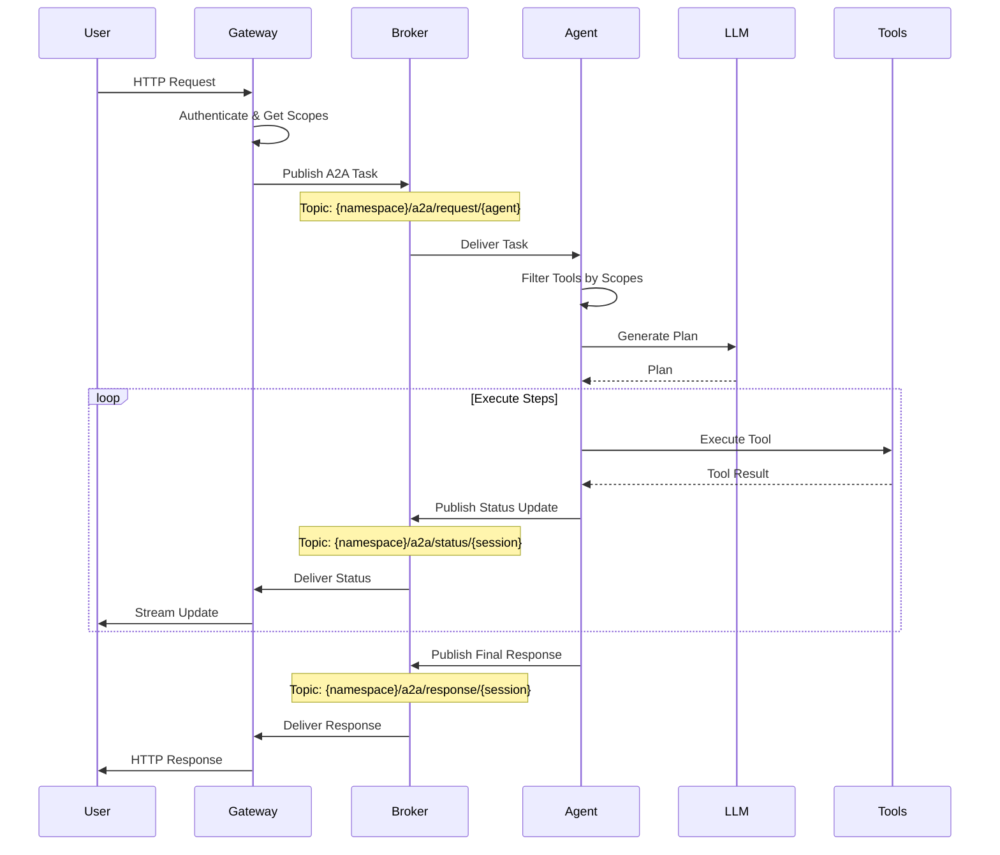
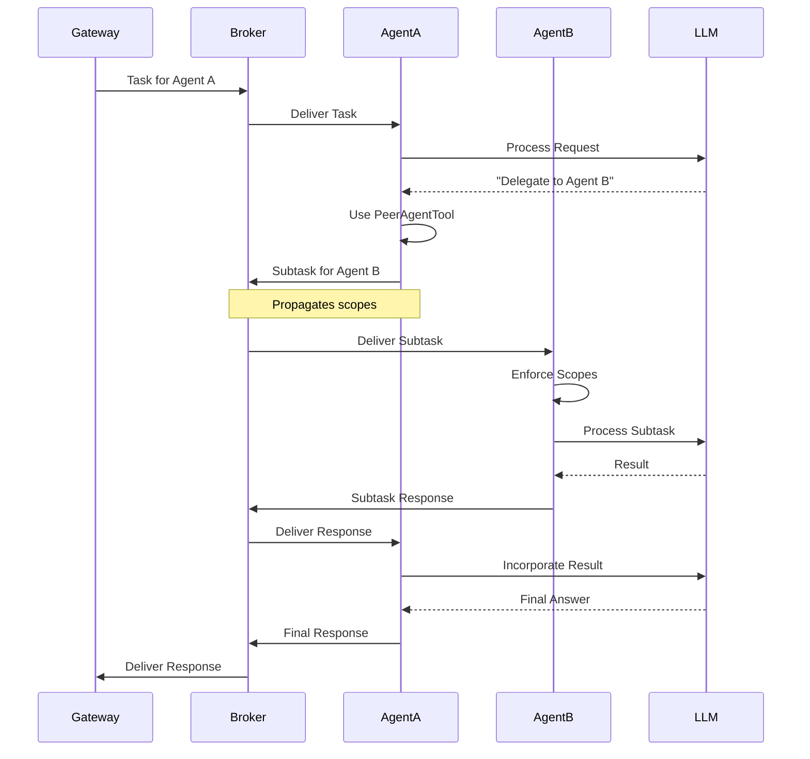
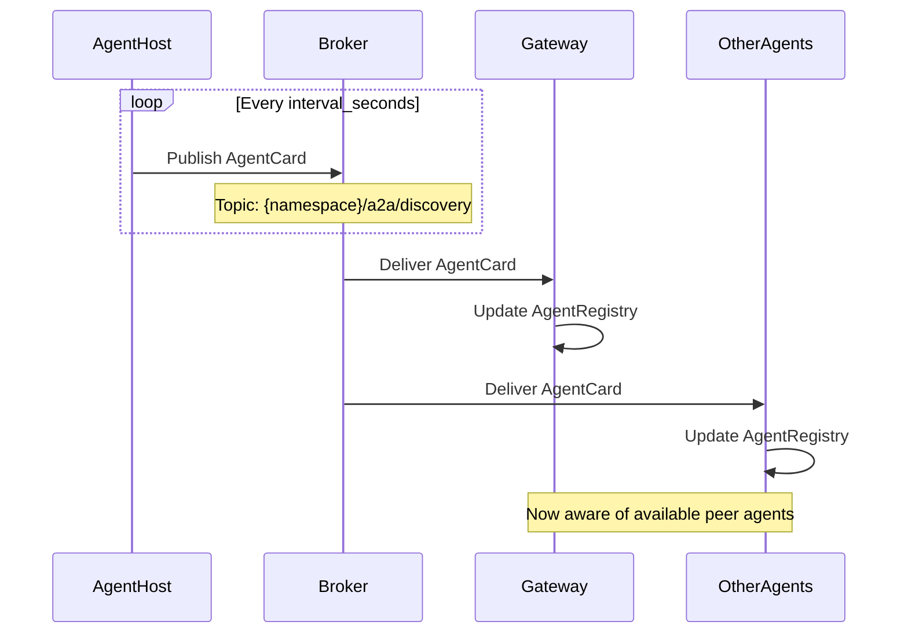

# Architecture Overview

Solace Agent Mesh is an event-driven framework that creates a distributed ecosystem of collaborative AI agents. The architecture decouples agent logic from communication and orchestration, enabling you to build scalable, resilient, and modular AI systems.

<Note>
The framework integrates Solace Event Broker for messaging, Solace AI Connector (SAC) for component lifecycle management, and Google Agent Development Kit (ADK) for agent intelligence.
</Note>

## Architectural Principles

The design of Agent Mesh is founded on three key architectural principles:

<CardGroup cols={3}>
  <Card title="Event-Driven Architecture" icon="bolt">
    All interactions between major components are asynchronous and mediated by the Solace event broker, eliminating direct dependencies.
  </Card>
  
  <Card title="Component Decoupling" icon="puzzle-piece">
    Gateways, Agent Hosts, and services communicate through standardized A2A protocol messages without knowing each other's implementation.
  </Card>
  
  <Card title="Scalability & Resilience" icon="arrows-maximize">
    Horizontal scaling of components with fault tolerance and guaranteed message delivery through the event broker.
  </Card>
</CardGroup>

### Why Event-Driven?

The event-driven architecture provides several critical benefits:

- **Asynchronous Communication**: Components don't wait for responses, enabling high throughput
- **Loose Coupling**: Services can be developed, deployed, and scaled independently
- **Fault Tolerance**: The event broker ensures message delivery even if components fail
- **Dynamic Scaling**: Add or remove components without system downtime
- **Complete Observability**: All communication flows through the broker for monitoring

## System Architecture Diagram

The following diagram illustrates how external systems, gateways, the event broker, agent hosts, and backend services interact:



## Core Components

### Solace Event Broker

The Solace Event Broker serves as the central nervous system of the agent mesh.

<Tabs>
  <Tab title="Overview">
    The event broker provides:
    - **Topic-based routing**: Hierarchical topic structure for precise message routing
    - **Request/reply patterns**: Synchronous-style communication over async messaging
    - **Publish/subscribe**: For agent discovery and broadcast messages
    - **Guaranteed delivery**: Messages are persisted and delivered even if recipients are offline
    - **High throughput**: Handles millions of messages per second
  </Tab>
  
  <Tab title="Topic Structure">
    Agent Mesh uses a hierarchical topic structure:
    
    ```plaintext
    {namespace}/a2a/request/{agent_name}
    {namespace}/a2a/response/{session_id}
    {namespace}/a2a/status/{session_id}
    {namespace}/a2a/discovery
    ```
    
    Example topics:
    ```plaintext
    solace_app/a2a/request/OrchestratorAgent
    solace_app/a2a/response/session-abc123
    solace_app/a2a/status/session-abc123
    solace_app/a2a/discovery
    ```
  </Tab>
  
  <Tab title="Message Flow">
    Messages flow through the broker using pub/sub:
    
    1. Gateway publishes task to agent's request topic
    2. Agent subscribes to its request topic
    3. Agent publishes status updates to status topic
    4. Gateway subscribes to status topic for that session
    5. Agent publishes final response to response topic
    6. Gateway receives and forwards to user
  </Tab>
</Tabs>

### Gateways

Gateways bridge external systems and the agent mesh, handling protocol translation and session management.

<Info>
Gateways are SAC applications built using the Gateway Development Kit (GDK), which provides BaseGatewayApp and BaseGatewayComponent classes.
</Info>

**Key Responsibilities:**

<Steps>
  <Step title="Protocol Translation">
    Convert external protocols (HTTP, WebSockets, Slack RTM) into standardized A2A protocol messages and vice versa.
  </Step>
  
  <Step title="Authentication & Authorization">
    Authenticate incoming requests and use a pluggable AuthorizationService to retrieve user permission scopes.
  </Step>
  
  <Step title="Session Management">
    Manage external user sessions and map them to A2A task lifecycles.
  </Step>
  
  <Step title="Response Handling">
    Handle asynchronous responses and status updates from agents, including streaming updates.
  </Step>
  
  <Step title="Embed Resolution">
    Perform late-stage processing like resolving artifact_content embeds before delivery to users.
  </Step>
</Steps>

**Built-in Gateway Types:**

<CodeGroup>
```yaml Web UI Gateway
app_module: solace_agent_mesh.gateway.http_sse.app

app_config:
  namespace: ${NAMESPACE}
  session_secret_key: "${SESSION_SECRET_KEY}"
  fastapi_host: ${FASTAPI_HOST, localhost}
  fastapi_port: ${FASTAPI_PORT, 8000}
  artifact_service: *default_artifact_service
  enable_embed_resolution: true
```

```yaml REST Gateway
app_module: solace_agent_mesh.gateway.generic.app

app_config:
  gateway_type: rest
  namespace: ${NAMESPACE}
  rest_host: localhost
  rest_port: 8080
```

```yaml Slack Gateway
app_module: solace_agent_mesh.gateway.adapter.app

app_config:
  adapter_type: slack
  namespace: ${NAMESPACE}
  slack_bot_token: ${SLACK_BOT_TOKEN}
  slack_app_token: ${SLACK_APP_TOKEN}
```
</CodeGroup>

### Agent Hosts and Agents

An Agent Host is a SAC application that hosts a single ADK-based agent.

<Tabs>
  <Tab title="Agent Host">
    **Agent Host Responsibilities:**
    
    - Manages the lifecycle of the ADK Runner and LlmAgent
    - Handles A2A protocol translation between incoming requests and ADK Task objects
    - Enforces permission scopes by filtering available tools
    - Initializes ADK services (ArtifactService, MemoryService)
    - Publishes agent capabilities via AgentCard
    - Manages agent discovery and peer delegation
    
    **Configuration:**
    ```yaml
    app_module: solace_agent_mesh.agent.sac.app
    
    app_config:
      namespace: ${NAMESPACE}
      agent_name: "OrchestratorAgent"
      display_name: "Orchestrator"
      supports_streaming: true
      model: *planning_model
      instruction: |
        You are the Orchestrator Agent...
    ```
  </Tab>
  
  <Tab title="Agent Definition">
    **Agent Configuration Components:**
    
    <CardGroup cols={2}>
      <Card title="Instructions" icon="file-lines">
        Define the agent's persona, responsibilities, and behavior guidelines.
      </Card>
      
      <Card title="LLM Configuration" icon="brain">
        Specify model, API endpoint, temperature, max tokens, etc.
      </Card>
      
      <Card title="Toolset" icon="wrench">
        Built-in tools, custom Python functions, or MCP Toolsets.
      </Card>
      
      <Card title="Services" icon="database">
        Session service, artifact service, identity service configuration.
      </Card>
    </CardGroup>
    
    **Example Agent Configuration:**
    ```yaml
    agent_name: "OrchestratorAgent"
    instruction: |
      You are the Orchestrator Agent. Process tasks,
      coordinate with peer agents, and manage workflows.
    
    model:
      model: ${LLM_SERVICE_PLANNING_MODEL_NAME}
      api_base: ${LLM_SERVICE_ENDPOINT}
      api_key: ${LLM_SERVICE_API_KEY}
      temperature: 0.1
      max_tokens: 16000
    
    tools:
      - tool_type: builtin-group
        group_name: "artifact_management"
      - tool_type: builtin-group
        group_name: "data_analysis"
      - tool_type: builtin
        tool_name: "get_current_time"
    ```
  </Tab>
  
  <Tab title="Agent Card">
    **Agent Discovery via AgentCard:**
    
    Each agent publishes an AgentCard describing its capabilities:
    
    ```yaml
    agent_card:
      description: "The Orchestrator manages tasks and coordinates multi-agent workflows."
      defaultInputModes: ["text"]
      defaultOutputModes: ["text", "file"]
      skills:
        - id: strategic_planning
          name: Strategic Planning
          description: Analyzes complex requests and creates structured execution plans.
        
        - id: agent_coordination
          name: Agent Coordination
          description: Coordinates multi-agent workflows and manages data handoffs.
        
        - id: artifact_management
          name: Artifact Management
          description: Creates, transforms, and manages various artifact types.
    ```
    
    AgentCards are published to the discovery topic periodically:
    ```yaml
    agent_card_publishing:
      interval_seconds: 10
    
    agent_discovery:
      enabled: true
    ```
  </Tab>
</Tabs>

## The A2A Protocol

The Agent-to-Agent (A2A) protocol is the standardized communication protocol based on JSON-RPC 2.0.

### Protocol Message Types

<Tabs>
  <Tab title="SendTaskRequest">
    **Purpose**: Submit a task to an agent
    
    **Topic**: `{namespace}/a2a/request/{agent_name}`
    
    **Structure**:
    ```json
    {
      "jsonrpc": "2.0",
      "method": "a2a.sendMessage",
      "params": {
        "taskId": "task-abc123",
        "message": {
          "contextId": "session-xyz789",
          "parts": [
            {
              "kind": "text",
              "text": "What is the weather in London?"
            }
          ]
        }
      },
      "id": "req-1"
    }
    ```
    
    **User Properties** (Solace message headers):
    ```json
    {
      "a2a_client_id": "webui-gateway-001",
      "a2a_session_id": "session-xyz789",
      "a2a_reply_to_topic": "solace_app/a2a/response/session-xyz789",
      "a2a_user_id": "user-123"
    }
    ```
  </Tab>
  
  <Tab title="StatusUpdate">
    **Purpose**: Stream progress updates during task execution
    
    **Topic**: `{namespace}/a2a/status/{session_id}`
    
    **Structure**:
    ```json
    {
      "jsonrpc": "2.0",
      "method": "a2a.updateStatus",
      "params": {
        "taskId": "task-abc123",
        "status": "working",
        "message": "Calling weather API...",
        "progress": 0.5
      }
    }
    ```
  </Tab>
  
  <Tab title="SendTaskResponse">
    **Purpose**: Deliver final task result
    
    **Topic**: `{namespace}/a2a/response/{session_id}`
    
    **Structure**:
    ```json
    {
      "jsonrpc": "2.0",
      "result": {
        "taskId": "task-abc123",
        "message": {
          "contextId": "session-xyz789",
          "parts": [
            {
              "kind": "text",
              "text": "The current weather in London is partly cloudy with a temperature of 15°C."
            }
          ]
        }
      },
      "id": "req-1"
    }
    ```
  </Tab>
  
  <Tab title="AgentCard">
    **Purpose**: Publish agent capabilities for discovery
    
    **Topic**: `{namespace}/a2a/discovery`
    
    **Structure**:
    ```json
    {
      "agentId": "OrchestratorAgent",
      "displayName": "Orchestrator",
      "description": "Manages tasks and coordinates workflows",
      "defaultInputModes": ["text"],
      "defaultOutputModes": ["text", "file"],
      "skills": [
        {
          "id": "strategic_planning",
          "name": "Strategic Planning",
          "description": "Creates structured execution plans"
        }
      ]
    }
    ```
  </Tab>
</Tabs>

### Message Parts

A2A messages contain an array of "parts" that can be different types:

<CodeGroup>
```json Text Part
{
  "kind": "text",
  "text": "Hello, how can I help you?"
}
```

```json File Part (Data)
{
  "kind": "file",
  "data": "base64-encoded-data-here",
  "mimeType": "image/png",
  "metadata": {
    "name": "chart.png",
    "size": 12345
  }
}
```

```json File Part (Reference)
{
  "kind": "file",
  "uri": "artifact://report.pdf",
  "mimeType": "application/pdf",
  "metadata": {
    "name": "report.pdf",
    "artifact_id": "artifact-123"
  }
}
```

```json Status Update Part
{
  "kind": "text",
  "text": "{{status_update}}Analyzing data...{{/status_update}}"
}
```
</CodeGroup>

## Key Architectural Flows

### User Task Processing Flow

This flow demonstrates how a user request moves through the system:



<Steps>
  <Step title="Request Initiation">
    User submits a request through a gateway (Web UI, Slack, REST API, etc.).
  </Step>
  
  <Step title="Authentication & Authorization">
    Gateway authenticates the request and retrieves user permission scopes via AuthorizationService.
  </Step>
  
  <Step title="A2A Task Creation">
    Gateway translates the request into an A2A task message, including scopes in message user properties.
  </Step>
  
  <Step title="Task Routing">
    Gateway publishes the message to the target agent's request topic on the Solace Broker.
  </Step>
  
  <Step title="Agent Processing">
    Agent Host receives the message, extracts scopes, filters available tools, and initiates an ADK task.
  </Step>
  
  <Step title="LLM Interaction">
    ADK LlmAgent processes the task, invoking the LLM with filtered tools and generating a plan.
  </Step>
  
  <Step title="Tool Execution">
    Agent executes tools as needed, publishing status updates throughout the process.
  </Step>
  
  <Step title="Response Delivery">
    Agent publishes final response, gateway performs late-stage processing, and delivers result to user.
  </Step>
</Steps>

### Agent-to-Agent Delegation Flow

Agents can delegate subtasks to peer agents while maintaining security context:



<Warning>
When agents delegate to peers, the original user's permission scopes are propagated to maintain security context throughout the delegation chain.
</Warning>

### Agent Discovery Flow

The system automatically discovers available agents through a publish-subscribe mechanism:



<Steps>
  <Step title="AgentCard Publishing">
    On startup and periodically, each Agent Host publishes an AgentCard describing its capabilities to the discovery topic.
  </Step>
  
  <Step title="Subscription">
    Gateways and other Agent Hosts subscribe to the discovery topic.
  </Step>
  
  <Step title="Registry Update">
    Upon receiving an AgentCard, components update their local AgentRegistry.
  </Step>
  
  <Step title="Agent Availability">
    Components are now aware of available agents for user selection (at gateways) or peer delegation (at agents).
  </Step>
</Steps>

## Services and Storage

Agent Mesh provides pluggable services for various storage and management needs:

<Tabs>
  <Tab title="Session Service">
    **Purpose**: Store conversation history and context
    
    **Available Types**:
    - `memory`: In-memory storage (development only)
    - `sql`: SQLite, PostgreSQL, or other SQL databases
    - `vertex_rag`: Google Vertex AI RAG for vector-based retrieval
    
    **Configuration**:
    ```yaml
    session_service:
      type: "sql"
      database_url: "${DATABASE_URL, sqlite:///session.db}"
      default_behavior: "PERSISTENT"
    ```
    
    **Behaviors**:
    - `PERSISTENT`: Sessions persist across agent restarts
    - `RUN_BASED`: Sessions cleared when agent stops
  </Tab>
  
  <Tab title="Artifact Service">
    **Purpose**: Store files and artifacts created by agents
    
    **Available Types**:
    - `memory`: In-memory storage (development only)
    - `filesystem`: Local file system
    - `gcs`: Google Cloud Storage
    - `s3`: Amazon S3 or S3-compatible storage
    
    **Configuration**:
    ```yaml
    artifact_service:
      type: "filesystem"
      base_path: "/tmp/samv2"
      artifact_scope: "namespace"
    ```
    
    **Scopes**:
    - `namespace`: Artifacts shared across namespace
    - `app`: Artifacts isolated per application
    - `custom`: Custom scoping logic
  </Tab>
  
  <Tab title="Identity Service">
    **Purpose**: Retrieve user information and attributes
    
    **Available Types**:
    - `local_file`: JSON file with user data
    - Custom implementations via plugins
    
    **Configuration**:
    ```yaml
    identity_service:
      type: local_file
      file_path: ./people/employees.json
      cache_ttl_seconds: 300
    ```
  </Tab>
</Tabs>

## Advanced Features

### Dynamic Embeds

Embeds allow late-stage resolution of placeholders in agent responses:

<CodeGroup>
```markdown Status Update Embed
{{status_update}}Analyzing data...{{/status_update}}
```

```markdown Artifact Content Embed
{{artifact_content:report.pdf}}
```

```markdown Calculation Embed
{{calc:2 + 2}}
```
</CodeGroup>

Gateways resolve these embeds before delivering to users:
- `status_update`: Rendered as streaming status message
- `artifact_content`: File content loaded and embedded
- `calc`: Mathematical expression evaluated

### Artifact Handling Modes

<Tabs>
  <Tab title="ignore">
    Artifacts are not included in responses. Useful when artifacts are large or not needed by the client.
  </Tab>
  
  <Tab title="embed">
    Artifact data is embedded directly in the A2A message as base64. Best for small artifacts.
  </Tab>
  
  <Tab title="reference">
    Only artifact metadata and URI are included. Gateway can fetch on-demand. Best for large artifacts.
  </Tab>
</Tabs>

### Auto-Summarization

Conversation history can be automatically summarized to manage context length:

```yaml
auto_summarization:
  enabled: true
  compaction_percentage: 0.25  # Summarize 25% of history when triggered
```

### Tool Permission Scopes

Tools can be restricted based on user permissions:

```python
# Before model callback filters tools based on scopes
if "admin" not in user_scopes:
    filtered_tools = [t for t in tools if not t.requires_admin]
```

## Deployment Architecture

Agent Mesh supports various deployment patterns:

<Tabs>
  <Tab title="Development (Single Process)">
    All components run in a single process:
    
    ```bash
    sam run
    ```
    
    - Simple setup
    - Easy debugging
    - Not suitable for production
  </Tab>
  
  <Tab title="Distributed (Multiple Processes)">
    Each component runs as a separate process:
    
    ```bash
    # Terminal 1: Run orchestrator
    sam run .solace/agents/orchestrator.yaml
    
    # Terminal 2: Run weather agent
    sam run .solace/agents/weather_agent.yaml
    
    # Terminal 3: Run web UI
    sam run .solace/gateways/webui_gateway.yaml
    ```
    
    - Better isolation
    - Independent scaling
    - Easier debugging of specific components
  </Tab>
  
  <Tab title="Containerized (Docker/Kubernetes)">
    Each component runs in a container:
    
    ```yaml
    # docker-compose.yml
    services:
      orchestrator:
        image: my-sam:latest
        command: run .solace/agents/orchestrator.yaml
      
      weather-agent:
        image: my-sam:latest
        command: run .solace/agents/weather_agent.yaml
      
      webui:
        image: my-sam:latest
        command: run .solace/gateways/webui_gateway.yaml
        ports:
          - "8000:8000"
    ```
    
    - Production-ready
    - Easy scaling
    - Infrastructure as code
  </Tab>
</Tabs>

## Performance Considerations

<CardGroup cols={2}>
  <Card title="Message Size" icon="weight-scale">
    Keep A2A messages under 10MB (Solace broker limit). Use artifact references for large files.
  </Card>
  
  <Card title="Tool Parallelization" icon="arrows-split-up-and-left">
    Enable parallel tool calls in LLM configuration:
    ```yaml
    model:
      parallel_tool_calls: true
    ```
  </Card>
  
  <Card title="Caching" icon="database">
    Use prompt caching to reduce LLM costs:
    ```yaml
    model:
      cache_strategy: "5m"  # 5 minute cache
    ```
  </Card>
  
  <Card title="Batching" icon="layer-group">
    Configure stream batching threshold:
    ```yaml
    stream_batching_threshold_bytes: 120
    ```
  </Card>
</CardGroup>

## Security Architecture

<Steps>
  <Step title="Gateway Authentication">
    Gateways authenticate users and retrieve permission scopes.
  </Step>
  
  <Step title="Scope Propagation">
    User scopes are included in A2A message user properties.
  </Step>
  
  <Step title="Tool Filtering">
    Agent Hosts filter available tools based on propagated scopes.
  </Step>
  
  <Step title="Delegation Context">
    When agents delegate to peers, scopes are propagated through the delegation chain.
  </Step>
</Steps>

## Next Steps

Now that you understand the architecture:

<CardGroup cols={2}>
  <Card title="Create Custom Agents" icon="user-plus">
    Learn how to build specialized agents for your use cases.
  </Card>
  
  <Card title="Build Gateways" icon="door-open">
    Create custom gateways to integrate with your systems.
  </Card>
  
  <Card title="Deploy to Production" icon="rocket">
    Learn best practices for production deployments.
  </Card>
  
  <Card title="Monitor & Debug" icon="chart-line">
    Set up observability and troubleshooting for your agent mesh.
  </Card>
</CardGroup>
