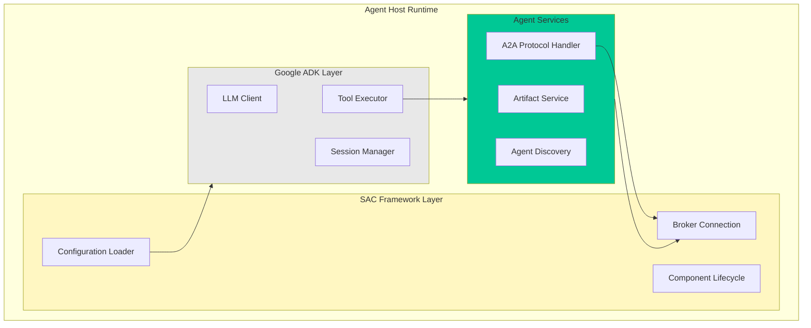

Agent Hosts are the runtime environments that execute AI agents within Solace Agent Mesh. Each agent host integrates Google's Agent Development Kit (ADK) with the Solace AI Connector (SAC) framework, providing a complete environment for AI-powered task execution.

## What is an Agent Host?

An Agent Host is a **Universal A2A Agent Runtime** that:

- Hosts AI agents developed with Google ADK
- Configures agent capabilities through YAML files
- Communicates via the A2A protocol over Solace Event Mesh
- Manages sessions, artifacts, and tool execution
- Discovers and delegates to peer agents dynamically

<Info>
Agent Hosts are configured through the `solace_agent_mesh.agent.sac.app` module and use the `SamAgentApp` class.
</Info>

## Architecture



## Configuration Structure

Agent hosts are configured through YAML files with the following structure:

```yaml
log:
  stdout_log_level: INFO
  log_file_level: DEBUG
  log_file: agent.log

!include ../shared_config.yaml

apps:
  - name: my_agent_app
    app_base_path: .
    app_module: solace_agent_mesh.agent.sac.app
    
    broker:
      <<: *broker_connection
    
    app_config:
      # Agent identity and capabilities
      namespace: ${NAMESPACE}
      agent_name: "MyAgent"
      display_name: "My Custom Agent"
      
      # LLM configuration
      model: *planning_model
      
      # Agent instructions
      instruction: |
        You are a specialized agent that performs...
      
      # Tool configuration
      tools:
        - tool_type: builtin
          tool_name: "web_request"
        - tool_type: builtin-group
          group_name: "artifact_management"
      
      # Services
      session_service:
        type: "sql"
        database_url: "sqlite:///agent.db"
        default_behavior: "PERSISTENT"
      
      artifact_service:
        type: "filesystem"
        base_path: "/tmp/samv2"
        artifact_scope: namespace
      
      # Agent card for discovery
      agent_card:
        description: "Agent that performs specific tasks"
        defaultInputModes: ["text"]
        defaultOutputModes: ["text", "file"]
        skills:
          - id: "my_skill"
            name: "My Skill"
            description: "Detailed skill description"
      
      # Discovery and communication
      agent_card_publishing:
        interval_seconds: 10
      
      agent_discovery:
        enabled: true
      
      inter_agent_communication:
        allow_list: ["*"]
        request_timeout_seconds: 120
```

## Key Configuration Sections

### Agent Identity

<ParamField path="agent_name" type="string" required>
  The unique identifier for the agent within the namespace. Used in A2A topic routing.
</ParamField>

<ParamField path="display_name" type="string">
  Human-readable name shown in UI and logs. Defaults to `agent_name`.
</ParamField>

<ParamField path="namespace" type="string" required>
  The A2A topic namespace (e.g., "myorg/production"). All components in the same namespace can communicate.
</ParamField>

### LLM Configuration

<ParamField path="model" type="object" required>
  LLM model configuration. Typically references a shared model definition:
  
  ```yaml
  model:
    model: "gpt-4"
    api_base: "https://api.openai.com/v1"
    api_key: "${OPENAI_API_KEY}"
    temperature: 0.1
    max_tokens: 16000
  ```
</ParamField>

<ParamField path="instruction" type="string" required>
  System instructions that define the agent's behavior, capabilities, and response style.
</ParamField>

### Tool Configuration

Agents can access three types of tools:

<Tabs>
  <Tab title="Built-in Tools">
    ```yaml
    tools:
      - tool_type: builtin
        tool_name: "web_request"
      
      - tool_type: builtin
        tool_name: "convert_file_to_markdown"
      
      - tool_type: builtin-group
        group_name: "artifact_management"
      
      - tool_type: builtin-group
        group_name: "data_analysis"
    ```
  </Tab>
  
  <Tab title="Custom Python Tools">
    ```yaml
    tools:
      - tool_type: python
        component_module: src.custom_tools.my_tool
        component_base_path: .
        function_name: my_function
        tool_name: "my_tool"
    ```
  </Tab>
  
  <Tab title="MCP Tools">
    ```yaml
    tools:
      - tool_type: mcp
        connection_params:
          type: stdio
          command: "npx"
          args:
            - "@modelcontextprotocol/server-filesystem"
            - "/path/to/files"
    ```
  </Tab>
</Tabs>

### Session Management

<ParamField path="session_service.type" type="string" default="memory">
  Session storage backend: `sql`, `memory`, or custom implementation.
</ParamField>

<ParamField path="session_service.database_url" type="string">
  Database connection string for SQL-based sessions (PostgreSQL, MySQL, SQLite).
</ParamField>

<ParamField path="session_service.default_behavior" type="string" default="PERSISTENT">
  Session behavior: `PERSISTENT` (maintain history) or `RUN_BASED` (clear between runs).
</ParamField>

### Artifact Management

<ParamField path="artifact_service.type" type="string" default="filesystem">
  Artifact storage backend: `filesystem`, `s3`, or custom implementation.
</ParamField>

<ParamField path="artifact_service.base_path" type="string">
  Base directory for filesystem artifacts.
</ParamField>

<ParamField path="artifact_service.artifact_scope" type="string" default="namespace">
  Artifact visibility: `namespace` (shared across namespace), `agent` (private to agent), or `session` (private to session).
</ParamField>

<ParamField path="artifact_handling_mode" type="string" default="reference">
  How artifacts are transmitted: `reference` (send URI), `embed` (send base64 content), or `inline` (send text content).
</ParamField>

### Agent Card (Discovery)

The agent card advertises capabilities to other agents:

```yaml
agent_card:
  description: "Concise description of what this agent does"
  defaultInputModes: ["text", "file"]
  defaultOutputModes: ["text", "file"]
  skills:
    - id: "skill_identifier"
      name: "Human Readable Skill Name"
      description: "Detailed description of what this skill does and when to use it"
```

<Info>
Skill descriptions are used by other agents (especially orchestrators) to decide when to delegate tasks.
</Info>

### Discovery and Communication

<ParamField path="agent_card_publishing.interval_seconds" type="integer" default="10">
  How often to broadcast the agent card. Set to `0` to disable periodic publishing.
</ParamField>

<ParamField path="agent_discovery.enabled" type="boolean" default="true">
  Whether to discover and communicate with peer agents.
</ParamField>

<ParamField path="inter_agent_communication.allow_list" type="array" required>
  List of agent names this agent can delegate to. Use `["*"]` to allow all agents.
</ParamField>

<ParamField path="inter_agent_communication.request_timeout_seconds" type="integer" default="120">
  Maximum time to wait for responses from peer agents.
</ParamField>

## Example Configurations

### Simple Web Agent

<Accordion title="View Configuration">
```yaml
apps:
  - name: web_agent_app
    app_base_path: .
    app_module: solace_agent_mesh.agent.sac.app
    broker:
      <<: *broker_connection

    app_config:
      namespace: ${NAMESPACE}
      supports_streaming: true
      agent_name: "WebAgent"
      display_name: "Web Agent"
      model: *planning_model
      
      instruction: |
        You can fetch content from web URLs using the 'web_request' tool.
        Always save useful fetched content as an artifact.

      tools:
        - tool_type: builtin
          tool_name: "web_request"
        - tool_type: builtin-group
          group_name: "artifact_management"

      session_service:
        type: "memory"
        default_behavior: "PERSISTENT"

      artifact_service:
        type: "filesystem"
        base_path: "/tmp/samv2"
        artifact_scope: namespace
      
      artifact_handling_mode: "reference"
      enable_embed_resolution: true

      agent_card:
        description: "An agent that fetches content from web URLs."
        defaultInputModes: ["text"]
        defaultOutputModes: ["text", "file"]
        skills:
          - id: "web_request"
            name: "Web Request"
            description: "Fetches and processes content from web URLs."

      agent_card_publishing:
        interval_seconds: 10
      
      agent_discovery:
        enabled: false
      
      inter_agent_communication:
        allow_list: []
        request_timeout_seconds: 120
```
</Accordion>

### Orchestrator Agent

<Accordion title="View Configuration">
```yaml
apps:
  - name: orchestrator_agent_app
    app_base_path: .
    app_module: solace_agent_mesh.agent.sac.app
    broker:
      <<: *broker_connection

    app_config:
      namespace: ${NAMESPACE}
      supports_streaming: true
      agent_name: "OrchestratorAgent"
      display_name: "Orchestrator"
      model: *planning_model

      instruction: | 
        You are the Orchestrator Agent. Your responsibilities:
        1. Process tasks from external sources via the Gateway.
        2. Analyze each task:
           a. Single Agent Delegation: Delegate to one peer agent if suitable
           b. Multi-Agent Coordination: Create and execute multi-step plans
           c. Direct Execution: Handle tasks yourself if appropriate
        
        - Use list_artifacts to track created artifacts
        - Use signal_artifact_for_return for important artifacts
        - Provide progress updates using status_update embeds

      session_service:
        type: "sql"
        database_url: "sqlite:///orchestrator.db"
        default_behavior: "PERSISTENT"
      
      artifact_service:
        type: "filesystem"
        base_path: "/tmp/samv2"
        artifact_scope: namespace
      
      artifact_handling_mode: "reference"
      enable_embed_resolution: true
      max_llm_calls_per_task: 25

      tools:
        - tool_type: builtin-group
          group_name: "artifact_management"
        - tool_type: builtin-group
          group_name: "data_analysis"
        - tool_type: builtin
          tool_name: "get_current_time"

      agent_card:
        description: "Manages tasks and coordinates multi-agent workflows."
        defaultInputModes: ["text"]
        defaultOutputModes: ["text", "file"]
        skills:
          - id: strategic_planning
            name: Strategic Planning
            description: Analyzes complex requests and creates execution plans
          - id: agent_coordination
            name: Agent Coordination
            description: Identifies suitable agents and coordinates workflows
          - id: artifact_management
            name: Artifact Management
            description: Creates and manages documents, reports, and data files

      agent_card_publishing:
        interval_seconds: 10
      
      agent_discovery:
        enabled: true
      
      inter_agent_communication:
        allow_list: ["*"]
        request_timeout_seconds: 2000
```
</Accordion>

### MCP Integration Agent

<Accordion title="View Configuration">
```yaml
apps:
  - name: mcp_agent_app
    app_base_path: .
    app_module: solace_agent_mesh.agent.sac.app
    broker:
      <<: *broker_connection

    app_config:
      namespace: ${NAMESPACE}
      supports_streaming: true
      agent_name: "MCPAgent"
      display_name: "MCP Integration Agent"
      model: *planning_model
      
      instruction: |
        You have access to external tools via MCP servers.
        Use these tools to accomplish tasks and save results as artifacts.

      tools:
        - tool_type: mcp
          connection_params:
            type: stdio
            command: "npx"
            args:
              - "@modelcontextprotocol/server-filesystem"
              - "/workspace"
        - tool_type: builtin-group
          group_name: "artifact_management"

      session_service:
        type: "memory"
        default_behavior: "PERSISTENT"

      artifact_service:
        type: "filesystem"
        base_path: "/tmp/samv2"
        artifact_scope: namespace
      
      artifact_handling_mode: "reference"
      enable_embed_resolution: true

      agent_card:
        description: "Agent with MCP tool integration capabilities."
        defaultInputModes: ["text", "file"]
        defaultOutputModes: ["text", "file"]
        skills:
          - id: "file_operations"
            name: "File Operations"
            description: "Read, write, and manage files via MCP server"

      agent_card_publishing:
        interval_seconds: 10
      
      agent_discovery:
        enabled: false
      
      inter_agent_communication:
        allow_list: []
        request_timeout_seconds: 60
```
</Accordion>

## Running Agent Hosts

Start an agent host using the SAM CLI:

```bash
# Run a single agent
sam run configs/agents/my_agent.yaml

# Run multiple agents
sam run configs/agents/orchestrator.yaml configs/agents/web_agent.yaml

# Run all configs in a directory
sam run configs/agents/
```

## Agent Lifecycle

1. **Startup**
   - Load configuration from YAML
   - Connect to Solace broker
   - Initialize session and artifact services
   - Set up ADK runtime with LLM and tools

2. **Discovery**
   - Publish agent card to discovery topic
   - Subscribe to peer agent cards (if discovery enabled)
   - Inject peer agent information into system instructions

3. **Active Processing**
   - Listen on `{namespace}/a2a/v1/agent/request/{agent_name}`
   - Receive task requests via A2A protocol
   - Execute LLM calls with tool access
   - Publish status updates and responses

4. **Shutdown**
   - Complete in-flight tasks
   - Clean up sessions (if configured)
   - Disconnect from broker

## Advanced Features

### Auto-Summarization

Automatically summarize conversation history to manage context length:

```yaml
app_config:
  auto_summarization:
    enabled: true
    compaction_percentage: 0.25  # Summarize 25% of history when triggered
```

### OAuth2 Authentication for LLMs

```yaml
model:
  model: "custom-model"
  api_base: "https://api.example.com/v1"
  oauth_token_url: "https://auth.example.com/token"
  oauth_client_id: "${CLIENT_ID}"
  oauth_client_secret: "${CLIENT_SECRET}"
  oauth_scope: "ai.inference"
```

### S3 Artifact Storage

```yaml
artifact_service:
  type: "s3"
  bucket_name: "my-artifacts"
  region: "us-east-1"
  access_key_id: "${AWS_ACCESS_KEY_ID}"
  secret_access_key: "${AWS_SECRET_ACCESS_KEY}"
  artifact_scope: namespace
```

### Stream Batching

Control streaming response chunk size:

```yaml
app_config:
  stream_batching_threshold_bytes: 120  # Batch up to 120 bytes before sending
```

## Best Practices

<AccordionGroup>
  <Accordion title="Agent Naming">
    - Use descriptive, unique names within your namespace
    - Follow a consistent naming convention (e.g., `CamelCase`)
    - Avoid special characters that might conflict with topic routing
  </Accordion>
  
  <Accordion title="Tool Selection">
    - Only include tools the agent actually needs
    - Use tool groups for common patterns (artifact_management, data_analysis)
    - Document custom tools with clear descriptions
  </Accordion>
  
  <Accordion title="Instructions">
    - Be specific about the agent's role and capabilities
    - Include artifact handling guidelines
    - Mention when to use status_update embeds
    - Describe delegation patterns for orchestrators
  </Accordion>
  
  <Accordion title="Session Management">
    - Use SQL-based sessions for production (persistence across restarts)
    - Use memory sessions for development/testing
    - Set appropriate default_behavior (PERSISTENT vs RUN_BASED)
  </Accordion>
  
  <Accordion title="Discovery Configuration">
    - Enable discovery for orchestrators and coordinating agents
    - Disable discovery for isolated/specialized agents
    - Use allow_list to restrict delegation patterns
  </Accordion>
</AccordionGroup>

## Troubleshooting

<AccordionGroup>
  <Accordion title="Agent not receiving tasks">
    Check:
    - Namespace matches gateway/client configuration
    - Agent name is correctly specified in requests
    - Broker connection is established (check logs)
    - Queue subscriptions are active
  </Accordion>
  
  <Accordion title="Tool execution failures">
    Check:
    - Tool is correctly configured in YAML
    - Required environment variables are set
    - Custom tool modules are importable
    - MCP server is running and accessible
  </Accordion>
  
  <Accordion title="Session data lost">
    Check:
    - session_service.type is "sql" (not "memory")
    - Database file/connection is persistent
    - default_behavior is "PERSISTENT" (not "RUN_BASED")
  </Accordion>
  
  <Accordion title="Artifacts not shared">
    Check:
    - artifact_scope is "namespace" (not "agent" or "session")
    - base_path is consistent across agents
    - File system permissions allow read/write
  </Accordion>
</AccordionGroup>

## Next Steps

<CardGroup cols={2}>
  <Card title="Built-in Tools" icon="toolbox" href="/components/builtin-tools">
    Explore available tools for agents
  </Card>
  
  <Card title="Creating Agents" icon="code" href="/developing/create-agents">
    Learn to build custom agents
  </Card>
  
  <Card title="Python Tools" icon="python" href="/developing/creating-python-tools">
    Develop custom tools for agents
  </Card>
  
  <Card title="MCP Integration" icon="plug" href="/developing/tutorials/mcp-integration">
    Integrate MCP servers
  </Card>
</CardGroup>
