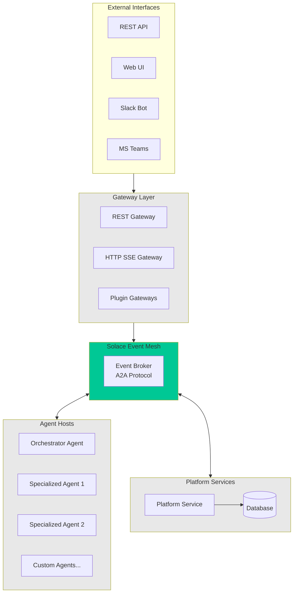

Solace Agent Mesh is built on a distributed, event-driven architecture that enables scalable multi-agent AI systems. The framework integrates three key technologies:

- **Solace AI Connector (SAC)** - Handles broker connections, configuration loading, and component lifecycle
- **Google Agent Development Kit (ADK)** - Provides agent runtime, LLM interaction, and tool execution
- **Agent-to-Agent (A2A) Protocol** - Enables standardized communication between all components

## Architecture Overview

The component architecture follows a modular design where each component serves a specific purpose while communicating through the Solace Event Mesh:



## Core Components

<CardGroup cols={2}>
  <Card title="Agent Hosts" icon="robot" href="/components/agent-hosts">
    Runtime environments that host AI agents built with Google ADK, configured through YAML files
  </Card>
  
  <Card title="Platform Service" icon="server" href="/components/platform-service">
    Backend microservice providing management APIs for configuration and deployment operations
  </Card>
  
  <Card title="Gateways" icon="plug" href="/components/gateways">
    Protocol adapters that translate external requests into A2A messages and route them through the mesh
  </Card>
  
  <Card title="Plugins" icon="puzzle-piece" href="/components/plugins">
    Modular extensions that add custom agents, gateways, and specialized functionality
  </Card>
</CardGroup>

## Component Communication

All components communicate through the **A2A Protocol** over the Solace Event Mesh. This provides:

- **Decoupling** - Components can be developed, deployed, and scaled independently
- **Reliability** - Built-in message persistence and guaranteed delivery
- **Scalability** - Event-driven architecture handles high-throughput scenarios
- **Dynamic Discovery** - Agents can find and delegate to peers without static configuration

### Topic Structure

The A2A protocol uses a hierarchical topic structure:

```
{namespace}/a2a/v1/
├── discovery/
│   ├── agentcards        # Agent capability announcements
│   └── gatewaycards      # Gateway capability announcements
├── agent/
│   └── request/{agent}   # Task requests to specific agents
└── gateway/
    ├── status/{id}/{task}   # Status updates to gateways
    └── response/{id}/{task}  # Final responses to gateways
```

## Configuration Structure

Solace Agent Mesh uses YAML-based configuration files that follow the SAC framework structure:

```yaml
log:
  stdout_log_level: INFO
  log_file_level: DEBUG
  log_file: app.log

# Shared configuration (broker, models, services)
!include shared_config.yaml

apps:
  - name: my_component_app
    app_base_path: .
    app_module: solace_agent_mesh.agent.sac.app
    
    broker:
      <<: *broker_connection
    
    app_config:
      namespace: ${NAMESPACE}
      # Component-specific configuration
```

### Shared Configuration

The `shared_config.yaml` file centralizes common settings:

<Accordion title="Example shared_config.yaml">
```yaml
shared_config:
  - broker_connection: &broker_connection
      broker_url: ${SOLACE_BROKER_URL}
      broker_username: ${SOLACE_BROKER_USERNAME}
      broker_password: ${SOLACE_BROKER_PASSWORD}
      broker_vpn: ${SOLACE_BROKER_VPN}

  - models:
    planning: &planning_model
      model: ${LLM_SERVICE_PLANNING_MODEL_NAME}
      api_base: ${LLM_SERVICE_ENDPOINT}
      api_key: ${LLM_SERVICE_API_KEY}
      temperature: 0.1
      max_tokens: 16000

    general: &general_model
      model: ${LLM_SERVICE_GENERAL_MODEL_NAME}
      api_base: ${LLM_SERVICE_ENDPOINT}
      api_key: ${LLM_SERVICE_API_KEY}

  - services:
    session_service: &default_session_service
      type: "sql"
      default_behavior: "PERSISTENT"
      database_url: ${SESSION_DATABASE_URL}
    
    artifact_service: &default_artifact_service
      type: "filesystem"
      base_path: "/tmp/samv2"
      artifact_scope: namespace
```
</Accordion>

## Project Structure

A typical Solace Agent Mesh project is organized as follows:

```
my-sam-project/
├── configs/
│   ├── shared_config.yaml      # Common configuration
│   ├── agents/
│   │   ├── orchestrator.yaml   # Orchestrator agent config
│   │   └── custom_agent.yaml   # Custom agent configs
│   ├── gateways/
│   │   ├── rest_gateway.yaml   # REST gateway config
│   │   └── webui_gateway.yaml  # WebUI gateway config
│   └── services/
│       └── platform.yaml       # Platform service config
├── src/
│   └── custom_tools/           # Custom Python tools
├── .env                        # Environment variables
└── requirements.txt            # Python dependencies
```

## Component Lifecycle

All components follow a common lifecycle managed by the SAC framework:

1. **Initialization** - Load configuration, connect to broker, initialize services
2. **Discovery** - Publish capability cards (for agents/gateways)
3. **Active** - Listen for A2A messages, process requests
4. **Cleanup** - Graceful shutdown, session cleanup, disconnect from broker

## Next Steps

Explore the detailed documentation for each component type:

<CardGroup cols={2}>
  <Card title="Agent Hosts" icon="robot" href="/components/agent-hosts">
    Learn how to configure and deploy AI agents
  </Card>
  
  <Card title="Platform Service" icon="server" href="/components/platform-service">
    Set up the management backend service
  </Card>
  
  <Card title="Plugins" icon="puzzle-piece" href="/components/plugins">
    Extend functionality with custom plugins
  </Card>
  
  <Card title="Projects" icon="folder-tree" href="/components/projects">
    Understand project organization and management
  </Card>
</CardGroup>
