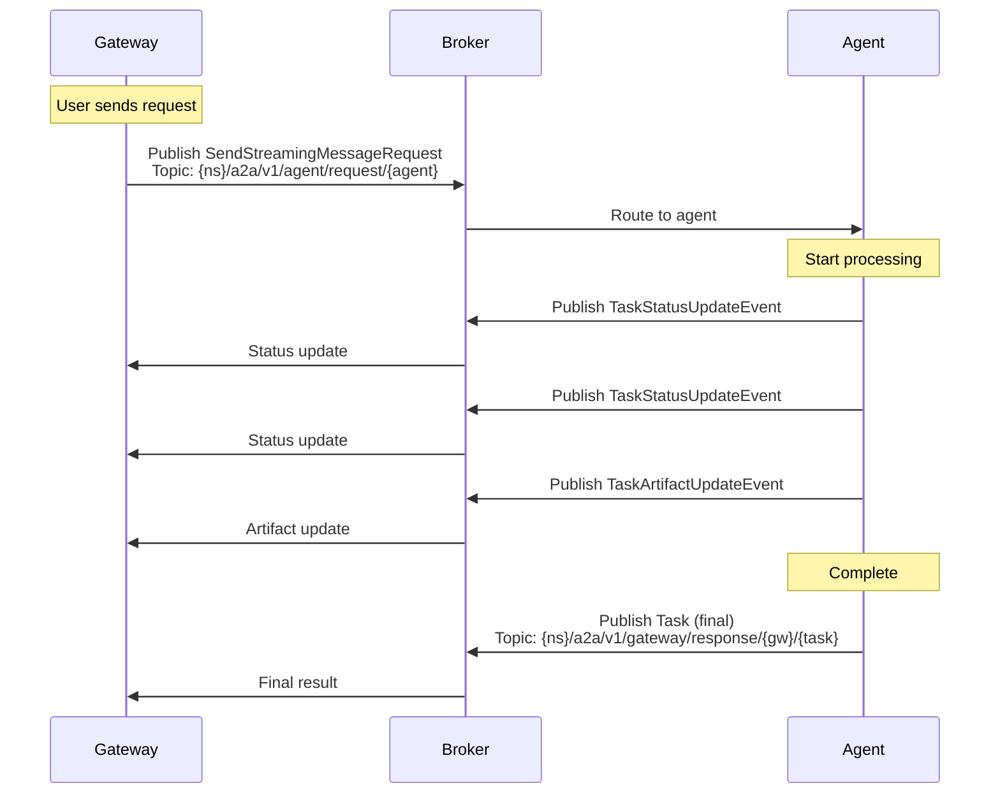
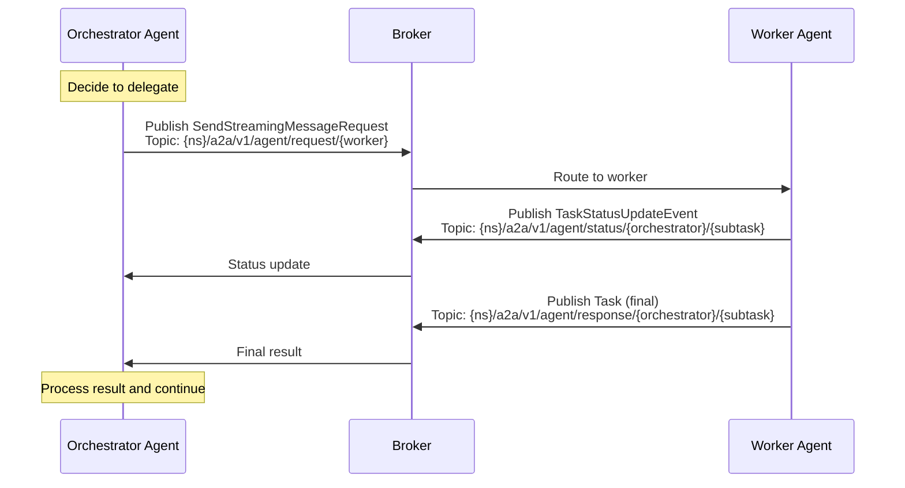
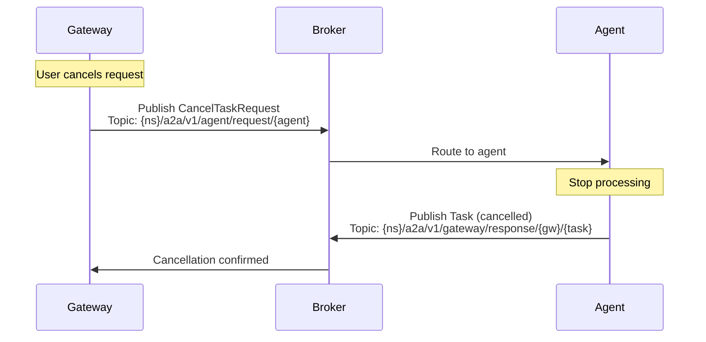

# A2A Protocol

The A2A (Agent-to-Agent) protocol is the communication backbone of Solace Agent Mesh. It defines how agents, gateways, and orchestrators exchange messages over a Solace PubSub+ message broker using JSON-RPC 2.0.

## Protocol Overview

A2A builds on three foundational standards:

<CardGroup cols={3}>
  <Card title="JSON-RPC 2.0" icon="code">
    Request/response envelope structure
  </Card>
  <Card title="Solace Topics" icon="route">
    Hierarchical publish/subscribe routing
  </Card>
  <Card title="A2A Spec" icon="file-contract">
    Message types, content format, and lifecycle
  </Card>
</CardGroup>

### Key Characteristics

- **Asynchronous**: Non-blocking request/response via pub/sub
- **Streaming**: Support for incremental results (Server-Sent Events style)
- **Routable**: Topic-based routing enables dynamic discovery
- **Typed**: Strong schema validation via Pydantic models
- **Extensible**: Metadata and extensions for custom data

## Message Structure

### JSON-RPC Envelope

All A2A messages follow JSON-RPC 2.0:

```json
{
  "jsonrpc": "2.0",
  "id": "task-abc123",
  "method": "agent/sendStreamingMessage",
  "params": {
    "message": { /* A2A Message */ },
    "metadata": { /* Optional metadata */ }
  }
}
```

<ParamField path="jsonrpc" type="string" required>
  Always "2.0" per JSON-RPC specification
</ParamField>

<ParamField path="id" type="string | number" required>
  Unique request identifier for correlation (typically task ID)
</ParamField>

<ParamField path="method" type="string" required>
  RPC method name (e.g., "agent/sendStreamingMessage")
</ParamField>

<ParamField path="params" type="object">
  Method-specific parameters
</ParamField>

### A2A Message Format

From the A2A specification:

```typescript
interface Message {
  role: "user" | "agent";
  parts: Part[];
  context_id?: string;
  metadata?: Record<string, any>;
}

type Part = TextPart | DataPart | FilePart;

interface TextPart {
  text: string;
  metadata?: Record<string, any>;
}

interface DataPart {
  data: Record<string, any>;
  metadata?: Record<string, any>;
}

interface FilePart {
  file: FileWithUri | FileWithBytes;
  metadata?: Record<string, any>;
}
```

## Message Types

### Request Messages

<Tabs>
  <Tab title="SendStreamingMessageRequest">
    Request streaming execution (incremental results):

    ```json
    {
      "jsonrpc": "2.0",
      "id": "task-123",
      "method": "agent/sendStreamingMessage",
      "params": {
        "message": {
          "role": "user",
          "parts": [
            {
              "text": "Analyze the quarterly sales data"
            }
          ],
          "context_id": "session-abc",
          "metadata": {
            "agent_name": "analysis_agent",
            "priority": "high"
          }
        }
      }
    }
    ```

    From `src/solace_agent_mesh/common/a2a/protocol.py:554-571`:
    ```python
    def create_send_streaming_message_request(
        message: Message,
        task_id: str,
        metadata: Optional[Dict[str, Any]] = None,
    ) -> SendStreamingMessageRequest:
        """Creates a SendStreamingMessageRequest object."""
        send_params = MessageSendParams(
            message=message, 
            metadata=metadata
        )
        return SendStreamingMessageRequest(
            id=task_id, 
            params=send_params
        )
    ```
  </Tab>

  <Tab title="SendMessageRequest">
    Request non-streaming execution (single final result):

    ```json
    {
      "jsonrpc": "2.0",
      "id": "task-456",
      "method": "agent/sendMessage",
      "params": {
        "message": {
          "role": "user",
          "parts": [
            {"text": "What is 2+2?"}
          ]
        }
      }
    }
    ```

    **Use when:** Simple request/response with no intermediate updates needed.
  </Tab>

  <Tab title="CancelTaskRequest">
    Cancel an in-progress task:

    ```json
    {
      "jsonrpc": "2.0",
      "id": "cancel-req-789",
      "method": "agent/cancelTask",
      "params": {
        "id": "task-123"
      }
    }
    ```

    From `src/solace_agent_mesh/common/a2a/protocol.py:520-531`:
    ```python
    def create_cancel_task_request(task_id: str) -> CancelTaskRequest:
        """Creates a CancelTaskRequest object."""
        params = TaskIdParams(id=task_id)
        return CancelTaskRequest(
            id=uuid.uuid4().hex, 
            params=params
        )
    ```
  </Tab>
</Tabs>

### Response Messages

<Tabs>
  <Tab title="TaskStatusUpdateEvent">
    Incremental update during streaming execution:

    ```json
    {
      "jsonrpc": "2.0",
      "id": "task-123",
      "result": {
        "type": "task.status.update",
        "task_id": "task-123",
        "context_id": "session-abc",
        "status": {
          "state": "working",
          "message": {
            "role": "agent",
            "parts": [
              {
                "text": "Analyzing data... Found 1,234 records."
              }
            ]
          },
          "is_final": false
        }
      }
    }
    ```

    **Published to:** Status topic for streaming updates
  </Tab>

  <Tab title="TaskArtifactUpdateEvent">
    Artifact (file) update during execution:

    ```json
    {
      "jsonrpc": "2.0",
      "id": "task-123",
      "result": {
        "type": "task.artifact.update",
        "task_id": "task-123",
        "context_id": "session-abc",
        "artifact": {
          "artifact_id": "artifact-xyz",
          "name": "sales_chart.png",
          "description": "Q4 sales visualization",
          "parts": [
            {
              "file": {
                "name": "sales_chart.png",
                "mime_type": "image/png",
                "uri": "artifact://session-abc/sales_chart.png"
              }
            }
          ]
        }
      }
    }
    ```

    **Published to:** Status topic for streaming updates
  </Tab>

  <Tab title="Task (Final Result)">
    Final task result:

    ```json
    {
      "jsonrpc": "2.0",
      "id": "task-123",
      "result": {
        "id": "task-123",
        "context_id": "session-abc",
        "status": {
          "state": "completed",
          "message": {
            "role": "agent",
            "parts": [
              {
                "text": "Analysis complete. See attached report."
              }
            ]
          },
          "is_final": true
        },
        "artifacts": [
          {
            "artifact_id": "report-123",
            "name": "analysis_report.pdf",
            "parts": [...]
          }
        ]
      }
    }
    ```

    **Published to:** Response topic (final result)
  </Tab>

  <Tab title="Error Response">
    Error result:

    ```json
    {
      "jsonrpc": "2.0",
      "id": "task-123",
      "error": {
        "code": -32000,
        "message": "Agent execution failed",
        "data": {
          "error_type": "timeout",
          "details": "Task exceeded 5 minute timeout"
        }
      }
    }
    ```

    From `src/solace_agent_mesh/common/a2a/protocol.py:412-430`:
    ```python
    def create_internal_error_response(
        message: str,
        request_id: Optional[Union[str, int]],
        data: Optional[Dict[str, Any]] = None,
    ) -> JSONRPCResponse:
        """Creates a JSON-RPC response for an InternalError."""
        error = InternalError(message=message, data=data)
        return JSONRPCResponse(id=request_id, error=error)
    ```
  </Tab>
</Tabs>

## Topic Structure

A2A uses hierarchical Solace topics for routing:

### Topic Hierarchy

```
{namespace}/a2a/v1/{category}/{type}/{identifier}
```

<ParamField path="namespace" type="string" required>
  Organization/tenant namespace (e.g., "acme/ai")
</ParamField>

<ParamField path="category" type="string" required>
  Message category: `agent`, `gateway`, `client`, `discovery`
</ParamField>

<ParamField path="type" type="string" required>
  Message type: `request`, `response`, `status`
</ParamField>

<ParamField path="identifier" type="string" required>
  Agent name, gateway ID, or task ID
</ParamField>

### Topic Patterns

From `src/solace_agent_mesh/common/a2a/protocol.py:34-215`:

<Tabs>
  <Tab title="Agent Topics">
    **Agent Request Topic:**
    ```python
    def get_agent_request_topic(namespace: str, agent_name: str) -> str:
        return f"{namespace}/a2a/v1/agent/request/{agent_name}"
    
    # Example: "acme/ai/a2a/v1/agent/request/research_agent"
    ```

    **Agent Response Topic (for peer agents):**
    ```python
    def get_agent_response_topic(
        namespace: str, 
        delegating_agent_name: str, 
        sub_task_id: str
    ) -> str:
        return f"{namespace}/a2a/v1/agent/response/{delegating_agent_name}/{sub_task_id}"
    
    # Example: "acme/ai/a2a/v1/agent/response/orchestrator/subtask-xyz"
    ```

    **Agent Status Topic:**
    ```python
    def get_peer_agent_status_topic(
        namespace: str,
        delegating_agent_name: str,
        sub_task_id: str
    ) -> str:
        return f"{namespace}/a2a/v1/agent/status/{delegating_agent_name}/{sub_task_id}"
    ```

    **Subscription Patterns:**
    ```python
    # Subscribe to all responses for this agent
    get_agent_response_subscription_topic(namespace, agent_name)
    # Returns: "acme/ai/a2a/v1/agent/response/{agent_name}/>"
    
    # Subscribe to all status updates for this agent
    get_agent_status_subscription_topic(namespace, agent_name)
    # Returns: "acme/ai/a2a/v1/agent/status/{agent_name}/>"
    ```
  </Tab>

  <Tab title="Gateway Topics">
    **Gateway Response Topic:**
    ```python
    def get_gateway_response_topic(
        namespace: str,
        gateway_id: str,
        task_id: str
    ) -> str:
        return f"{namespace}/a2a/v1/gateway/response/{gateway_id}/{task_id}"
    ```

    **Gateway Status Topic:**
    ```python
    def get_gateway_status_topic(
        namespace: str,
        gateway_id: str,
        task_id: str
    ) -> str:
        return f"{namespace}/a2a/v1/gateway/status/{gateway_id}/{task_id}"
    ```

    **Subscription Patterns:**
    ```python
    # Subscribe to all responses for this gateway
    get_gateway_response_subscription_topic(namespace, gateway_id)
    # Returns: "acme/ai/a2a/v1/gateway/response/{gateway_id}/>"
    
    # Subscribe to all status updates for this gateway
    get_gateway_status_subscription_topic(namespace, gateway_id)
    # Returns: "acme/ai/a2a/v1/gateway/status/{gateway_id}/>"
    ```
  </Tab>

  <Tab title="Discovery Topics">
    **Agent Card Publishing:**
    ```python
    def get_agent_discovery_topic(namespace: str) -> str:
        return f"{namespace}/a2a/v1/discovery/agentcards"
    ```

    **Gateway Card Publishing:**
    ```python
    def get_gateway_discovery_topic(namespace: str) -> str:
        return f"{namespace}/a2a/v1/discovery/gatewaycards"
    ```

    **Discovery Subscription (all):**
    ```python
    def get_discovery_subscription_topic(namespace: str) -> str:
        return f"{namespace}/a2a/v1/discovery/>"
    # Receives both agent and gateway cards
    ```
  </Tab>

  <Tab title="Client Topics">
    **Client Response Topic:**
    ```python
    def get_client_response_topic(namespace: str, client_id: str) -> str:
        return f"{namespace}/a2a/v1/client/response/{client_id}"
    ```

    **Client Status Topic:**
    ```python
    def get_client_status_topic(
        namespace: str,
        client_id: str,
        task_id: str
    ) -> str:
        return f"{namespace}/a2a/v1/client/status/{client_id}/{task_id}"
    ```

    **Client Status Subscription:**
    ```python
    def get_client_status_subscription_topic(
        namespace: str,
        client_id: str
    ) -> str:
        return f"{namespace}/a2a/v1/client/status/{client_id}/>"
    ```
  </Tab>
</Tabs>

## Message Flow Patterns

### Pattern 1: Gateway → Agent (Streaming)



### Pattern 2: Agent → Agent (Delegation)



### Pattern 3: Task Cancellation



## User Properties (Metadata)

Solace messages can include user properties for routing and context:

```python
user_properties = {
    "clientId": "gateway_123",          # Sender identifier
    "userId": "user_abc",               # End-user identifier
    "replyTo": response_topic,          # Where to send response
    "a2aStatusTopic": status_topic,     # Where to send status updates
    "a2aUserConfig": user_config_json,  # User-specific configuration
    "authToken": signed_jwt_token,      # Optional: Enterprise auth
}

component.publish_a2a_message(
    payload=request.model_dump(exclude_none=True),
    topic=target_topic,
    user_properties=user_properties
)
```

<ParamField path="clientId" type="string" required>
  Identifier of the sending component (gateway ID or agent name)
</ParamField>

<ParamField path="userId" type="string">
  End-user identifier for access control and personalization
</ParamField>

<ParamField path="replyTo" type="string" required>
  Topic where the agent should publish the final Task result
</ParamField>

<ParamField path="a2aStatusTopic" type="string">
  Topic where the agent should publish streaming status updates (SendStreamingMessage only)
</ParamField>

<ParamField path="a2aUserConfig" type="string (JSON)">
  User-specific configuration resolved by middleware (scopes, preferences, etc.)
</ParamField>

## Content Part Types

### TextPart

Plain text content:

```json
{
  "text": "The analysis shows a 15% increase in sales.",
  "metadata": {
    "language": "en",
    "confidence": 0.95
  }
}
```

### DataPart

Structured data (JSON):

```json
{
  "data": {
    "type": "tool_call",
    "function_name": "web_search",
    "arguments": {
      "query": "latest AI news"
    }
  },
  "metadata": {
    "tool_call_id": "call_xyz"
  }
}
```

Common data part types:
- `tool_call`: Function call from LLM
- `tool_result`: Function execution result
- `structured_output`: Validated JSON response
- `agent_progress_update`: Custom status information

### FilePart

File/artifact with URI or bytes:

```json
// With URI (recommended for large files)
{
  "file": {
    "name": "report.pdf",
    "mime_type": "application/pdf",
    "uri": "artifact://session-abc/report.pdf"
  },
  "metadata": {
    "size_bytes": 1048576,
    "version": 2
  }
}

// With inline bytes (for small files)
{
  "file": {
    "name": "config.json",
    "mime_type": "application/json",
    "bytes": "eyJrZXkiOiJ2YWx1ZSJ9"  // base64 encoded
  }
}
```

## Helper Functions

The A2A SDK provides helper functions for common operations:

### Creating Messages

```python
from solace_agent_mesh.common import a2a

# Create user message
message = a2a.create_user_message(
    parts=[
        a2a.create_text_part("Hello, agent!"),
        a2a.create_file_part_from_uri(
            uri="artifact://session-123/data.csv",
            name="data.csv",
            mime_type="text/csv"
        )
    ],
    metadata={"priority": "high"},
    context_id="session-123"
)

# Create agent message
response_msg = a2a.create_agent_message(
    parts=[a2a.create_text_part("Analysis complete!")]
)

# Create data message
data_msg = a2a.create_agent_data_message(
    data={"status": "processing", "progress": 0.5}
)
```

### Creating Events

```python
# Create status update
status_event = a2a.create_status_update(
    task_id="task-123",
    context_id="session-abc",
    message=response_msg,
    is_final=False
)

# Create artifact update  
artifact_event = a2a.create_artifact_update(
    task_id="task-123",
    context_id="session-abc",
    artifact=artifact_obj
)
```

### Extracting Data

```python
# Get message from status update
message = a2a.get_message_from_status_update(status_event)

# Get parts from message
parts = a2a.get_parts_from_message(message)

# Extract task ID from topic
task_id = a2a.extract_task_id_from_topic(
    topic="acme/ai/a2a/v1/gateway/response/web_ui/task-123",
    subscription_pattern="acme/ai/a2a/v1/gateway/response/web_ui/>",
    log_identifier="[Gateway]"
)
```

## Best Practices

<AccordionGroup>
  <Accordion title="Topic Design">
    - Use clear, consistent namespaces
    - Include version in topic path (e.g., `/a2a/v1/`)
    - Use wildcards (`>`) for subscription patterns
    - Avoid overly deep topic hierarchies
  </Accordion>

  <Accordion title="Message Size">
    - Use artifact URIs for large files (> 1MB)
    - Compress large text content when possible
    - Stream large datasets in chunks
    - Monitor broker message size limits
  </Accordion>

  <Accordion title="Error Handling">
    - Always include meaningful error messages
    - Use JSON-RPC error codes consistently
    - Include context in error data field
    - Log errors with correlation IDs
  </Accordion>

  <Accordion title="Metadata Usage">
    - Use metadata for non-essential context
    - Keep metadata JSON-serializable
    - Document custom metadata fields
    - Avoid sensitive data in metadata
  </Accordion>
</AccordionGroup>

## Next Steps

<CardGroup cols={2}>
  <Card title="Agents" icon="robot" href="/core-concepts/agents">
    Learn how agents implement A2A communication
  </Card>
  <Card title="Gateways" icon="door-open" href="/core-concepts/gateways">
    See how gateways translate external protocols to A2A
  </Card>
  <Card title="Workflows" icon="diagram-project" href="/core-concepts/workflows">
    Orchestrate agents with workflow DAGs
  </Card>
  <Card title="Message Broker Setup" icon="server" href="/deployment/broker-setup">
    Configure Solace PubSub+ for A2A
  </Card>
</CardGroup>