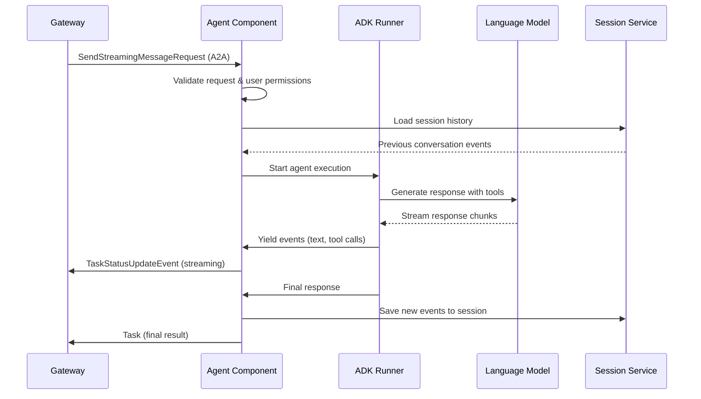

# Agents

Agents are the fundamental building blocks of Solace Agent Mesh. They are autonomous AI-powered components that can process requests, use tools, maintain conversation history, and collaborate with other agents through the A2A (Agent-to-Agent) protocol.

## Agent Architecture

Each agent in Solace Agent Mesh is built on Google's Agent Development Kit (ADK) and extended with mesh-specific capabilities:

```python
# From: src/solace_agent_mesh/agent/adk/app_llm_agent.py
class AppLlmAgent(LlmAgent):
    """
    Custom LlmAgent subclass that includes a reference to the hosting
    SamAgentComponent.

    This allows tools and callbacks within the ADK agent's execution context
    to access host-level configurations and services.
    """
    host_component: Any = Field(None, exclude=True)
```

### Key Components

<CardGroup cols={2}>
  <Card title="Agent Component" icon="cube">
    The core orchestration layer that handles A2A messaging, task execution, and lifecycle management
  </Card>
  <Card title="ADK Agent" icon="brain">
    The underlying LLM-powered agent from Google ADK with access to tools and memory
  </Card>
  <Card title="Session Service" icon="database">
    Manages conversation history and context across multiple interactions
  </Card>
  <Card title="Artifact Service" icon="file">
    Handles file storage and retrieval for agent inputs/outputs
  </Card>
</CardGroup>

## Agent Configuration

### Basic Agent Setup

Create an agent by defining a YAML configuration file:

```yaml agent_config.yaml
name: research_agent
namespace: acme/ai

log_level: info

model:
  model: anthropic/claude-4.5-sonnet
  max_output_tokens: 8192
  temperature: 0.7

instruction: |
  You are a research assistant that helps users find and analyze information.
  You can search the web, read documents, and synthesize findings.

tools:
  - type: mcp
    name: web_search
    config:
      api_key: ${WEB_SEARCH_API_KEY}
      max_results: 10

session_db:
  type: postgres
  connection_string: ${DATABASE_URL}
  pool_size: 10

artifact_service:
  type: s3
  bucket: agent-artifacts
  region: us-west-2
```

### Advanced Configuration

<AccordionGroup>
  <Accordion title="Auto-Summarization">
    Enable automatic conversation history summarization to handle long-running conversations:

    ```yaml
    auto_summarization:
      enabled: true
      compaction_percentage: 0.25  # Summarize oldest 25% of conversation
    ```

    **How it works:**
    - Monitors token count during execution
    - Triggers progressive summarization when context limit approached
    - Preserves recent messages while compressing older history
    - Stores summaries in session database for continuity

    From `src/solace_agent_mesh/agent/adk/runner.py:176-219`:
    ```python
    def _test_and_trigger_compaction(
        test_token_threshold: int,
        adk_session: ADKSession,
        component: Any
    ) -> None:
        """
        Test token count and trigger compaction if exceeded.
        Progressive Summarization: Each new summary re-compresses 
        (old_summary + new_content), keeping total size bounded.
        """
        total_tokens = _calculate_session_context_tokens(
            adk_session.events, 
            model=str(component.adk_agent.model)
        )
        
        if total_tokens > test_token_threshold:
            raise BadRequestError(
                message=f"Too many tokens: {total_tokens} exceeds limit"
            )
    ```
  </Accordion>

  <Accordion title="Agent Card Publishing">
    Configure how your agent advertises its capabilities:

    ```yaml
    agent_card:
      description: Research assistant with web search capabilities
      version: 1.0.0
      skills:
        - name: web_search
          description: Search the web for information
          input_schema:
            type: object
            properties:
              query:
                type: string
                description: Search query
        - name: document_analysis
          description: Analyze and extract insights from documents

    agent_card_publishing:
      enabled: true
      interval_seconds: 30
    ```
  </Accordion>

  <Accordion title="Tool Scoping">
    Control which tools are available based on request metadata:

    ```yaml
    tools:
      - type: mcp
        name: sensitive_db_access
        scopes:
          - admin
          - data_analyst
    ```

    Only requests with matching scopes in their A2A user config can use these tools.
  </Accordion>
</AccordionGroup>

## Agent Execution Flow

When an agent receives a request through A2A:



### Task Execution Context

Each agent request creates a task execution context that tracks:

- **Task ID**: Unique identifier for correlation
- **Session ID**: Links to conversation history
- **User Identity**: For access control and personalization
- **A2A Context**: Metadata, parent tasks, client info
- **Active Tools**: Currently executing tool calls
- **Streaming State**: Buffer for incremental responses

## Agent-to-Agent Communication

Agents can invoke other agents using the A2A protocol:

```python
# From agent tools/callbacks
from solace_agent_mesh.common import a2a

# Create a message to send to another agent
message = a2a.create_user_message(
    parts=[a2a.create_text_part("Analyze this data for insights")],
    metadata={"source_agent": "research_agent"}
)

# Send request to peer agent
request = a2a.create_send_streaming_message_request(
    message=message,
    task_id="subtask_123"
)

# Publish to peer agent's request topic
topic = a2a.get_agent_request_topic(namespace, "analysis_agent")
component.publish_a2a_message(
    payload=request.model_dump(exclude_none=True),
    topic=topic,
    user_properties={
        "clientId": component.agent_name,
        "replyTo": a2a.get_agent_response_topic(
            namespace, 
            component.agent_name, 
            "subtask_123"
        )
    }
)
```

### Hierarchical Task Tracking

Agents maintain parent-child relationships for delegated tasks:

- **Root tasks**: Initiated by gateways/users
- **Subtasks**: Created when agents call other agents
- **Task depth limits**: Prevent infinite recursion
- **Cancellation propagation**: Parent cancels all children

## Session Management

Agents use persistent sessions to maintain conversation context:

### Session Lifecycle

1. **Creation**: First message creates new session
2. **Event Append**: Each interaction adds events to session
3. **Compaction**: Older events summarized when context grows
4. **Retrieval**: Full history loaded on each request

### Session Filtering

The `FilteringSessionService` automatically handles:

- **Ghost event removal**: Events replaced by summaries are hidden
- **Compaction tracking**: Uses state_delta for O(1) filtering
- **Progressive summaries**: Newer summaries override older ones

From `src/solace_agent_mesh/agent/adk/runner.py:324-575`:
```python
async def _create_compaction_event(
    component: "SamAgentComponent",
    session: ADKSession,
    compaction_threshold: float = 0.25,
) -> tuple[int, str]:
    """
    Create a compaction event using percentage-based progressive summarization.
    
    Strategy:
    1. Calculate total token count across all conversation events
    2. Determine target compaction size (total_tokens * compaction_threshold)
    3. Find user turn boundary closest to target percentage
    4. Extract previous summary and create fake event for LlmEventSummarizer
    5. Pass [FakeSummaryEvent, NewEvents] to LLM for progressive re-compression
    6. Persist compaction event to DB (append-only, old events remain)
    """
```

## Artifact Handling

Agents can create and reference artifacts (files/documents):

### Creating Artifacts

```python
from solace_agent_mesh.agent.utils.artifact_helpers import (
    save_artifact_with_metadata
)

# Save artifact from agent code
await save_artifact_with_metadata(
    artifact_service=component.shared_artifact_service,
    app_name=component.agent_name,
    user_id=session.user_id,
    session_id=session.id,
    filename="analysis_report.md",
    content=report_content.encode('utf-8'),
    mime_type="text/markdown",
    description="Research findings report",
    metadata={"generated_by": "research_agent"}
)
```

### Referencing Artifacts in Responses

Use embed syntax to reference artifacts:

```markdown
Here's the analysis report:

{{ARTIFACT:analysis_report.md}}

The data shows interesting patterns...
```

The gateway will resolve the embed and send the file to the user.

## Tool Integration

Agents can use tools via MCP (Model Context Protocol):

### MCP Tool Configuration

```yaml
tools:
  - type: mcp
    name: filesystem
    command: node
    args:
      - /path/to/filesystem-server/index.js
    env:
      ALLOWED_DIRECTORIES: /workspace,/data
```

### Tool Call Flow

From `src/solace_agent_mesh/agent/adk/runner.py:1344-1450`:
```python
async def run_adk_async_task(
    component: "SamAgentComponent",
    task_context: "TaskExecutionContext",
    adk_session: ADKSession,
    adk_content: adk_types.Content,
    run_config: RunConfig,
    a2a_context: dict[str, Any],
) -> bool:
    """
    Runs the ADK Runner asynchronously and processes events:
    - User messages
    - Model responses  
    - Tool calls (function_call events)
    - Tool results (function_response events)
    - Long-running tool tracking
    """
    pending_long_running_tools: set[str] = set()
    
    async for event in adk_event_generator:
        # Process different event types
        if event.content:
            # Stream text/data to gateway
            await component.process_intermediate_event(...)
```

## Error Handling

Agents handle various failure scenarios:

<CardGroup cols={2}>
  <Card title="Context Limit Errors" icon="memory">
    Automatic progressive summarization retries with compaction
  </Card>
  <Card title="LLM Call Limits" icon="ban">
    Configurable max calls per session with graceful termination
  </Card>
  <Card title="Tool Failures" icon="tools">
    Retry logic and error message formatting for LLM recovery
  </Card>
  <Card title="Task Cancellation" icon="stop">
    Clean cancellation with propagation to subtasks and tools
  </Card>
</CardGroup>

## Best Practices

<AccordionGroup>
  <Accordion title="Instruction Design">
    - Be specific about agent capabilities and limitations
    - Include examples of expected input/output formats
    - Define clear boundaries for tool usage
    - Set appropriate tone and personality
  </Accordion>

  <Accordion title="Session Management">
    - Use meaningful session IDs (e.g., user_id + conversation_id)
    - Enable auto-summarization for long-running conversations
    - Consider session cleanup policies for inactive users
  </Accordion>

  <Accordion title="Performance Optimization">
    - Configure appropriate model parameters (temperature, max_tokens)
    - Use streaming for better user experience
    - Implement tool result caching where applicable
    - Monitor token usage and adjust compaction thresholds
  </Accordion>

  <Accordion title="Security">
    - Use tool scoping to restrict sensitive operations
    - Validate user permissions before processing requests
    - Sanitize user inputs in tool calls
    - Log security-relevant events for auditing
  </Accordion>
</AccordionGroup>

## Next Steps

<CardGroup cols={2}>
  <Card title="Gateways" icon="door-open" href="/core-concepts/gateways">
    Learn how gateways connect agents to external systems
  </Card>
  <Card title="A2A Protocol" icon="network-wired" href="/core-concepts/a2a-protocol">
    Dive deep into the Agent-to-Agent messaging protocol
  </Card>
  <Card title="Workflows" icon="diagram-project" href="/core-concepts/workflows">
    Orchestrate multiple agents with prescriptive workflows
  </Card>
  <Card title="Orchestrator" icon="traffic-light" href="/core-concepts/orchestrator">
    Understand centralized agent coordination
  </Card>
</CardGroup>