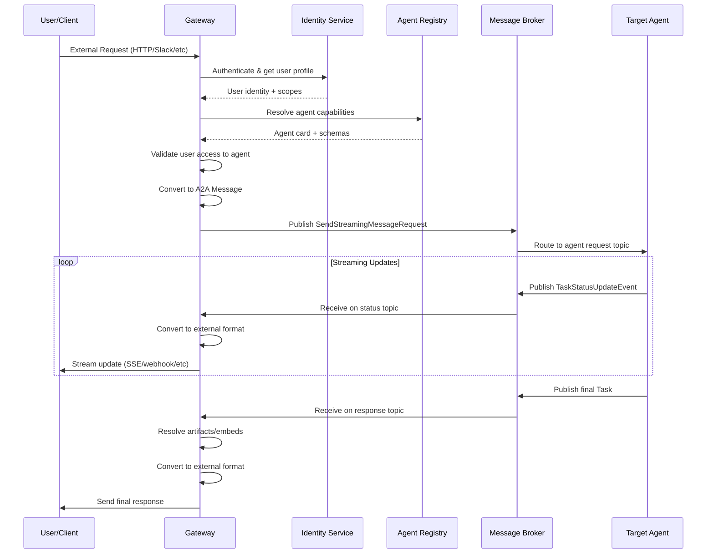

# Gateways

Gateways are the bridge between Solace Agent Mesh and external communication platforms. They translate external protocols (HTTP, Slack, Teams, etc.) into A2A (Agent-to-Agent) messages and route responses back to users.

## Gateway Architecture

All gateways extend the `BaseGatewayComponent` which provides common A2A integration:

```python
# From: src/solace_agent_mesh/gateway/base/component.py
class BaseGatewayComponent(SamComponentBase):
    """
    Abstract base class for Gateway components.

    Initializes shared services and manages the core lifecycle for processing
    A2A messages and interacting with an external communication platform.
    """
```

### Gateway Responsibilities

<Steps>
  <Step title="External Request Handling">
    Receive requests from external platforms (HTTP API, Slack messages, etc.)
  </Step>
  <Step title="Authentication & Authorization">
    Validate user identity and resolve permissions from identity services
  </Step>
  <Step title="A2A Translation">
    Convert external request format to A2A Message protocol
  </Step>
  <Step title="Agent Routing">
    Publish A2A request to target agent's topic on message broker
  </Step>
  <Step title="Response Streaming">
    Collect A2A status updates and final responses from agents
  </Step>
  <Step title="Format Translation">
    Convert A2A responses back to external platform format
  </Step>
  <Step title="Delivery">
    Send formatted response to user via external platform
  </Step>
</Steps>

## Built-in Gateway Types

### HTTP SSE Gateway

The HTTP SSE (Server-Sent Events) gateway provides a real-time web API:

```yaml http_sse_gateway.yaml
name: web_gateway
namespace: acme/ai
gateway_id: web_ui

log_level: info

server:
  host: 0.0.0.0
  port: 8080
  cors:
    enabled: true
    origins:
      - https://app.example.com
      - http://localhost:3000

identity_service:
  type: oauth2
  issuer: https://auth.example.com
  audience: agent-mesh-api

artifact_service:
  type: s3
  bucket: gateway-artifacts
  region: us-west-2

gateway_card:
  description: Web API gateway for agent mesh
  version: 1.0.0
  metadata:
    ui_url: https://app.example.com
    api_base_url: https://api.example.com

gateway_card_publishing:
  enabled: true
  interval_seconds: 30
```

**Key Features:**
- Real-time streaming via Server-Sent Events (SSE)
- Multi-session management per user
- Rich artifact handling (inline files, embeds)
- Session history and context management
- Task status tracking and cancellation

### Generic Gateway

A flexible gateway for custom integrations:

```yaml generic_gateway.yaml
name: custom_gateway
namespace: acme/ai
gateway_id: custom_platform

adapter:
  type: custom
  module: my_company.adapters.custom_platform
  config:
    api_endpoint: https://platform.example.com/api
    webhook_secret: ${PLATFORM_WEBHOOK_SECRET}
```

## Gateway Configuration

### Core Settings

<ParamField path="gateway_id" type="string" required>
  Unique identifier for this gateway instance
</ParamField>

<ParamField path="namespace" type="string" required>
  A2A namespace for message routing (e.g., "acme/ai")
</ParamField>

<ParamField path="artifact_service" type="object">
  Configuration for artifact storage (S3, GCS, Azure Blob, or filesystem)
</ParamField>

<ParamField path="enable_embed_resolution" type="boolean" default="true">
  Whether to resolve {{ARTIFACT:filename}} embeds before sending to external platform
</ParamField>

<ParamField path="gateway_max_artifact_resolve_size_bytes" type="integer" default="10485760">
  Maximum artifact size (in bytes) to resolve inline. Larger artifacts send as references.
</ParamField>

### Identity Service Integration

Gateways can integrate with various identity providers:

<Tabs>
  <Tab title="OAuth2/OIDC">
    ```yaml
    identity_service:
      type: oauth2
      issuer: https://auth.example.com
      audience: agent-mesh-api
      jwks_uri: https://auth.example.com/.well-known/jwks.json
    ```
  </Tab>
  <Tab title="Local File">
    ```yaml
    identity_service:
      type: local_file
      file_path: /config/users.json
    ```

    Example users.json:
    ```json
    {
      "users": [
        {
          "id": "user123",
          "name": "Alice Smith",
          "email": "alice@example.com",
          "scopes": ["user", "analyst"]
        }
      ]
    }
    ```
  </Tab>
  <Tab title="Custom Provider">
    ```yaml
    identity_service:
      type: custom
      module: my_company.identity.CustomIdentityService
      config:
        api_endpoint: https://identity.example.com
    ```
  </Tab>
</Tabs>

## Request Flow

Here's how a request flows through a gateway:



## Task Context Management

Gateways track task context for correlation and session management:

```python
# From: src/solace_agent_mesh/gateway/base/component.py:302-530
async def submit_a2a_task(
    self,
    target_agent_name: str,
    a2a_parts: List[ContentPart],
    external_request_context: Dict[str, Any],
    user_identity: Any,
    is_streaming: bool = True,
) -> str:
    """
    Submit a task to an agent via A2A protocol.
    
    This method:
    1. Validates user authentication
    2. Resolves user configuration (middleware)
    3. Validates agent access permissions (RBAC)
    4. Creates A2A message with metadata
    5. Publishes to agent's request topic
    6. Stores task context for response correlation
    """
    # Validate authentication
    if not isinstance(user_identity, dict) or not user_identity.get("id"):
        raise PermissionError("User not authenticated")
    
    # Validate agent access
    validate_agent_access(
        user_config=user_config,
        target_agent_name=target_agent_name,
        validation_context={
            "gateway_id": self.gateway_id,
            "source": "gateway_request",
        },
    )
    
    # Create and publish A2A request
    task_id = f"gdk-task-{uuid.uuid4().hex}"
    a2a_message = a2a.create_user_message(
        parts=a2a_parts,
        metadata={"agent_name": target_agent_name},
        context_id=a2a_session_id,
    )
    
    # Store context for response handling
    self.task_context_manager.store_context(task_id, external_request_context)
    
    return task_id
```

### Task Context Contents

<ResponseField name="task_id" type="string">
  Unique identifier for this task
</ResponseField>

<ResponseField name="a2a_session_id" type="string">
  Session ID for conversation continuity
</ResponseField>

<ResponseField name="user_identity" type="object">
  User profile from identity service
</ResponseField>

<ResponseField name="a2a_user_config" type="object">
  User-specific configuration from middleware
</ResponseField>

<ResponseField name="external_platform_data" type="object">
  Platform-specific context (channel IDs, thread IDs, etc.)
</ResponseField>

## Artifact Handling

Gateways support different artifact handling strategies:

### Inline Resolution (HTTP SSE)

Modern gateways with rich UI support can resolve artifacts inline:

```python
# Gateway with inline artifact support
class HttpSseGatewayComponent(BaseGatewayComponent):
    def __init__(self, **kwargs):
        super().__init__(
            supports_inline_artifact_resolution=True,
            filter_tool_data_parts=False,  # Show all parts in UI
            **kwargs
        )
```

When `supports_inline_artifact_resolution=True`:
- `{{ARTIFACT:filename.pdf}}` → Resolved to base64 FilePart
- Agent responses include inline files
- Frontend displays files in chat UI

### Signal-Based Resolution (Slack, Legacy)

Legacy gateways that need to upload files separately:

```python
class SlackGatewayComponent(BaseGatewayComponent):
    def __init__(self, **kwargs):
        super().__init__(
            supports_inline_artifact_resolution=False,
            filter_tool_data_parts=True,  # Hide tool internals
            **kwargs
        )
```

When `supports_inline_artifact_resolution=False`:
- `{{ARTIFACT:filename}}` → Signal event sent to gateway
- Gateway handles signal by downloading artifact
- Gateway uploads to Slack/Teams via platform API
- User sees native file attachment

From `src/solace_agent_mesh/gateway/base/component.py:656-789`:
```python
async def _handle_resolved_signals(
    self,
    external_request_context: Dict,
    signals: List[Tuple[None, str, Any]],
    original_rpc_id: Optional[str],
):
    """Handle artifact signals for legacy gateways."""
    for signal_type, signal_data in signals:
        if signal_type == "SIGNAL_ARTIFACT_RETURN":
            # Load artifact from storage
            artifact_data = await load_artifact_content_or_metadata(
                self.shared_artifact_service,
                filename=signal_data["filename"],
                version=signal_data["version"],
                load_metadata_only=False,
            )
            
            # Create FilePart for platform upload
            file_part = a2a.create_file_part_from_bytes(
                content_bytes=artifact_data["content"],
                name=filename,
                mime_type=artifact_data["metadata"]["mime_type"],
            )
            
            # Send as TaskArtifactUpdateEvent
            artifact_event = a2a.create_artifact_update(
                task_id=task_id,
                artifact=artifact,
            )
            await self._send_update_to_external(...)
```

## Embed Resolution

Gateways support recursive embed resolution for artifacts:

```markdown
# Example agent response with embeds
Here's the report:

{{ARTIFACT:report.md}}

# Inside report.md
See the data visualization:
{{ARTIFACT:chart.png}}
```

From `src/solace_agent_mesh/gateway/base/component.py:1029-1094`:
```python
async def _resolve_embeds_in_artifact_content(
    self,
    content_bytes: bytes,
    mime_type: Optional[str],
    filename: str,
    external_request_context: Dict[str, Any],
) -> bytes:
    """
    For text-based artifacts, recursively resolve late embeds.
    Handles nested {{ARTIFACT:...}} references.
    """
    if is_text_based_mime_type(mime_type):
        decoded_content = content_bytes.decode("utf-8")
        
        resolved_string = await resolve_embeds_recursively_in_string(
            text=decoded_content,
            context=embed_eval_context,
            types_to_resolve=LATE_EMBED_TYPES,
            max_depth=self.gateway_recursive_embed_depth,
        )
        
        return resolved_string.encode("utf-8")
    
    return content_bytes
```

**Configuration:**

<ParamField path="gateway_recursive_embed_depth" type="integer" default="3">
  Maximum nesting depth for recursive artifact resolution
</ParamField>

## Discovery & Agent Cards

Gateways subscribe to agent discovery to maintain an agent registry:

```python
# From: src/solace_agent_mesh/gateway/base/component.py:1180-1207
async def _handle_discovery_message(self, payload: Dict) -> bool:
    """Handle incoming agent and gateway discovery messages."""
    agent_card = AgentCard(**payload)
    
    if is_gateway_card(agent_card):
        # Track other gateways
        self.gateway_registry.add_or_update_gateway(agent_card)
    else:
        # Track agents for routing
        self.core_a2a_service.process_discovery_message(agent_card)
    
    return True
```

Gateways also publish their own gateway cards:

```python
# Gateway card with capabilities
gateway_card = {
    "name": self.gateway_id,
    "description": "Web UI Gateway",
    "version": "1.0.0",
    "extensions": {
        "gateway_type": "http_sse",
        "capabilities": [
            "streaming",
            "artifacts",
            "multi_session"
        ],
        "metadata": {
            "ui_url": "https://app.example.com",
            "api_base_url": "https://api.example.com"
        }
    }
}
```

## Message Routing

Gateways use topic-based routing for A2A messages:

### Outbound (Gateway → Agent)

```python
# Publish to agent's request topic
topic = a2a.get_agent_request_topic(namespace, agent_name)
# Example: "acme/ai/a2a/v1/agent/request/research_agent"

user_properties = {
    "clientId": gateway_id,
    "userId": user_id,
    "replyTo": a2a.get_gateway_response_topic(namespace, gateway_id, task_id),
    "a2aStatusTopic": a2a.get_gateway_status_topic(namespace, gateway_id, task_id),
}
```

### Inbound (Agent → Gateway)

Gateways subscribe to wildcard topics for responses:

```python
# Subscribe to all responses for this gateway
response_subscription = a2a.get_gateway_response_subscription_topic(
    namespace, 
    gateway_id
)
# Example: "acme/ai/a2a/v1/gateway/response/web_ui/>"

# Subscribe to all status updates for this gateway
status_subscription = a2a.get_gateway_status_subscription_topic(
    namespace,
    gateway_id  
)
# Example: "acme/ai/a2a/v1/gateway/status/web_ui/>"
```

## Error Handling

Gateways handle various error scenarios gracefully:

<AccordionGroup>
  <Accordion title="Agent Not Found">
    ```json
    {
      "error": {
        "code": -32601,
        "message": "Agent 'unknown_agent' not found in registry",
        "data": {
          "available_agents": ["research_agent", "coding_agent"]
        }
      }
    }
    ```
  </Accordion>

  <Accordion title="Authentication Failure">
    ```json
    {
      "error": {
        "code": -32600,
        "message": "Authentication required",
        "data": {
          "auth_url": "https://auth.example.com/login"
        }
      }
    }
    ```
  </Accordion>

  <Accordion title="Permission Denied">
    ```json
    {
      "error": {
        "code": -32600,
        "message": "Access denied to agent 'admin_agent'",
        "data": {
          "required_scopes": ["admin"],
          "user_scopes": ["user"]
        }
      }
    }
    ```
  </Accordion>

  <Accordion title="Task Timeout">
    ```json
    {
      "error": {
        "code": -32000,
        "message": "Task execution timeout",
        "data": {
          "task_id": "gdk-task-abc123",
          "timeout_seconds": 300
        }
      }
    }
    ```
  </Accordion>
</AccordionGroup>

## Building Custom Gateways

Create a custom gateway by extending `BaseGatewayComponent`:

```python
from solace_agent_mesh.gateway.base.component import BaseGatewayComponent

class MyCustomGateway(BaseGatewayComponent):
    def __init__(self, **kwargs):
        super().__init__(
            supports_inline_artifact_resolution=True,
            filter_tool_data_parts=False,
            **kwargs
        )
        
        # Initialize platform-specific client
        self.platform_client = MyPlatformClient(
            api_key=self.get_config("platform_api_key")
        )
    
    async def _extract_initial_claims(
        self, 
        external_event_data: Any
    ) -> Optional[Dict[str, Any]]:
        """Extract user identity from platform event."""
        # Parse platform-specific auth token
        token = external_event_data.get("auth_token")
        claims = await self.platform_client.verify_token(token)
        
        return {
            "id": claims["user_id"],
            "name": claims["name"],
            "email": claims["email"],
        }
    
    async def _send_update_to_external(
        self,
        external_request_context: Dict[str, Any],
        event_data: Any,
        is_final_chunk_of_update: bool,
    ):
        """Send A2A event back to platform."""
        # Convert A2A message to platform format
        platform_message = self._convert_to_platform_format(event_data)
        
        # Send via platform API
        channel_id = external_request_context["channel_id"]
        await self.platform_client.send_message(
            channel_id=channel_id,
            message=platform_message
        )
```

## Best Practices

<CardGroup cols={2}>
  <Card title="Session Management" icon="database">
    Use meaningful session IDs that map to platform conversation threads
  </Card>
  <Card title="Error Recovery" icon="shield">
    Implement retry logic for transient failures, with exponential backoff
  </Card>
  <Card title="Rate Limiting" icon="gauge">
    Respect platform rate limits and implement queuing if needed
  </Card>
  <Card title="Monitoring" icon="chart-line">
    Track task latency, error rates, and platform API usage
  </Card>
</CardGroup>

## Next Steps

<CardGroup cols={2}>
  <Card title="A2A Protocol" icon="network-wired" href="/core-concepts/a2a-protocol">
    Deep dive into the messaging protocol
  </Card>
  <Card title="Agents" icon="robot" href="/core-concepts/agents">
    Learn how to build intelligent agents
  </Card>
</CardGroup>