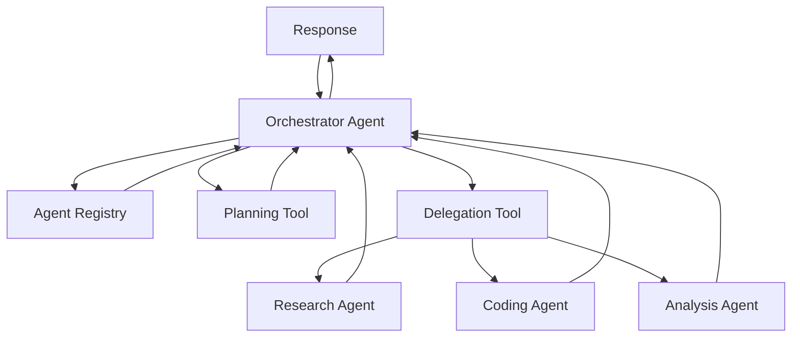
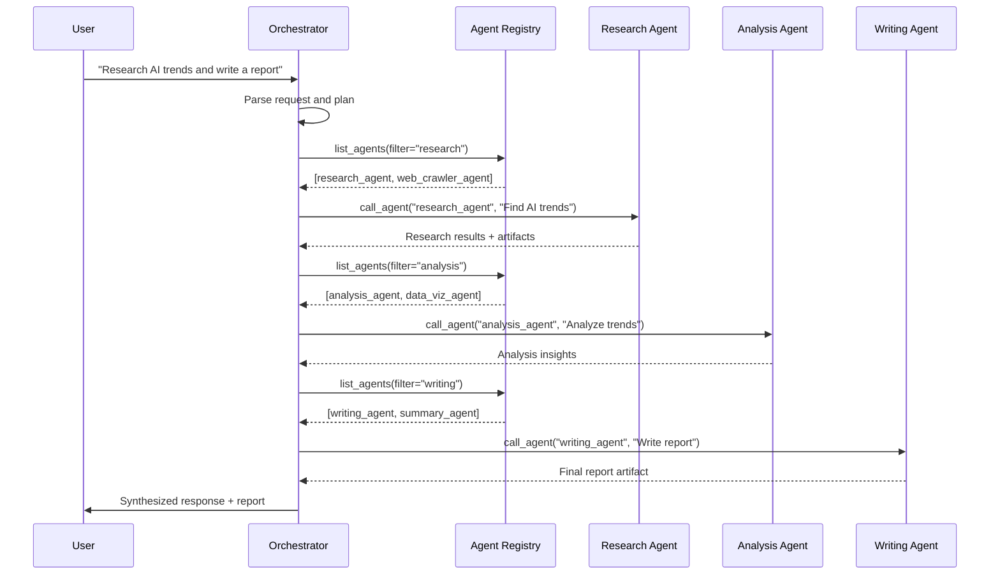

# Orchestrator

The Orchestrator is a specialized agent that provides centralized coordination, intelligent routing, and execution planning for complex multi-agent workflows. It acts as a traffic controller, analyzing user requests and delegating work to the most appropriate agents.

<Note>
  The Orchestrator complements [Workflows](/core-concepts/workflows) by providing dynamic, LLM-driven routing as opposed to static DAG-based orchestration.
</Note>

## When to Use the Orchestrator

Choose the Orchestrator for:

<CardGroup cols={2}>
  <Card title="Dynamic Routing" icon="route">
    When the sequence of agents needed depends on request content and cannot be predetermined
  </Card>
  <Card title="Adaptive Planning" icon="brain">
    When the LLM needs to decide which agents to call based on intermediate results
  </Card>
  <Card title="Conversational Flow" icon="comments">
    When users might change direction mid-conversation, requiring flexible orchestration
  </Card>
  <Card title="Agent Discovery" icon="magnifying-glass">
    When you want automatic selection from available agents based on capabilities
  </Card>
</CardGroup>

Choose [Workflows](/core-concepts/workflows) for:
- Deterministic, repeatable processes
- Complex control flow (loops, conditionals, maps)
- Guaranteed execution order
- Compliance and audit requirements

## Architecture

The Orchestrator is implemented as a standard agent with specialized tools:



### Core Components

<Steps>
  <Step title="Agent Registry Access">
    The Orchestrator subscribes to agent discovery and maintains an up-to-date registry of available agents and their capabilities
  </Step>
  <Step title="Capability Matching">
    Uses agent cards (schemas, skills, descriptions) to match user requests to appropriate agents
  </Step>
  <Step title="Delegation Tools">
    Built-in MCP tools allow the LLM to invoke other agents via A2A protocol
  </Step>
  <Step title="Result Synthesis">
    Aggregates responses from multiple agents into coherent final answer
  </Step>
</Steps>

## Configuration

### Basic Orchestrator Setup

```yaml orchestrator.yaml
name: orchestrator
namespace: acme/ai

log_level: info

model:
  model: anthropic/claude-4.5-sonnet
  max_output_tokens: 16384
  temperature: 0.3  # Lower temperature for more deterministic routing

instruction: |
  You are an intelligent orchestrator that coordinates multiple specialized agents.
  
  Your role:
  1. Analyze user requests to understand intent and requirements
  2. Identify which agents are needed based on their capabilities
  3. Plan the sequence of agent calls to fulfill the request
  4. Delegate subtasks to appropriate agents via agent_call tool
  5. Synthesize responses from multiple agents into coherent answers
  6. Handle errors and retry with alternative agents if needed
  
  Available agents are discovered automatically via the agent registry.
  Use the list_agents tool to see current capabilities.
  
  Always explain your routing decisions to the user.

tools:
  # Agent delegation tool
  - type: mcp
    name: agent_mesh_tools
    command: python
    args:
      - -m
      - solace_agent_mesh.tools.orchestrator_mcp
    env:
      AGENT_REGISTRY_CONFIG: /config/agent_registry.json

session_db:
  type: postgres
  connection_string: ${DATABASE_URL}

artifact_service:
  type: s3
  bucket: orchestrator-artifacts

agent_card:
  description: Intelligent orchestrator for multi-agent coordination
  version: 1.0.0
  skills:
    - name: orchestrate
      description: Coordinate multiple agents to fulfill complex requests
      input_schema:
        type: object
        properties:
          request:
            type: string
            description: User request to orchestrate
```

### Orchestrator Tools

The Orchestrator uses specialized MCP tools for agent coordination:

#### list_agents

Query the agent registry to discover available agents:

```json
{
  "name": "list_agents",
  "description": "List available agents and their capabilities",
  "inputSchema": {
    "type": "object",
    "properties": {
      "filter": {
        "type": "string",
        "description": "Filter agents by capability keywords"
      }
    }
  }
}
```

Example usage:
```json
// Tool call
{
  "name": "list_agents",
  "arguments": {
    "filter": "web search"
  }
}

// Tool result
{
  "agents": [
    {
      "name": "research_agent",
      "description": "Research assistant with web search",
      "skills": [
        {
          "name": "web_search",
          "description": "Search the web for information"
        }
      ]
    }
  ]
}
```

#### call_agent

Delegate a subtask to another agent:

```json
{
  "name": "call_agent",
  "description": "Call another agent to perform a subtask",
  "inputSchema": {
    "type": "object",
    "properties": {
      "agent_name": {
        "type": "string",
        "description": "Name of the agent to call"
      },
      "message": {
        "type": "string",
        "description": "Task description for the agent"
      },
      "context": {
        "type": "object",
        "description": "Additional context or artifacts to pass"
      }
    },
    "required": ["agent_name", "message"]
  }
}
```

Example orchestration:
```json
// Step 1: Research
{
  "name": "call_agent",
  "arguments": {
    "agent_name": "research_agent",
    "message": "Find the latest information about AI agent frameworks"
  }
}

// Step 2: Analysis (using research results)
{
  "name": "call_agent",
  "arguments": {
    "agent_name": "analysis_agent",
    "message": "Analyze the following research findings and identify trends",
    "context": {
      "research_results": "{{previous_result}}"
    }
  }
}

// Step 3: Visualization
{
  "name": "call_agent",
  "arguments": {
    "agent_name": "visualization_agent",
    "message": "Create a comparison chart of the agent frameworks",
    "context": {
      "data": "{{analysis_result}}"
    }
  }
}
```

## Execution Flow

Here's how the Orchestrator handles a complex request:



### Orchestration Patterns

<AccordionGroup>
  <Accordion title="Sequential Delegation">
    Call agents one after another, passing results forward:

    ```
    User Request
      ↓
    Research Agent → results
      ↓
    Analysis Agent → insights (using results)
      ↓
    Writing Agent → report (using insights)
      ↓
    Final Response
    ```

    **Use when:** Tasks have clear dependencies and must run in order
  </Accordion>

  <Accordion title="Parallel Delegation">
    Call multiple agents concurrently for independent tasks:

    ```
    User Request
      ↓
    ┌─────────┬─────────┬─────────┐
    │ Agent 1 │ Agent 2 │ Agent 3 │ (parallel)
    └─────────┴─────────┴─────────┘
      ↓         ↓         ↓
    Synthesis Agent
      ↓
    Final Response
    ```

    **Use when:** Subtasks are independent and can run concurrently
  </Accordion>

  <Accordion title="Conditional Routing">
    Choose agents dynamically based on intermediate results:

    ```
    User Request
      ↓
    Classifier Agent
      ↓
    ┌─────────────┬─────────────┐
    │ Category A  │ Category B  │
    ├─────────────┼─────────────┤
    │ Specialist  │ Specialist  │
    │ Agent A     │ Agent B     │
    └─────────────┴─────────────┘
      ↓
    Final Response
    ```

    **Use when:** Route depends on request analysis or classification
  </Accordion>

  <Accordion title="Iterative Refinement">
    Loop with an agent until quality threshold met:

    ```
    User Request
      ↓
    Generator Agent → draft
      ↓
    Critic Agent → feedback
      ↓
    ┌─────────────────────┐
    │ If not acceptable   │
    │   └→ Generator (retry)
    └─────────────────────┘
      ↓
    Final Response
    ```

    **Use when:** Output requires iterative improvement
  </Accordion>
</AccordionGroup>

## Agent Registry Integration

The Orchestrator maintains an active agent registry through discovery:

```python
# Orchestrator subscribes to agent discovery
subscriptions = [
    {"topic": a2a.get_discovery_subscription_topic(namespace)}
]

# When agent cards are received:
def process_agent_card(agent_card: AgentCard):
    """
    Store agent metadata for routing decisions:
    - Agent name and description
    - Skills and capabilities (input/output schemas)
    - Required scopes for access control
    - Version and availability status
    """
    agent_registry.add_or_update_agent(agent_card)
```

### Agent Card Schema

Agents advertise capabilities via agent cards:

```json
{
  "name": "data_analysis_agent",
  "description": "Performs statistical analysis on datasets",
  "version": "2.1.0",
  "skills": [
    {
      "name": "analyze_csv",
      "description": "Analyze CSV data and generate insights",
      "input_schema": {
        "type": "object",
        "properties": {
          "csv_file": {
            "type": "string",
            "description": "Artifact reference to CSV file"
          },
          "analysis_type": {
            "type": "string",
            "enum": ["descriptive", "correlation", "regression"]
          }
        },
        "required": ["csv_file"]
      },
      "output_schema": {
        "type": "object",
        "properties": {
          "insights": {"type": "string"},
          "visualizations": {
            "type": "array",
            "items": {"type": "string"}
          }
        }
      }
    }
  ],
  "extensions": {
    "required_scopes": ["data_access"],
    "max_concurrent_tasks": 5
  }
}
```

The Orchestrator uses this metadata to:
- Match user intent to agent capabilities
- Validate input/output compatibility between agents
- Check permission requirements
- Provide intelligent suggestions to users

## Error Handling & Recovery

The Orchestrator implements robust error handling:

### Agent Failure Recovery

```yaml
instruction: |
  Error handling guidelines:
  
  1. If an agent call fails:
     - Check the error message for actionable issues
     - Consider calling an alternative agent with similar capabilities
     - Break down the task into smaller pieces if too complex
     
  2. If an agent is unavailable:
     - Use list_agents to find alternatives
     - Explain the situation to the user
     - Offer to proceed with available agents or wait
     
  3. If agent output is incomplete or malformed:
     - Retry the same agent with more specific instructions
     - Use a validation agent to check quality
     - Fall back to a simpler approach if needed
```

### Timeout Handling

Orchestrator can set timeouts for agent calls:

```json
{
  "name": "call_agent",
  "arguments": {
    "agent_name": "slow_research_agent",
    "message": "Deep research on topic",
    "timeout_seconds": 120
  }
}
```

If timeout exceeded:
- Orchestrator receives timeout error
- Can decide to retry, use partial results, or switch agents
- Notifies user about delays

## Advanced Features

### Context Propagation

Pass artifacts and context between agents:

```json
// First agent creates artifact
{
  "name": "call_agent",
  "arguments": {
    "agent_name": "data_collector",
    "message": "Collect sales data for Q4"
  }
}
// Returns: {"artifact_ref": "sales_data_q4.csv"}

// Second agent uses artifact
{
  "name": "call_agent",
  "arguments": {
    "agent_name": "data_analysis_agent",
    "message": "Analyze the sales data",
    "context": {
      "input_file": "{{ARTIFACT:sales_data_q4.csv}}"
    }
  }
}
```

### User Interaction

Orchestrator can ask for user input during execution:

```markdown
I've found three potential approaches:

1. Use the research agent for web search (faster, less comprehensive)
2. Use the academic agent for scholarly sources (slower, more authoritative)
3. Use both in parallel and combine results

Which would you prefer?
```

User's choice influences subsequent routing decisions.

### Cost Optimization

Orchestrator can optimize for cost:

```yaml
instruction: |
  Cost-aware routing:
  - Prefer smaller/faster models for simple tasks
  - Use expensive models only when quality is critical
  - Consider caching results for similar requests
  - Batch requests when possible to reduce overhead
```

## Monitoring & Observability

Track Orchestrator performance:

<CardGroup cols={2}>
  <Card title="Agent Call Metrics" icon="chart-line">
    - Number of agent invocations per request
    - Success/failure rates by agent
    - Average latency per agent
    - Cost per orchestration session
  </Card>
  <Card title="Routing Analytics" icon="route">
    - Most frequently called agent combinations
    - Common routing patterns
    - Failed routing attempts
    - User satisfaction by routing strategy
  </Card>
</CardGroup>

### Logging Best Practices

Structured logging for orchestration decisions:

```python
log.info(
    "Orchestration plan",
    extra={
        "user_request": user_message,
        "planned_agents": ["research_agent", "analysis_agent"],
        "estimated_steps": 3,
        "session_id": session_id,
    }
)

log.info(
    "Agent call result",
    extra={
        "agent_name": "research_agent",
        "status": "success",
        "latency_ms": 2341,
        "artifact_count": 2,
    }
)
```

## Orchestrator vs Workflow Comparison

| Feature | Orchestrator | Workflow |
|---------|-------------|----------|
| **Routing Logic** | Dynamic (LLM-driven) | Static (predefined DAG) |
| **Flexibility** | Adapts to request content | Fixed structure |
| **Predictability** | Variable execution path | Deterministic |
| **Complexity** | Simpler config, complex behavior | Complex config, predictable |
| **Use Case** | Conversational, exploratory | Production, compliance |
| **Error Recovery** | LLM decides strategy | Predefined retry policies |
| **Cost** | Variable (LLM calls) | Fixed (DAG execution) |
| **Control Flow** | Inferred by LLM | Explicit (loops, branches) |

## Best Practices

<AccordionGroup>
  <Accordion title="Clear Agent Descriptions">
    Ensure all agents have:
    - Precise capability descriptions
    - Well-defined input/output schemas
    - Example use cases in agent card
    - Clear scope boundaries

    This helps the Orchestrator make accurate routing decisions.
  </Accordion>

  <Accordion title="Orchestrator Instruction Design">
    - Provide explicit routing guidelines
    - Include examples of successful orchestrations
    - Define fallback strategies for failures
    - Set clear quality criteria for results
  </Accordion>

  <Accordion title="Testing Routing Logic">
    Test orchestration with:
    - Simple single-agent requests
    - Complex multi-agent workflows
    - Edge cases (missing agents, timeouts)
    - User clarification scenarios
    - Performance under load
  </Accordion>

  <Accordion title="Performance Optimization">
    - Use agent capability caching
    - Implement request deduplication
    - Set appropriate timeouts
    - Monitor and optimize slow paths
    - Consider parallel execution where safe
  </Accordion>
</AccordionGroup>

## Limitations & Considerations

<Warning>
  **Key Limitations:**
  
  - **Non-determinism**: Same request may use different agents on retry
  - **LLM Costs**: Each routing decision consumes LLM tokens
  - **Latency**: Sequential LLM calls add overhead
  - **Debugging**: Dynamic routing harder to debug than static workflows
</Warning>

**When NOT to use Orchestrator:**
- Regulatory compliance requiring audit trails
- Real-time systems needing predictable latency
- High-volume batch processing
- Simple linear workflows with known steps

## Next Steps

<CardGroup cols={2}>
  <Card title="Workflows" icon="diagram-project" href="/core-concepts/workflows">
    Learn about static DAG-based orchestration
  </Card>
  <Card title="A2A Protocol" icon="network-wired" href="/core-concepts/a2a-protocol">
    Deep dive into agent communication
  </Card>
  <Card title="Agents" icon="robot" href="/core-concepts/agents">
    Build specialized agents for orchestration
  </Card>
  <Card title="Agent Cards" icon="id-card" href="/guides/agent-cards">
    Design effective capability advertisements
  </Card>
</CardGroup>