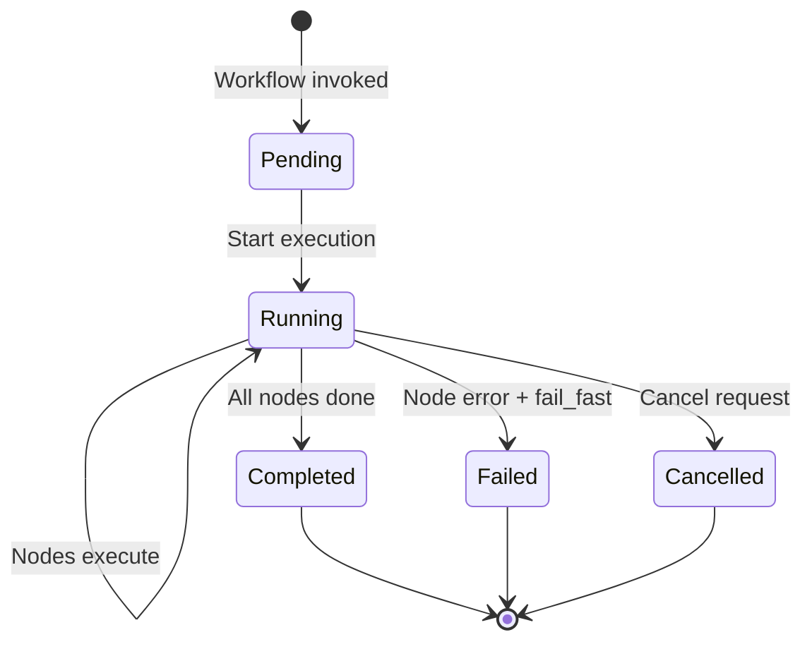

# Workflows

Workflows in Solace Agent Mesh provide **prescriptive orchestration** for multi-agent systems. Unlike the dynamic [Orchestrator](/core-concepts/orchestrator), workflows define deterministic execution graphs that guarantee consistent behavior, proper error handling, and full auditability.

## Workflow Fundamentals

A workflow is a **Directed Acyclic Graph (DAG)** of nodes where:

- **Nodes** represent operations (agent calls, conditional branches, loops)
- **Edges** define dependencies and execution order
- **Data flows** from node outputs to node inputs via template expressions

```yaml workflow_example.yaml
name: research_and_report_workflow
namespace: acme/ai

workflow:
  description: Research a topic and generate a comprehensive report
  version: 1.0.0
  
  nodes:
    - id: research
      type: agent
      agent_name: research_agent
      input:
        query: "{{workflow.input.topic}}"
    
    - id: analyze
      type: agent
      agent_name: analysis_agent
      depends_on: [research]
      input:
        data: "{{research.output.findings}}"
    
    - id: write_report
      type: agent
      agent_name: writing_agent
      depends_on: [analyze]
      input:
        content: "{{analyze.output.insights}}"
        format: "markdown"
  
  output_mapping:
    report: "{{write_report.output.document}}"
```

## Workflow Architecture

Workflows are implemented as special agents that register in the mesh:

```python
# From: src/solace_agent_mesh/workflow/app.py:592-687
class WorkflowApp(App):
    """
    Custom App class for workflow orchestration.
    
    Workflows register as agents on the mesh, allowing:
    - Gateway invocation (users can call workflows directly)
    - Agent-to-agent calls (workflows can invoke other workflows)
    - Discovery via agent cards
    - Standard A2A message handling
    """
    
    def __init__(self, app_info: Dict[str, Any], **kwargs):
        # Validate workflow definition
        app_config = WorkflowAppConfig.model_validate_and_clean(
            app_info.get("app_config", {})
        )
        
        # Generate A2A subscriptions
        subscriptions = self._generate_subscriptions(
            namespace, 
            workflow_name
        )
```

### Key Components

<CardGroup cols={2}>
  <Card title="DAG Executor" icon="gears">
    Manages node execution order, dependency resolution, and parallel execution
  </Card>
  <Card title="Agent Caller" icon="phone">
    Handles agent invocations via A2A protocol with result tracking
  </Card>
  <Card title="Workflow State" icon="database">
    Tracks execution progress, node outputs, and control flow state
  </Card>
  <Card title="Event Publisher" icon="broadcast-tower">
    Streams execution events for monitoring and visualization
  </Card>
</CardGroup>

## Node Types

### Agent Node

Call another agent to perform work:

```yaml
- id: sentiment_analysis
  type: agent
  agent_name: nlp_agent
  depends_on: [data_collection]
  input:
    text: "{{data_collection.output.reviews}}"
    analysis_type: "sentiment"
  instruction: |
    Analyze customer sentiment from the provided reviews.
    Focus on overall tone and key themes.
  timeout: 2m
  retry_strategy:
    limit: 3
    retry_policy: OnFailure
    backoff:
      duration: 5s
      factor: 2.0
```

<ParamField path="agent_name" type="string" required>
  Name of the agent to invoke
</ParamField>

<ParamField path="input" type="object">
  Input mapping (supports template expressions)
</ParamField>

<ParamField path="instruction" type="string">
  Optional guidance text sent to the agent (supports templates)
</ParamField>

<ParamField path="when" type="string">
  Conditional execution clause (Argo-style). Node skips if false.
</ParamField>

<ParamField path="timeout" type="string">
  Node-specific timeout (e.g., "30s", "5m", "1h")
</ParamField>

<ParamField path="retry_strategy" type="object">
  Retry configuration for this node
</ParamField>

### Switch Node

Multi-way conditional branching:

```yaml
- id: route_by_category
  type: switch
  depends_on: [classify]
  cases:
    - condition: "{{classify.output.category}} == 'technical'"
      node: technical_specialist
    - condition: "{{classify.output.category}} == 'billing'"
      node: billing_specialist
    - condition: "{{classify.output.category}} == 'sales'"
      node: sales_specialist
  default: general_support

- id: technical_specialist
  type: agent
  agent_name: tech_support_agent
  depends_on: [route_by_category]
  # ... agent config

- id: billing_specialist
  type: agent
  agent_name: billing_agent
  depends_on: [route_by_category]
  # ... agent config
```

<Note>
  Switch nodes evaluate cases in order. First matching condition wins. Non-selected branches are automatically skipped.
</Note>

### Loop Node

Repeat a node while a condition is true:

```yaml
- id: poll_until_ready
  type: loop
  depends_on: [start_job]
  condition: "{{check_status.output.state}} != 'completed'"
  max_iterations: 20
  delay: 10s
  node: check_status

- id: check_status
  type: agent
  agent_name: status_checker
  depends_on: [poll_until_ready]
  input:
    job_id: "{{start_job.output.job_id}}"
```

From `src/solace_agent_mesh/workflow/dag_executor.py:633-767`:
```python
async def _execute_loop_node(
    self,
    node: LoopNode,
    workflow_state: WorkflowExecutionState,
    workflow_context: WorkflowExecutionContext,
):
    """
    Execute loop node for while-loop iteration.
    
    On first iteration (iteration=0), always runs (do-while behavior).
    Then checks condition before subsequent iterations.
    """
    iteration = workflow_state.loop_iterations.get(node.id, 0)
    
    # Check max iterations
    if iteration >= node.max_iterations:
        workflow_state.completed_nodes[node.id] = "loop_max_iterations"
        return
    
    # Evaluate condition (skip on first iteration)
    if iteration > 0:
        should_continue = evaluate_condition(
            node.condition, 
            workflow_state
        )
        if not should_continue:
            workflow_state.completed_nodes[node.id] = "loop_condition_false"
            return
    
    # Apply delay between iterations
    if node.delay and iteration > 0:
        await asyncio.sleep(parse_duration(node.delay))
    
    # Execute inner node
    await self._execute_agent_node(inner_node, ...)
```

<Warning>
  Loop nodes have a `max_iterations` safety limit (default: 100). Set this appropriately for your use case.
</Warning>

### Map Node

Parallel iteration over a collection:

```yaml
- id: process_all_files
  type: map
  depends_on: [list_files]
  items: "{{list_files.output.files}}"  # Array of filenames
  node: process_single_file
  max_items: 50
  concurrency_limit: 5

- id: process_single_file
  type: agent
  agent_name: file_processor
  depends_on: [process_all_files]
  input:
    filename: "{{_map_item}}"
    index: "{{_map_index}}"
```

**Special variables:**
- `{{_map_item}}`: Current item from the array
- `{{_map_index}}`: Zero-based index of current item

**Argo-compatible aliases:**
```yaml
# SAM syntax
items: "{{previous_node.output.array}}"

# Argo syntax (also supported)
withParam: "{{previous_node.output.array}}"
# OR
withItems:
  - item1
  - item2
  - item3
```

### Workflow Node

Call another workflow as a sub-workflow:

```yaml
- id: run_analysis_workflow
  type: workflow
  workflow_name: data_analysis_workflow
  depends_on: [data_prep]
  input:
    dataset: "{{data_prep.output.cleaned_data}}"
    parameters:
      method: "regression"
  timeout: 10m
```

<Note>
  Workflows can nest up to `max_call_depth` levels (default: 10) to prevent infinite recursion.
</Note>

## Template Expressions

Workflows use double-brace syntax for dynamic values:

### Workflow Input

```yaml
workflow:
  input_schema:
    type: object
    properties:
      topic:
        type: string
      language:
        type: string
        default: "en"

nodes:
  - id: research
    type: agent
    agent_name: research_agent
    input:
      query: "{{workflow.input.topic}}"
      lang: "{{workflow.input.language}}"
```

### Node Output References

```yaml
- id: analyze
  type: agent
  agent_name: analyzer
  input:
    # Reference previous node's output
    data: "{{research.output.findings}}"
    # Navigate nested fields
    confidence: "{{research.output.metadata.confidence}}"
```

### Operators

**Coalesce** (first non-null value):
```yaml
input:
  value:
    coalesce:
      - "{{optional_node.output.value}}"
      - "{{fallback_node.output.value}}"
      - "default_value"
```

**Concat** (string concatenation):
```yaml
input:
  message:
    concat:
      - "Analysis for "
      - "{{workflow.input.topic}}"
      - ": "
      - "{{summary.output.text}}"
```

### Argo-Compatible Aliases

For Argo Workflows users, SAM supports familiar syntax:

```yaml
# Argo syntax
workflow:
  parameters:  # SAM: input
    - name: topic
      value: "AI agents"

nodes:
  - id: research
    type: agent
    agent_name: research_agent
    arguments:  # SAM: input
      query: "{{workflow.parameters.topic}}"  # SAM: workflow.input.topic
```

From `src/solace_agent_mesh/workflow/flow_control/conditional.py`:
```python
def _apply_template_aliases(template: str) -> str:
    """
    Apply Argo-compatible template aliases.
    
    Transformations:
    - {{item}} → {{_map_item}}
    - {{workflow.parameters.x}} → {{workflow.input.x}}
    """
    # Map item alias
    if template == "{{item}}":
        return "{{_map_item}}"
    
    # Workflow parameters → input
    template = template.replace(
        "{{workflow.parameters.", 
        "{{workflow.input."
    )
    
    return template
```

## Control Flow

### Conditional Execution

Use `when` clauses for conditional nodes:

```yaml
- id: high_priority_handler
  type: agent
  agent_name: priority_agent
  when: "{{classify.output.priority}} == 'high'"
  depends_on: [classify]
  input:
    request: "{{workflow.input.request}}"
```

Supported operators:
- `==`, `!=`: Equality
- `>`, `<`, `>=`, `<=`: Comparison
- `and`, `or`, `not`: Boolean logic
- `in`: Membership (e.g., `{{value}} in ['a', 'b']`)

### Parallel Execution

Nodes with no dependency on each other run in parallel:

```yaml
nodes:
  # These three nodes run in parallel
  - id: web_search
    type: agent
    agent_name: search_agent
    depends_on: [start]
  
  - id: database_query
    type: agent
    agent_name: db_agent
    depends_on: [start]
  
  - id: api_call
    type: agent
    agent_name: api_agent
    depends_on: [start]
  
  # This node waits for all three to complete
  - id: synthesis
    type: agent
    agent_name: synthesis_agent
    depends_on: [web_search, database_query, api_call]
```

From `src/solace_agent_mesh/workflow/dag_executor.py:266-300`:
```python
# Multiple nodes ready = implicit parallel execution
if len(next_nodes) > 1:
    parallel_group_id = f"implicit_parallel_{uuid.uuid4().hex[:8]}"
    
    # Assign each node to separate branch
    for branch_idx, node_id in enumerate(next_nodes):
        node_parallel_info[node_id] = (parallel_group_id, branch_idx)
        workflow_state.parallel_branch_assignments[parallel_group_id][node_id] = branch_idx
    
    log.info(
        f"Implicit parallel execution: {len(next_nodes)} nodes, "
        f"group={parallel_group_id}"
    )

# Execute all ready nodes
for node_id in next_nodes:
    await self.execute_node(node_id, workflow_state, workflow_context)
```

### Error Handling

**Retry Strategy:**
```yaml
workflow:
  # Default retry for all nodes
  retry_strategy:
    limit: 3
    retry_policy: OnFailure
    backoff:
      duration: 1s
      factor: 2.0
      max_duration: 30s

nodes:
  - id: flaky_api_call
    type: agent
    agent_name: api_agent
    # Override with node-specific retry
    retry_strategy:
      limit: 5
      retry_policy: Always
```

<ParamField path="limit" type="integer" default="3">
  Maximum retry attempts
</ParamField>

<ParamField path="retry_policy" type="enum" default="OnFailure">
  When to retry: `Always`, `OnFailure`, `OnError`
</ParamField>

<ParamField path="backoff" type="object">
  Exponential backoff configuration
</ParamField>

**Fail Fast:**
```yaml
workflow:
  fail_fast: true  # Stop scheduling new nodes on first failure (default)
  # OR
  fail_fast: false  # Continue running independent nodes after failure
```

### Exit Handlers

Run cleanup or notification logic on workflow completion:

```yaml
workflow:
  on_exit:
    always: cleanup_node
    on_success: success_notification
    on_failure: error_notification
    on_cancel: cancel_notification

nodes:
  # ... main workflow nodes ...
  
  - id: cleanup_node
    type: agent
    agent_name: cleanup_agent
    input:
      session_id: "{{workflow.input.session_id}}"
  
  - id: success_notification
    type: agent
    agent_name: notifier
    input:
      message: "Workflow completed successfully"
  
  - id: error_notification
    type: agent
    agent_name: notifier
    input:
      message: "Workflow failed: {{workflow.error.message}}"
```

## Workflow Execution

### Lifecycle States



### Execution Context

From `src/solace_agent_mesh/workflow/workflow_execution_context.py`:
```python
class WorkflowExecutionState(BaseModel):
    """Tracks workflow execution progress."""
    
    execution_id: str  # Unique workflow run ID
    
    # Node tracking
    completed_nodes: Dict[str, Any] = {}  # node_id → result
    pending_nodes: List[str] = []         # Currently executing
    skipped_nodes: Dict[str, str] = {}    # Skipped due to conditionals
    
    # Data flow
    node_outputs: Dict[str, Dict] = {}    # Cached outputs for templates
    
    # Control flow state
    loop_iterations: Dict[str, int] = {}  # Loop counters
    active_branches: Dict[str, List] = {} # Fork/Map tracking
    parallel_branch_assignments: Dict = {}
    
    # Error tracking
    error_state: Optional[Dict] = None
    
    # Extensible metadata
    metadata: Dict[str, Any] = {}
```

### Event Streaming

Workflows publish execution events for monitoring:

**Node Start:**
```json
{
  "type": "workflow_node_execution_start",
  "node_id": "research",
  "node_type": "agent",
  "agent_name": "research_agent",
  "sub_task_id": "wf_exec123_research_xyz",
  "timestamp": "2026-03-04T10:15:30Z"
}
```

**Node Result:**
```json
{
  "type": "workflow_node_execution_result",
  "node_id": "research",
  "status": "success",
  "output_artifact_ref": {
    "name": "research_findings.json",
    "version": 1
  },
  "timestamp": "2026-03-04T10:16:45Z"
}
```

**Map Progress:**
```json
{
  "type": "workflow_map_progress",
  "node_id": "process_all_files",
  "total_items": 20,
  "completed_items": 8,
  "status": "in-progress"
}
```

## Complete Example

Here's a full workflow for research, analysis, and reporting:

```yaml complete_workflow.yaml
name: comprehensive_research_workflow
namespace: acme/ai

log_level: info

workflow:
  description: |
    Multi-stage research workflow:
    1. Gather information from multiple sources
    2. Analyze and synthesize findings
    3. Generate comprehensive report
  
  version: 2.1.0
  
  input_schema:
    type: object
    properties:
      topic:
        type: string
        description: Research topic
      depth:
        type: string
        enum: ["basic", "comprehensive"]
        default: "basic"
      format:
        type: string
        enum: ["markdown", "pdf", "html"]
        default: "markdown"
    required: ["topic"]
  
  output_schema:
    type: object
    properties:
      report:
        type: string
        description: Final report artifact reference
      metadata:
        type: object
  
  nodes:
    # Parallel research from multiple sources
    - id: web_research
      type: agent
      agent_name: web_research_agent
      input:
        query: "{{workflow.input.topic}}"
        max_results: 20
      timeout: 3m
    
    - id: academic_research
      type: agent
      agent_name: academic_agent
      when: "{{workflow.input.depth}} == 'comprehensive'"
      input:
        query: "{{workflow.input.topic}}"
        databases: ["arxiv", "pubmed"]
      timeout: 5m
    
    - id: database_query
      type: agent
      agent_name: internal_db_agent
      input:
        topic: "{{workflow.input.topic}}"
    
    # Synthesize research findings
    - id: synthesize
      type: agent
      agent_name: synthesis_agent
      depends_on: [web_research, academic_research, database_query]
      input:
        sources:
          web: "{{web_research.output.findings}}"
          academic:
            coalesce:
              - "{{academic_research.output.papers}}"
              - []
          internal: "{{database_query.output.results}}"
    
    # Quality check
    - id: quality_check
      type: agent
      agent_name: qa_agent
      depends_on: [synthesize]
      input:
        content: "{{synthesize.output.synthesis}}"
    
    # Conditional re-synthesis if quality low
    - id: needs_improvement
      type: switch
      depends_on: [quality_check]
      cases:
        - condition: "{{quality_check.output.score}} < 0.7"
          node: improve_synthesis
      default: generate_report
    
    - id: improve_synthesis
      type: agent
      agent_name: synthesis_agent
      depends_on: [needs_improvement]
      input:
        sources: "{{synthesize.output.sources}}"
        feedback: "{{quality_check.output.feedback}}"
        previous_attempt: "{{synthesize.output.synthesis}}"
    
    # Generate final report
    - id: generate_report
      type: agent
      agent_name: report_generator
      depends_on: [needs_improvement]
      input:
        content:
          coalesce:
            - "{{improve_synthesis.output.synthesis}}"
            - "{{synthesize.output.synthesis}}"
        format: "{{workflow.input.format}}"
        topic: "{{workflow.input.topic}}"
    
    # Generate visualizations in parallel
    - id: create_charts
      type: agent
      agent_name: visualization_agent
      depends_on: [generate_report]
      input:
        data: "{{generate_report.output.data_points}}"
    
    - id: create_summary
      type: agent
      agent_name: summarization_agent
      depends_on: [generate_report]
      input:
        full_report: "{{generate_report.output.report}}"
        max_length: 500
    
    # Final assembly
    - id: assemble_final
      type: agent
      agent_name: document_assembler
      depends_on: [create_charts, create_summary]
      input:
        report: "{{generate_report.output.report}}"
        charts: "{{create_charts.output.visualizations}}"
        summary: "{{create_summary.output.summary}}"
  
  output_mapping:
    report: "{{assemble_final.output.final_document}}"
    metadata:
      sources_count:
        coalesce:
          - "{{academic_research.output.count}}"
          - 0
      quality_score: "{{quality_check.output.score}}"
      generated_at: "{{assemble_final.output.timestamp}}"
  
  # Workflow-level configuration
  fail_fast: true
  max_call_depth: 5
  
  retry_strategy:
    limit: 2
    retry_policy: OnFailure
    backoff:
      duration: 10s
      factor: 2.0
  
  on_exit:
    always: cleanup
    on_failure: error_notification

session_db:
  type: postgres
  connection_string: ${DATABASE_URL}

artifact_service:
  type: s3
  bucket: workflow-artifacts

max_workflow_execution_time_seconds: 1800
default_node_timeout_seconds: 300
```

## Best Practices

<AccordionGroup>
  <Accordion title="Design for Idempotency">
    - Agent operations should be idempotent where possible
    - Use artifact versioning for reproducibility
    - Store intermediate results for retry recovery
    - Avoid side effects in conditional expressions
  </Accordion>

  <Accordion title="Error Handling Strategy">
    - Set appropriate timeouts for each node type
    - Use retry strategies judiciously (avoid on non-transient errors)
    - Implement exit handlers for cleanup
    - Log detailed error context for debugging
  </Accordion>

  <Accordion title="Performance Optimization">
    - Maximize parallel execution (minimize dependencies)
    - Use `concurrency_limit` on map nodes to avoid overload
    - Set realistic timeouts (too short = false failures)
    - Cache expensive computations in artifacts
  </Accordion>

  <Accordion title="Testing Workflows">
    - Test individual agent nodes in isolation first
    - Use mock agents for integration testing
    - Test edge cases (empty arrays, null values)
    - Validate conditional branches and loops
    - Test cancellation and timeout scenarios
  </Accordion>
</AccordionGroup>

## Workflow vs Orchestrator

Choose **Workflows** when you need:
- Deterministic, repeatable execution
- Complex control flow (loops, conditionals, maps)
- Guaranteed execution order
- Audit trails for compliance
- Performance-critical operations

Choose **Orchestrator** when you need:
- Dynamic routing based on content
- LLM-driven decision making
- Conversational adaptability
- Exploratory or research tasks

See the [Orchestrator comparison table](/core-concepts/orchestrator#orchestrator-vs-workflow-comparison) for detailed differences.

## Next Steps

<CardGroup cols={2}>
  <Card title="Orchestrator" icon="traffic-light" href="/core-concepts/orchestrator">
    Learn about dynamic LLM-driven orchestration
  </Card>
  <Card title="Agents" icon="robot" href="/core-concepts/agents">
    Build agents for use in workflows
  </Card>
  <Card title="A2A Protocol" icon="network-wired" href="/core-concepts/a2a-protocol">
    Understand agent communication
  </Card>
  <Card title="Deployment" icon="rocket" href="/deployment/workflows">
    Deploy and monitor workflows in production
  </Card>
</CardGroup>