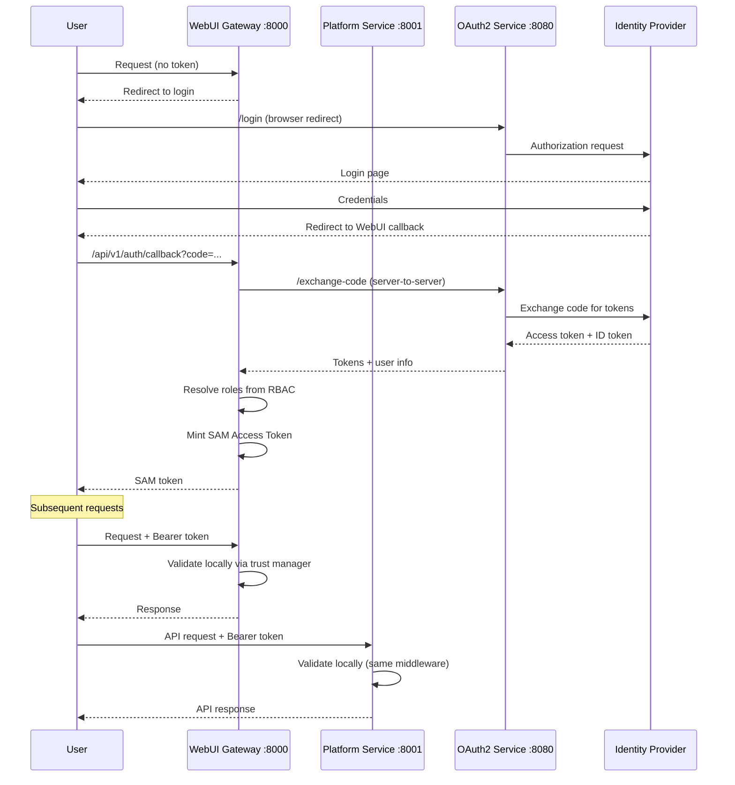

# Authentication & Authorization

Agent Mesh Enterprise secures access through two complementary layers: **authentication** validates user identity via OAuth2 or SAM Access Tokens, and **authorization** determines permissions via RBAC scopes. Both the WebUI Gateway and Platform Service share the same authentication middleware, ensuring consistent security across all endpoints.

## Architecture Overview

The authentication system consists of three main components:

1. **OAuth2 Service** (port 8080): Manages authentication flow with identity providers
2. **WebUI Gateway** (port 8000): Handles browser login and serves web interface
3. **Platform Service** (port 8001): Provides REST API for programmatic access

### Authentication Flow



## OAuth2 Configuration

### Supported Providers

Agent Mesh Enterprise supports any OAuth2/OIDC-compliant provider:

- **Azure (Microsoft Entra ID)**: Enterprise identity management
- **Google**: Google Workspace integration
- **Auth0**: Third-party identity platform
- **Okta**: Enterprise SSO provider
- **Keycloak**: Self-hosted open-source IAM
- **Custom OIDC**: Any standards-compliant provider

### OAuth2 Flows

The system implements OAuth2 flows from RFC 6749:

#### Client Credentials Flow

Server-to-server authentication where the client acts on its own behalf:

```python
from solace_agent_mesh.common.oauth import OAuth2Client

client = OAuth2Client()
token_data = await client.fetch_client_credentials_token(
    token_url="https://auth.example.com/token",
    client_id="your-client-id",
    client_secret="your-client-secret",
    scope="read write"
)
access_token = token_data["access_token"]
```

**Response includes:**
- `access_token`: The access token string
- `expires_in`: Token lifetime in seconds
- `token_type`: Usually "Bearer"
- `scope`: Granted scopes (optional)
- `expires_at`: Unix timestamp when token expires

#### Authorization Code Flow

User-delegated authentication where the application acts on behalf of a user:

```python
token_data = await client.fetch_authorization_code_token(
    token_url="https://auth.example.com/token",
    client_id="your-client-id",
    client_secret="your-client-secret",
    code="authorization-code-from-callback",
    redirect_uri="https://yourdomain.com/callback"
)
```

**Response includes:**
- `access_token`: The access token string
- `refresh_token`: Token for obtaining new access tokens
- `expires_in`: Token lifetime in seconds
- `token_type`: Usually "Bearer"

#### Refresh Token Flow

Obtain new access tokens without user interaction:

```python
token_data = await client.fetch_refresh_token(
    token_url="https://auth.example.com/token",
    client_id="your-client-id",
    client_secret="your-client-secret",
    refresh_token="existing-refresh-token"
)
```

### Provider Configuration

Create `oauth2_config.yaml` with your provider settings:

```yaml
enabled: ${OAUTH2_ENABLED:false}
development_mode: ${OAUTH2_DEV_MODE:false}

providers:
  # Azure/Microsoft
  azure:
    issuer: https://login.microsoftonline.com/${AZURE_TENANT_ID}/v2.0
    client_id: ${AZURE_CLIENT_ID}
    client_secret: ${AZURE_CLIENT_SECRET}
    redirect_uri: ${AZURE_REDIRECT_URI:http://localhost:8080/callback}
    scope: "openid email profile offline_access"

  # Google
  google:
    issuer: "https://accounts.google.com"
    client_id: ${GOOGLE_CLIENT_ID}
    client_secret: ${GOOGLE_CLIENT_SECRET}
    redirect_uri: ${GOOGLE_REDIRECT_URI:http://localhost:8080/callback}
    scope: "openid email profile"

  # Auth0
  auth0:
    issuer: ${AUTH0_ISSUER:https://your-domain.auth0.com/}
    client_id: ${AUTH0_CLIENT_ID}
    client_secret: ${AUTH0_CLIENT_SECRET}
    redirect_uri: ${AUTH0_REDIRECT_URI:http://localhost:8080/callback}
    scope: "openid email profile"
    audience: ${AUTH0_AUDIENCE:}  # Optional

  # Okta
  okta:
    issuer: ${OKTA_ISSUER:https://your-okta-domain.okta.com/oauth2/default}
    client_id: ${OKTA_CLIENT_ID}
    client_secret: ${OKTA_CLIENT_SECRET}
    redirect_uri: ${OKTA_REDIRECT_URI:http://localhost:8080/callback}
    scope: "openid email profile"

  # Keycloak
  keycloak:
    issuer: ${KEYCLOAK_ISSUER:https://your-keycloak.com/auth/realms/your-realm}
    client_id: ${KEYCLOAK_CLIENT_ID}
    client_secret: ${KEYCLOAK_CLIENT_SECRET}
    redirect_uri: ${KEYCLOAK_REDIRECT_URI:http://localhost:8080/callback}
    scope: "openid email profile"

# Session configuration
session:
  timeout: ${OAUTH2_SESSION_TIMEOUT:3600}  # 1 hour

# Security settings
security:
  cors:
    enabled: ${OAUTH2_CORS_ENABLED:true}
    origins: ${OAUTH2_CORS_ORIGINS:*}
  rate_limit:
    enabled: ${OAUTH2_RATE_LIMIT_ENABLED:true}
    requests_per_minute: ${OAUTH2_RATE_LIMIT_RPM:60}
```

### OIDC Discovery

The system uses OpenID Connect Discovery to automatically find endpoints:

1. Provider's `issuer` URL points to discovery endpoint
2. System fetches `.well-known/openid-configuration`
3. Authorization, token, and userinfo endpoints discovered automatically
4. No need to configure individual endpoint URLs

## SAM Access Tokens

### Overview

SAM Access Tokens are locally signed JWTs that enable efficient authentication:

- **Minted at Login**: Created during OAuth callback after role resolution
- **Embedded Roles**: Contains user roles and scopes
- **Local Validation**: No network call to OAuth2 service
- **ES256 Signed**: Using gateway's ephemeral EC key
- **Configurable TTL**: Default 3600 seconds (1 hour)

### Token Structure

```json
{
  "header": {
    "alg": "ES256",
    "typ": "JWT",
    "kid": "gateway-key-id"
  },
  "payload": {
    "sub": "user@example.com",
    "sam_user_id": "user@example.com",
    "email": "user@example.com",
    "name": "John Doe",
    "roles": ["data_analyst", "viewer"],
    "provider": "azure",
    "jti": "unique-token-id",
    "iat": 1234567890,
    "exp": 1234571490
  }
}
```

### Configuration

Enable SAM tokens in your gateway configuration:

```yaml
app_config:
  sam_access_token:
    enabled: true
    ttl_seconds: 3600
    clock_skew_tolerance: 300
```

### Trust Manager

The Trust Manager enables distributed token validation:

1. **Key Generation**: Gateway creates ephemeral EC key pair at startup
2. **Trust Card Publication**: Public key published to broker in JWKS format
3. **Registry Subscription**: Components subscribe and store keys
4. **Local Validation**: Tokens validated using registry keys
5. **Periodic Refresh**: Keys re-published every 60 seconds

**Security Features:**
- Only gateways can sign user identity JWTs
- Task ID binding prevents cross-task replay
- Clock skew tolerance for distributed systems
- Automatic key rotation support

## Role-Based Access Control (RBAC)

### RBAC Concepts

**Users** represent identities (typically email addresses):
- Normalized to lowercase for emails
- Case-sensitive for non-email identifiers
- Mapped to roles via configuration

**Roles** are collections of permissions:
- Represent job functions or responsibilities
- Can inherit from other roles
- Assigned to users in configuration

**Scopes** are granular permissions:
- Pattern-based (e.g., `tool:data:read`)
- Support wildcards (e.g., `tool:*:*`)
- Hierarchical structure

### Configuration Files

#### Role Definitions

Create `role-to-scope-definitions.yaml`:

```yaml
roles:
  admin:
    description: "Full system access"
    scopes:
      - "*"

  data_analyst:
    description: "Data analysis specialist"
    scopes:
      - "tool:data:*"
      - "tool:artifact:load"
      - "tool:artifact:create"
      - "agent:data_analysis_agent:delegate"
      - "monitor/namespace/*:a2a_messages:subscribe"

  viewer:
    description: "Read-only access"
    scopes:
      - "tool:basic:read"
      - "tool:artifact:load"
      - "agent:*:delegate"

  developer:
    description: "Developer with tool access"
    inherits:
      - "viewer"
    scopes:
      - "tool:basic:*"
      - "tool:advanced:read"
      - "tool:artifact:create"
```

#### User Assignments

Create `user-to-role-assignments.yaml`:

```yaml
users:
  admin@example.com:
    roles: ["admin"]
    description: "System Administrator"

  analyst@example.com:
    roles: ["data_analyst"]
    description: "Senior Data Analyst"

  viewer@example.com:
    roles: ["viewer"]
    description: "Read-only User"

  dev@example.com:
    roles: ["developer", "viewer"]  # Multiple roles
    description: "Software Developer"

# Gateway-specific identities (optional)
gateway_specific_identities:
  "_default_enterprise_gateway:special@example.com":
    roles: ["admin"]
    description: "Gateway-specific admin"
```

#### Enterprise Configuration

Create `enterprise_config.yaml`:

```yaml
authorization_service:
  type: "default_rbac"
  role_to_scope_definitions_path: "config/auth/role-to-scope-definitions.yaml"
  user_to_role_assignments_path: "config/auth/user-to-role-assignments.yaml"

namespace: "enterprise_prod"
```

### Scope Types

#### Tool Scopes

Control access to tools:

```yaml
scopes:
  - "tool:basic:read"      # View basic tools
  - "tool:basic:*"         # All basic tool operations
  - "tool:data:*"          # All data tools
  - "tool:advanced:read"   # View advanced tools
```

#### Custom Tool Scopes

Define custom scopes in tool configuration:

```yaml
components:
  - component_name: query_customer_database
    component_module: my_custom_tools
    component_config:
      tool_name: "customer_database_query"
      required_scopes:
        - "tool:database:query"
      database_connection:
        host: "db.example.com"
```

Grant access via roles:

```yaml
roles:
  database_admin:
    scopes:
      - "tool:database:*"  # All database tools
```

#### Agent Scopes

Control access to specific agents:

```yaml
scopes:
  - "agent:customer_support_agent:delegate"   # Specific agent
  - "agent:data_*:delegate"                   # All data agents
  - "agent:*:delegate"                        # All agents
```

Agent scopes are automatically derived from `agent_name` configuration.

#### Artifact Scopes

Control access to files and data:

```yaml
scopes:
  - "tool:artifact:list"    # List artifacts
  - "tool:artifact:load"    # View/download
  - "tool:artifact:create"  # Create new
  - "tool:artifact:append"  # Append to existing
  - "tool:artifact:delete"  # Delete artifacts
  - "tool:artifact:*"       # All artifact operations
```

#### Monitoring Scopes

Control access to system monitoring:

```yaml
scopes:
  - "monitor/namespace/production:a2a_messages:subscribe"  # Specific namespace
  - "monitor/namespace/*:a2a_messages:subscribe"          # All namespaces
```

### Authorization Types

| Type | Behavior | Use Case |
|------|----------|----------|
| `deny_all` | Reject all access | Default when no config exists |
| `default_rbac` | File-based RBAC | Production deployments |
| `custom` | External system | Integration with existing IAM |
| `none` | Grant wildcard `*` | Development only |

<Warning>
  Using `type: none` grants full access to all users and should **never** be used in production.
</Warning>

## User Identity Resolution

The system extracts user identifiers from token claims in priority order:

```
sub → client_id → username → oid → preferred_username → upn → 
unique_name → email → name → azp → user_id
```

**Normalization Rules:**
- Email addresses: Converted to lowercase
- Non-email identifiers: Case-sensitive exact match
- Fallback: `sam_dev_user` for development

**Display Name Resolution:**

```
name → (given_name + family_name) → preferred_username → user_id
```

## Shared Authentication

### WebUI Gateway + Platform Service

Both services use the same authentication stack:

- **Shared Middleware**: `create_oauth_middleware(component)`
- **Shared Registry**: `MiddlewareRegistry` singleton
- **Shared Resolver**: `EnterpriseConfigResolverImpl`
- **Same Configuration**: Via `SAM_AUTHORIZATION_CONFIG`

<Warning>
  The Platform Service **only** inherits RBAC when `SAM_AUTHORIZATION_CONFIG` is set. 
  Configuring `authorization_service` only in WebUI Gateway YAML will cause Platform Service to use `deny_all`.
</Warning>

### Configuration Example

**WebUI Gateway (`webui.yaml`):**
```yaml
app_config:
  frontend_use_authorization: ${FRONTEND_USE_AUTHORIZATION}
  external_auth_service_url: ${EXTERNAL_AUTH_SERVICE_URL}
  external_auth_provider: ${EXTERNAL_AUTH_PROVIDER}
  frontend_auth_login_url: ${FRONTEND_AUTH_LOGIN_URL}
  frontend_redirect_url: ${FRONTEND_REDIRECT_URL}
  external_auth_callback_uri: ${EXTERNAL_AUTH_CALLBACK}
```

**Platform Service (`platform.yaml`):**
```yaml
app_config:
  frontend_use_authorization: ${FRONTEND_USE_AUTHORIZATION}
  external_auth_service_url: ${EXTERNAL_AUTH_SERVICE_URL}
  external_auth_provider: ${EXTERNAL_AUTH_PROVIDER}
```

**Environment Variables:**
```bash
export SAM_AUTHORIZATION_CONFIG="/app/config/enterprise_config.yaml"
export FRONTEND_USE_AUTHORIZATION="true"
export EXTERNAL_AUTH_SERVICE_URL="http://localhost:8080"
export EXTERNAL_AUTH_PROVIDER="azure"
```

## Token Extraction

The middleware extracts tokens from three sources (in order):

1. **Authorization Header**
   ```http
   Authorization: Bearer <token>
   ```

2. **Session Cookie**
   ```http
   Cookie: session=<session-id>
   ```
   Token stored in session under `access_token` key.

3. **Query Parameter**
   ```http
   GET /api/endpoint?token=<token>
   ```

## Development Mode

For local development, disable authentication:

```yaml
app_config:
  frontend_use_authorization: false
```

This assigns a hardcoded development identity:

| Field | Value |
|-------|-------|
| `id` | `sam_dev_user` |
| `name` | `Sam Dev User` |
| `email` | `sam@dev.local` |
| `auth_method` | `development` |

<Warning>
  Development mode bypasses all authentication. **Never** use in production.
</Warning>

## Exempt Paths

These paths bypass authentication for system operations:

| Path | Purpose |
|------|----------|
| `/health`, `/api/v1/platform/health` | Health checks |
| `/api/v1/config` | Frontend configuration |
| `/api/v1/auth/callback` | OAuth callback |
| `/api/v1/auth/login` | Login initiation |
| `/api/v1/auth/refresh` | Token refresh |
| `/api/v1/csrf-token` | CSRF protection |
| `/api/v1/auth/tool/callback` | Tool OAuth |

`OPTIONS` requests also bypass auth for CORS preflight.

## Microsoft Graph Integration

For Azure-based environments, integrate with Microsoft Graph:

```yaml
authorization_service:
  type: "default_rbac"
  role_to_scope_definitions_path: "config/auth/role-to-scope-definitions.yaml"
  user_to_role_provider: "ms_graph"
  
  ms_graph_config:
    ms_graph_tenant_id: ${MS_GRAPH_TENANT_ID}
    ms_graph_client_id: ${MS_GRAPH_CLIENT_ID}
    ms_graph_client_secret: ${MS_GRAPH_CLIENT_SECRET}
```

Roles are still defined in YAML, but user assignments come from Microsoft Graph.

## Troubleshooting

### 401 Errors on Platform Service

**Symptom**: WebUI works but Platform Service returns 401.

**Solution**: Set `SAM_AUTHORIZATION_CONFIG` environment variable.

```bash
export SAM_AUTHORIZATION_CONFIG="/app/config/enterprise_config.yaml"
```

### All Requests Denied

**Symptom**: All requests return 403 after login.

**Cause**: System using `deny_all` authorization.

**Solution**: Verify `enterprise_config.yaml` exists and contains `authorization_service` block.

### User Identity Mismatch

**Symptom**: User cannot access resources despite role assignment.

**Solution**: Check extracted identifier in logs. Email addresses are lowercased automatically.

```yaml
users:
  user@example.com:  # Matches User@Example.com
    roles: ["admin"]
```

### SAM Token Validation Fails

**Symptom**: Log shows "Token is not a valid sam_access_token".

**Normal Behavior**: Middleware tries SAM validation first, then falls back to IdP.

**If Expected**: Verify `sam_access_token.enabled: true` in gateway config.

## Best Practices

### Security

1. **Use HTTPS in Production**
   ```yaml
   ssl_cert: "/path/to/cert.pem"
   ssl_key: "/path/to/key.pem"
   ```

2. **Restrict CORS Origins**
   ```yaml
   cors:
     origins: "https://yourdomain.com"
   ```

3. **Configure Session Timeouts**
   ```yaml
   session:
     timeout: 1800  # 30 minutes
   ```

4. **Rotate Credentials Regularly**
   - OAuth2 client secrets
   - Gateway signing keys
   - Database credentials

5. **Implement Least Privilege**
   - Assign minimal scopes per role
   - Use specific scopes over wildcards
   - Regular access reviews

### Role Design

1. **Align with Job Functions**
   ```yaml
   roles:
     customer_support:
       description: "Customer support representative"
       scopes:
         - "agent:customer_support_agent:delegate"
         - "tool:artifact:load"
   ```

2. **Use Inheritance**
   ```yaml
   roles:
     operator:
       inherits: ["viewer"]
       scopes:
         - "tool:basic:*"
   ```

3. **Document Roles**
   ```yaml
   roles:
     data_analyst:
       description: "Analyst with database and artifact access"
       scopes: [...]
   ```

### Configuration Management

1. **Version Control**
   - Store configs in Git
   - Use separate files per environment
   - Never commit secrets

2. **Environment Variables**
   ```yaml
   client_secret: ${OAUTH_CLIENT_SECRET}
   ```

3. **Regular Backups**
   - Backup RBAC configuration files
   - Store securely off-host
   - Test restore procedures

## Reference

### Environment Variables

| Variable | Purpose | Default |
|----------|---------|----------|
| `SAM_AUTHORIZATION_CONFIG` | Enterprise config path | None |
| `FRONTEND_USE_AUTHORIZATION` | Enable authentication | `false` |
| `EXTERNAL_AUTH_SERVICE_URL` | OAuth2 service URL | None |
| `EXTERNAL_AUTH_PROVIDER` | Provider name | `generic` |
| `EXTERNAL_AUTH_CALLBACK` | OAuth callback URI | None |
| `FRONTEND_AUTH_LOGIN_URL` | Login endpoint | None |
| `FRONTEND_REDIRECT_URL` | Post-login redirect | None |
| `OAUTH2_ENABLED` | Enable OAuth2 service | `false` |
| `OAUTH2_DEV_MODE` | Allow HTTP (dev only) | `false` |

### Code Examples

#### Custom OAuth2 Integration

```python
from solace_agent_mesh.common.oauth import OAuth2RetryClient

client = OAuth2RetryClient(
    max_retries=3,
    backoff_base=2.0,
    backoff_jitter=True
)

token_data = await client.fetch_client_credentials_token(
    token_url="https://auth.example.com/token",
    client_id="your-client-id",
    client_secret="your-client-secret",
    scope="read write",
    verify=True,  # or path to CA cert
    timeout=30.0
)
```

#### Building Auth Headers

```python
from solace_agent_mesh.common.auth_headers import build_full_auth_headers

async def fetch_oauth_token(agent_name: str, auth_config: dict) -> str:
    # Your OAuth token fetching logic
    return "oauth_token_xyz"

headers = await build_full_auth_headers(
    agent_name="my-agent",
    agent_config={
        "authentication": {
            "type": "oauth2_client_credentials",
            "token_url": "https://auth.example.com/token",
            "client_id": "client123",
            "client_secret": "secret456"
        }
    },
    custom_headers_key="task_headers",
    oauth_token_fetcher=fetch_oauth_token
)
# Returns: {'Authorization': 'Bearer oauth_token_xyz'}
```

## Next Steps

<CardGroup cols={2}>
  <Card title="Security Best Practices" icon="shield" href="/enterprise/security">
    Implement defense-in-depth security
  </Card>
  
  <Card title="Enterprise Connectors" icon="plug" href="/enterprise/connectors">
    Connect to external data sources
  </Card>
</CardGroup>