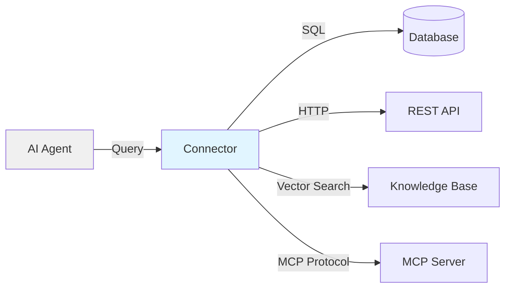

# Enterprise Connectors

Connectors allow your agents to access external data sources and services through natural language conversations. Agent Mesh Enterprise provides multiple connector types for integrating with databases, REST APIs, knowledge bases, and MCP-compliant servers.

## Overview

Connectors bridge the gap between AI agents and enterprise data:

- **Unified Access**: Single configuration for multiple agents
- **Credential Management**: Centralized authentication
- **Protocol Translation**: Automatic conversion between agent requests and external APIs
- **Schema Discovery**: Automatic tool generation from API specifications

### Architecture



## Connector Types

### SQL Connectors

Query relational databases using natural language:

**Supported Databases:**
- MySQL
- PostgreSQL
- MariaDB
- Microsoft SQL Server
- Oracle Database

**Features:**
- Natural language to SQL conversion
- Schema introspection
- Read-only enforcement
- Query result formatting

**Example Configuration:**

```yaml
connector:
  name: "analytics_database"
  type: "sql"
  
  connection:
    engine: "postgresql"
    host: "db.example.com"
    port: 5432
    database: "analytics"
    username: "sam_readonly"
    password: "${DB_PASSWORD}"
    
    # SSL/TLS
    ssl:
      enabled: true
      ca_cert: "/app/certs/db-ca.pem"
  
  # Security
  read_only: true
  allowed_schemas: ["public", "reporting"]
  denied_tables: ["sensitive_data", "credentials"]
```

**Usage Example:**

User asks: "What were our top 5 products by revenue last month?"

Agent:
1. Generates SQL: `SELECT product_name, SUM(revenue) as total FROM sales WHERE month = CURRENT_MONTH - 1 GROUP BY product_name ORDER BY total DESC LIMIT 5`
2. Executes query via connector
3. Returns formatted results to user

### OpenAPI Connectors

Interact with REST APIs using OpenAPI specifications:

**Features:**
- Automatic tool generation from OpenAPI spec
- Multiple authentication methods
- Request/response schema validation
- Configurable headers and parameters

**Authentication Types:**
- None (public APIs)
- API Key (header or query parameter)
- HTTP (Basic or Bearer)
- OAuth2/OIDC (client credentials)

**Example Configuration:**

```yaml
connector:
  name: "stripe_api"
  type: "openapi"
  
  # OpenAPI specification
  spec_file: "s3://connectors/stripe-openapi.yaml"
  
  # Authentication
  authentication:
    type: "api_key"
    location: "header"
    parameter_name: "Authorization"
    api_key: "Bearer ${STRIPE_API_KEY}"
  
  # Custom headers (optional)
  headers:
    - name: "Stripe-Version"
      value: "2023-10-16"
```

**OAuth2 Authentication:**

```yaml
authentication:
  type: "oauth2"
  authorization_endpoint: "https://auth.example.com/oauth/authorize"
  token_endpoint: "https://auth.example.com/oauth/token"
  client_id: "${OAUTH_CLIENT_ID}"
  client_secret: "${OAUTH_CLIENT_SECRET}"
  scopes: "read write"
  token_endpoint_auth_method: "client_secret_post"
```

**Usage Example:**

User asks: "Create an invoice for customer cus_123 for $99.99"

Agent:
1. Identifies OpenAPI operation: `POST /v1/invoices`
2. Constructs request with parameters
3. Connector handles authentication and HTTP request
4. Returns created invoice details

### Knowledge Base Connectors

Retrieve context from enterprise documentation:

**Features:**
- Vector similarity search
- Semantic retrieval
- Metadata filtering
- Context grounding for LLM responses

**Example Configuration:**

```yaml
connector:
  name: "company_knowledge_base"
  type: "knowledge_base"
  
  # Vector database
  vector_store:
    provider: "pinecone"  # or "weaviate", "qdrant", "chromadb"
    api_key: "${PINECONE_API_KEY}"
    environment: "us-west1-gcp"
    index_name: "company-docs"
  
  # Retrieval settings
  retrieval:
    top_k: 5
    similarity_threshold: 0.7
    metadata_filters:
      department: ["engineering", "product"]
```

**Usage Example:**

User asks: "What's our API rate limiting policy?"

Agent:
1. Embeds question as vector
2. Searches knowledge base for similar documents
3. Retrieves top 5 relevant chunks
4. Grounds LLM response in retrieved context
5. Cites source documents

### MCP Connectors

Communicate with Model Context Protocol servers:

**Features:**
- Standard protocol for AI tool access
- Dynamic tool discovery
- Structured data exchange
- Multi-modal support

**Example Configuration:**

```yaml
connector:
  name: "mcp_filesystem"
  type: "mcp"
  
  # MCP server
  server:
    command: "npx"
    args: ["-y", "@modelcontextprotocol/server-filesystem", "/workspace"]
    
    # Environment
    env:
      LOG_LEVEL: "info"
  
  # Tool configuration
  tools:
    enabled: true
    auto_discover: true
```

**Usage Example:**

User asks: "List files in the /workspace/reports directory"

Agent:
1. Calls MCP server's `list_directory` tool
2. MCP server executes filesystem operation
3. Returns structured file listing
4. Agent formats response for user

## Creating Connectors

### Web UI (Enterprise)

Create connectors through the Agent Mesh Enterprise web interface:

1. **Navigate to Connectors**
   ```
   Web UI → Connectors → Create Connector
   ```

2. **Select Connector Type**
   - SQL Database
   - OpenAPI/REST API
   - Knowledge Base
   - MCP Server

3. **Configure Connection**
   - Enter connection details
   - Provide credentials
   - Test connection

4. **Save and Deploy**
   - Connector becomes available to all agents
   - Assign to agents in Agent Builder

### Programmatic (YAML)

Define connectors in configuration files:

```yaml
# connectors.yaml
connectors:
  - name: "production_database"
    type: "sql"
    connection:
      engine: "postgresql"
      host: "${DB_HOST}"
      port: 5432
      database: "${DB_NAME}"
      username: "${DB_USER}"
      password: "${DB_PASSWORD}"
    read_only: true
  
  - name: "external_api"
    type: "openapi"
    spec_file: "${SPEC_URL}"
    authentication:
      type: "bearer"
      token: "${API_TOKEN}"
```

Load connectors at startup:

```bash
docker run -d \
  -v $(pwd)/connectors.yaml:/app/config/connectors.yaml \
  -e CONNECTORS_CONFIG="/app/config/connectors.yaml" \
  solace-agent-mesh-enterprise:latest
```

## Shared Credential Model

### Understanding Shared Access

All agents assigned to a connector use the **same credentials**:

```
Connector: production_database
├── Credentials: app_reader / password123
├── Assigned Agents:
│   ├── analytics_agent (uses app_reader)
│   ├── reporting_agent (uses app_reader)
│   └── dashboard_agent (uses app_reader)
└── All have IDENTICAL database permissions
```

**Implications:**
- Cannot restrict one agent to read-only and another to read-write
- Security boundaries exist at external system level
- Agent-level access control requires multiple connectors

### Security Best Practices

#### Least Privilege Credentials

Create dedicated database users with minimal permissions:

```sql
-- Read-only user for analytics connector
CREATE USER 'sam_analytics_readonly'@'%' IDENTIFIED BY 'strong-password';
GRANT SELECT ON analytics.* TO 'sam_analytics_readonly'@'%';

-- Read-write user for admin connector (separate)
CREATE USER 'sam_admin'@'%' IDENTIFIED BY 'different-strong-password';
GRANT SELECT, INSERT, UPDATE ON analytics.* TO 'sam_admin'@'%';
```

#### Multiple Connectors for Different Access Levels

Create separate connectors per access level:

```yaml
connectors:
  # Read-only connector
  - name: "analytics_readonly"
    type: "sql"
    connection:
      username: "sam_analytics_readonly"
      # Read-only grants at database level
  
  # Read-write connector
  - name: "analytics_admin"
    type: "sql"
    connection:
      username: "sam_admin"
      # Read-write grants at database level
```

Assign to agents based on requirements:

```yaml
agents:
  # Viewer agents
  - name: "analytics_viewer"
    connectors: ["analytics_readonly"]
  
  # Admin agents
  - name: "data_admin"
    connectors: ["analytics_admin"]
```

## Assigning Connectors to Agents

### Agent Builder (Web UI)

1. **Navigate to Agent Builder**
2. **Create or Edit Agent**
3. **Select Connectors**
   - Choose from available connectors
   - Multiple connectors per agent supported
4. **Deploy Agent**

### YAML Configuration

```yaml
flows:
  - name: customer_support_agent
    components:
      - component_name: support_agent
        component_module: solace_agent_mesh.agent.sac
        component_config:
          agent_name: "customer_support"
          
          # Assign connectors
          connectors:
            - "knowledge_base"  # Search company docs
            - "crm_api"         # Access customer data
            - "ticketing_api"   # Create support tickets
```

## Managing Connectors

### Editing Connectors

Modify connector configuration:

```
Web UI → Connectors → Select Connector → Edit
```

Changes apply:
- To all agents using the connector
- After agent redeployment
- May cause temporary disruptions

**Best Practice:** Update during maintenance windows.

### Deleting Connectors

Restrictions:
- Cannot delete if assigned to any agent
- Must undeploy agents first
- Removes from Agent Mesh only (external system unaffected)

Procedure:
1. Identify agents using connector
2. Undeploy agents or remove connector assignment
3. Delete connector
4. Clean up external credentials (database users, API keys)

### Connector Health Monitoring

Monitor connector status:

```yaml
metrics:
  connectors:
    - name: "production_database"
      metrics:
        - connection_status
        - query_latency_ms
        - error_rate
    - name: "external_api"
      metrics:
        - http_status_codes
        - request_latency_ms
        - authentication_failures
```

Alert on failures:

```yaml
alerts:
  - name: "connector_down"
    condition: "connection_status == 'disconnected'"
    severity: "critical"
    notification: "pagerduty"
```

## Access Control (RBAC)

Connector operations require specific capabilities:

| Capability | Purpose |
|------------|----------|
| `sam:connectors:create` | Create new connectors |
| `sam:connectors:read` | View connector configurations |
| `sam:connectors:update` | Modify connector settings |
| `sam:connectors:delete` | Remove connectors |

**Example Role:**

```yaml
roles:
  connector_admin:
    description: "Manage connectors"
    scopes:
      - "sam:connectors:*"  # All connector operations
  
  connector_viewer:
    description: "View connectors only"
    scopes:
      - "sam:connectors:read"
```

See [RBAC Setup Guide](/enterprise/authentication#role-based-access-control-rbac) for details.

## Troubleshooting

### Connection Failures

**Symptom:** Connector shows "disconnected" status

**Solutions:**

1. **Verify Network Access**
   ```bash
   # Test database connection
   docker exec sam-enterprise \
     psql -h db.example.com -U sam_user -d analytics -c "SELECT 1;"
   
   # Test API endpoint
   docker exec sam-enterprise \
     curl -v https://api.example.com/health
   ```

2. **Check Credentials**
   - Verify username/password
   - Check API key validity
   - Confirm OAuth2 client credentials

3. **Review Firewall Rules**
   - Allow outbound connections to external system
   - Check security groups (cloud environments)

### Authentication Errors

**Symptom:** 401/403 errors when using connector

**Solutions:**

1. **API Key Authentication**
   - Verify key hasn't expired
   - Check parameter name matches API requirements
   - Confirm location (header vs. query parameter)

2. **OAuth2 Authentication**
   ```bash
   # Test token endpoint manually
   curl -X POST https://auth.example.com/oauth/token \
     -H "Content-Type: application/x-www-form-urlencoded" \
     -d "grant_type=client_credentials" \
     -d "client_id=${CLIENT_ID}" \
     -d "client_secret=${CLIENT_SECRET}"
   ```

3. **Database Authentication**
   ```sql
   -- Verify user exists and has permissions
   SHOW GRANTS FOR 'sam_user'@'%';
   ```

### Query Failures

**Symptom:** SQL queries return errors

**Solutions:**

1. **Check Read-Only Mode**
   - Verify connector `read_only: true`
   - Ensure no INSERT/UPDATE/DELETE operations

2. **Schema Permissions**
   ```sql
   -- Grant SELECT on missing schemas
   GRANT SELECT ON new_schema.* TO 'sam_user'@'%';
   ```

3. **Table Access**
   - Check `allowed_schemas` configuration
   - Verify table not in `denied_tables` list

### OpenAPI Spec Loading

**Symptom:** Connector fails to load OpenAPI specification

**Solutions:**

1. **Validate Spec**
   ```bash
   # Use Swagger Editor
   docker run -p 8080:8080 swaggerapi/swagger-editor
   # Upload spec file and check for errors
   ```

2. **Check File Access**
   - Verify S3 bucket has public read access
   - Confirm spec file URL is accessible
   - Test direct download:
   ```bash
   curl -I https://s3.amazonaws.com/bucket/spec.yaml
   ```

3. **Version Compatibility**
   - Ensure OpenAPI 3.0+ (not Swagger 2.0)
   - Convert if needed: https://converter.swagger.io/

## Advanced Configuration

### Connection Pooling

Optimize database connections:

```yaml
connector:
  type: "sql"
  connection:
    # Pool settings
    pool_size: 10
    max_overflow: 20
    pool_timeout: 30
    pool_recycle: 3600  # Recycle connections after 1 hour
```

### Retry Logic

Handle transient failures:

```yaml
connector:
  type: "openapi"
  
  # Retry configuration
  retry:
    enabled: true
    max_attempts: 3
    backoff_multiplier: 2.0
    retry_on_status: [500, 502, 503, 504]
```

### Custom Headers

Add custom headers to API requests:

```yaml
connector:
  type: "openapi"
  
  # Custom headers
  headers:
    - name: "X-API-Version"
      value: "2024-01"
    - name: "X-Request-ID"
      value: "${REQUEST_ID}"  # Dynamic value
    - name: "User-Agent"
      value: "SolaceAgentMesh/1.0"
```

### SSL/TLS Configuration

Custom certificate validation:

```yaml
connector:
  type: "sql"
  connection:
    ssl:
      enabled: true
      verify_mode: "CERT_REQUIRED"
      ca_cert: "/app/certs/custom-ca.pem"
      client_cert: "/app/certs/client-cert.pem"
      client_key: "/app/certs/client-key.pem"
```

## Best Practices

### Security

1. **Use Read-Only Credentials**
   - Default to SELECT-only database users
   - Create separate connectors for write operations

2. **Rotate Credentials Regularly**
   ```bash
   # Quarterly rotation schedule
   0 0 1 */3 * /usr/local/bin/rotate-db-passwords.sh
   ```

3. **Encrypt Credentials**
   - Store in secrets manager (AWS Secrets Manager, HashiCorp Vault)
   - Use environment variables, not hardcoded values

4. **Monitor Access Logs**
   - Enable database query logging
   - Track API usage patterns
   - Alert on unusual activity

### Performance

1. **Connection Pooling**
   - Use pools for SQL connectors
   - Size based on concurrent agent requests

2. **Caching**
   - Cache OpenAPI specs
   - Cache knowledge base embeddings
   - Implement TTL-based invalidation

3. **Timeouts**
   ```yaml
   connector:
     timeout:
       connection: 10  # seconds
       query: 30       # seconds
   ```

### Reliability

1. **Health Checks**
   - Periodic connection validation
   - Automatic reconnection on failure

2. **Circuit Breakers**
   - Fail fast on repeated errors
   - Prevent cascade failures

3. **Graceful Degradation**
   - Continue operation if connector unavailable
   - Return cached results when possible

## Next Steps

<CardGroup cols={2}>
  <Card title="Authentication" icon="lock" href="/enterprise/authentication">
    Configure OAuth2 and RBAC
  </Card>
  
  <Card title="Security" icon="shield" href="/enterprise/security">
    Secure connectors and credentials
  </Card>
</CardGroup>