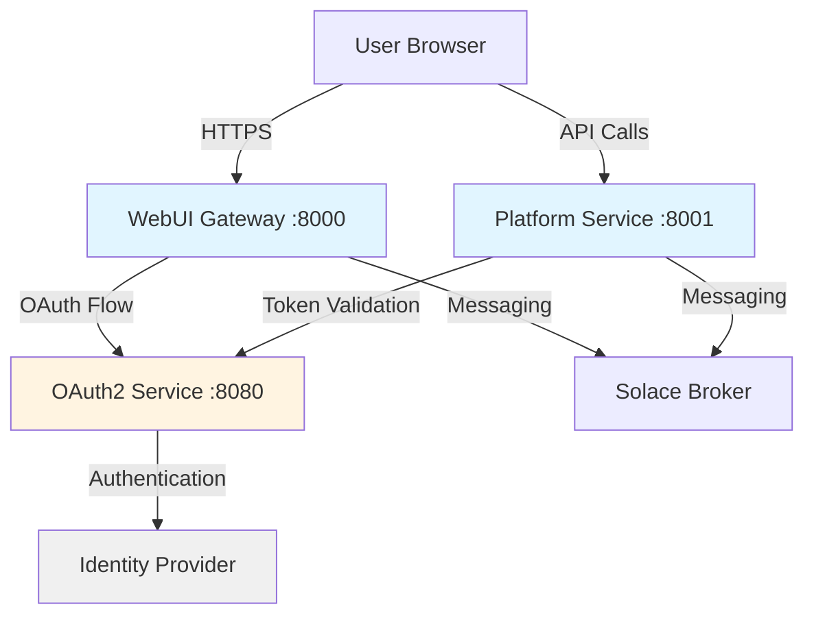

# Solace Agent Mesh Enterprise

Agent Mesh Enterprise extends the open-source framework with production-grade features designed for enterprise environments. This version provides security through single sign-on integration, granular access control through role-based permissions, and observability tools for monitoring agent workflows and system performance.

## What's Included

Enterprise is available as a self-managed container image that you can deploy in your own infrastructure. You can obtain access by joining the pilot program at [solace.com/solace-agent-mesh-pilot-registration](https://solace.com/solace-agent-mesh-pilot-registration/).

### Authentication & Authorization

Integrate with your existing identity systems through OAuth2-based Single Sign-On, supporting providers like Azure, Google, Auth0, Okta, and Keycloak. Implement role-based access control (RBAC) to define granular permissions for users and teams.

**Key Features:**
- OAuth2/OIDC authentication with automatic endpoint discovery
- SAM Access Tokens for efficient local validation
- Shared authentication between WebUI Gateway and Platform Service
- Trust Manager architecture for distributed token validation
- Multiple grant types: Client Credentials, Authorization Code, Refresh Token

See [Authentication](/enterprise/authentication) for implementation details.

### Security & Governance

Enterprise provides security-first architecture with defense in depth:

- **Secure by Default**: Deny-all authorization when no configuration exists
- **Role-Based Access Control**: Fine-grained permissions using scope-based authorization
- **Token Security**: ES256-signed JWTs with configurable TTL and automatic refresh
- **Network Security**: SSL/TLS support with custom CA certificates
- **Credential Management**: Shared credential model with connector-level access control

See [Security Best Practices](/enterprise/security) for comprehensive security guidance.

### Data Management

Optimize costs and improve accuracy through advanced data management:

- **Connectors**: Link agents to external data sources (SQL databases, APIs, knowledge bases)
- **Data Filtering**: Reduce unnecessary compute expenses
- **Data Governance**: Control information flow to prevent hallucinations

See [Enterprise Connectors](/enterprise/connectors) for connector types and configuration.

### Observability

Gain visibility into your agent ecosystem:

- **Workflow Viewer**: Track LLM interactions and agent communications in real time
- **Performance Monitoring**: Monitor system behavior and diagnose issues
- **Audit Logging**: Track authorization decisions and authentication events

## Architecture

### Component Overview

Agent Mesh Enterprise uses a distributed architecture:



### Authentication Flow

1. **User Login**: Browser redirects to OAuth2 service
2. **Identity Provider**: User authenticates with organizational credentials
3. **Token Exchange**: Authorization code exchanged for access tokens
4. **Role Resolution**: RBAC system resolves user roles and scopes
5. **SAM Token Minting**: Gateway creates signed JWT with embedded roles
6. **Local Validation**: Subsequent requests validated via Trust Manager

This architecture eliminates repeated calls to the OAuth2 service, improving performance and reducing latency.

## Getting Started

### Installation Prerequisites

Before installing Agent Mesh Enterprise, ensure you have:

- Docker installed and running
- Access to the Solace Product Portal
- An OAuth2 provider (Azure, Google, Auth0, Okta, or Keycloak)
- Client credentials from your OAuth2 provider
- A Solace broker (embedded or external)

### Quick Start

1. **Install Enterprise Image**
   ```bash
   # Download from Solace Product Portal
   docker load -i solace-agent-mesh-enterprise-<version>.tar.gz
   ```

2. **Create Configuration Directory**
   ```bash
   mkdir -p sam-enterprise/config/auth
   ```

3. **Configure RBAC**
   
   Create `role-to-scope-definitions.yaml` and `user-to-role-assignments.yaml` in `config/auth/`
   
   See [Authentication](/enterprise/authentication) for examples.

4. **Launch Container**
   ```bash
   docker run -d \
     --name sam-enterprise \
     -p 8000:8000 -p 8001:8001 -p 8080:8080 \
     -v $(pwd)/sam-enterprise:/app \
     -e SAM_AUTHORIZATION_CONFIG="/app/config/enterprise_config.yaml" \
     -e OAUTH2_ENABLED="true" \
     -e FRONTEND_USE_AUTHORIZATION="true" \
     solace-agent-mesh-enterprise:<tag>
   ```

5. **Verify Installation**
   
   Navigate to `http://localhost:8000` and complete the OAuth login flow.

## Core Concepts

### Authentication vs Authorization

**Authentication** validates identity:
- OAuth2 flow with external identity provider
- SAM Access Tokens for session management
- Token validation via Trust Manager

**Authorization** determines permissions:
- RBAC with role-to-scope mappings
- Scope-based access control for tools, agents, and artifacts
- Wildcard support for flexible permissions

### User Identity Resolution

The system extracts user identifiers from token claims in priority order:

`sub` → `client_id` → `username` → `oid` → `preferred_username` → `upn` → `unique_name` → `email` → `name` → `azp` → `user_id`

- Email addresses are normalized to lowercase
- Non-email identifiers are case-sensitive
- Fallback to `sam_dev_user` for development

### Trust Manager

The Trust Manager enables distributed token validation:

1. Gateway generates ephemeral EC key pair at startup
2. Public key published as Trust Card to broker
3. Components subscribe and store keys in Trust Registry
4. SAM tokens validated locally using registry keys
5. No network call to OAuth2 service needed

Only components with `component_type: "gateway"` can sign user identity JWTs.

### Shared Authentication

Both WebUI Gateway and Platform Service use the same authentication middleware:

- Single `MiddlewareRegistry` singleton
- Shared `EnterpriseConfigResolverImpl`
- Same RBAC configuration via `SAM_AUTHORIZATION_CONFIG`
- Consistent authorization across all API endpoints

## Authorization Types

| Type | Use Case | Behavior |
|------|----------|----------|
| `deny_all` | Default | Rejects all access when no config exists |
| `default_rbac` | Production | File-based RBAC with role definitions |
| `custom` | Integration | External authorization systems |
| `none` | Development | Grants wildcard `*` scope to all users |

<Warning>
  The `type: none` authorization configuration grants full access and should **never** be used in production.
</Warning>

## Configuration Management

### Environment Variables

Key environment variables for Enterprise:

| Variable | Purpose | Required |
|----------|---------|----------|
| `SAM_AUTHORIZATION_CONFIG` | Path to enterprise config or raw JSON | Yes (for RBAC) |
| `FRONTEND_USE_AUTHORIZATION` | Enable authentication | Yes |
| `EXTERNAL_AUTH_SERVICE_URL` | OAuth2 service URL | Yes |
| `EXTERNAL_AUTH_PROVIDER` | Provider name (azure, google, etc.) | Yes |
| `OAUTH2_ENABLED` | Enable OAuth2 service | Yes |
| `OAUTH2_DEV_MODE` | Allow HTTP for local development | No |

### File Locations

Standard configuration file paths:

```
sam-enterprise/
├── config/
│   ├── enterprise_config.yaml       # Main config
│   ├── auth/
│   │   ├── role-to-scope-definitions.yaml
│   │   └── user-to-role-assignments.yaml
│   ├── oauth2_server.yaml           # OAuth2 service config
│   └── oauth2_config.yaml           # Provider settings
└── logs/
```

## Security Best Practices

### Production Deployment

1. **Disable Development Mode**
   ```yaml
   frontend_use_authorization: true
   authorization_service:
     type: "default_rbac"  # Never use "none" in production
   ```

2. **Use HTTPS Everywhere**
   ```yaml
   ssl_cert: "/path/to/cert.pem"
   ssl_key: "/path/to/key.pem"
   ```

3. **Restrict CORS Origins**
   ```yaml
   security:
     cors:
       origins: "https://yourdomain.com"
   ```

4. **Configure Session Timeouts**
   ```yaml
   session:
     timeout: 3600  # 1 hour
   ```

5. **Implement Least Privilege**
   
   Assign minimal scopes required for each role.

### Credential Management

- Store OAuth2 client secrets as environment variables
- Use Docker secrets or Kubernetes secrets for production
- Rotate credentials regularly
- Never commit secrets to version control

## What's Next

<CardGroup cols={2}>
  <Card title="Authentication Setup" icon="lock" href="/enterprise/authentication">
    Configure OAuth2 and RBAC for secure access control
  </Card>
  
  <Card title="Security Best Practices" icon="shield" href="/enterprise/security">
    Implement defense-in-depth security measures
  </Card>
  
  <Card title="Enterprise Connectors" icon="plug" href="/enterprise/connectors">
    Connect agents to external data sources
  </Card>
  
  <Card title="Teams Integration" icon="users" href="/enterprise/teams-integration">
    Deploy agents to Microsoft Teams
  </Card>
</CardGroup>

## Support

For enterprise support:

- **Documentation**: [solace.com/docs/agent-mesh](https://solace.com/docs/agent-mesh)
- **Community**: [solace.community](https://solace.community)
- **Enterprise Support**: Contact your Solace account team
- **Pilot Program**: [solace.com/solace-agent-mesh-pilot-registration](https://solace.com/solace-agent-mesh-pilot-registration/)