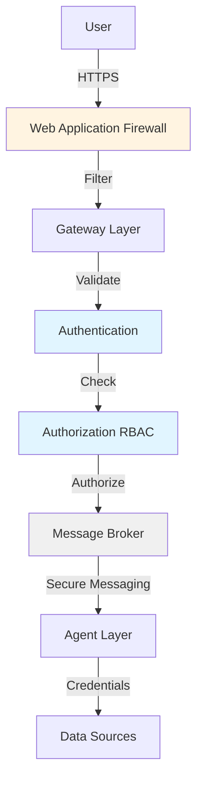

# Security Best Practices

Agent Mesh Enterprise provides multiple security layers to protect your deployment. This guide covers authentication, authorization, network security, credential management, and operational security best practices.

## Security Architecture

Agent Mesh Enterprise implements defense-in-depth security:



### Security Layers

1. **Network Layer**: TLS encryption, firewall rules, DDoS protection
2. **Authentication Layer**: OAuth2, token validation, session management
3. **Authorization Layer**: RBAC, scope enforcement, policy decisions
4. **Transport Layer**: Secure broker messaging, certificate validation
5. **Data Layer**: Credential management, encryption at rest, access control

## Authentication Security

### OAuth2 Configuration

#### Production Settings

Never use development mode in production:

```yaml
# ❌ NEVER in production
frontend_use_authorization: false
authorization_service:
  type: "none"

# ✅ Production configuration
frontend_use_authorization: true
authorization_service:
  type: "default_rbac"
  role_to_scope_definitions_path: "config/auth/roles.yaml"
  user_to_role_assignments_path: "config/auth/users.yaml"
```

#### Disable Development Mode

Disable OAuth2 development mode:

```yaml
# oauth2_config.yaml
enabled: true
development_mode: false  # ✅ Enforces HTTPS and strict validation
```

Development mode (`true`) allows:
- HTTP connections (insecure)
- Relaxed token scope validation
- Insecure transport

**Never enable in production.**

### Token Security

#### SAM Access Tokens

Configure secure token settings:

```yaml
app_config:
  sam_access_token:
    enabled: true
    ttl_seconds: 3600  # 1 hour
    clock_skew_tolerance: 300  # 5 minutes
    
  # Session timeout (should be <= token TTL)
  session:
    timeout: 3600
    secure_cookies: true
    httponly_cookies: true
    samesite: "strict"
```

**Best Practices:**
- Token TTL: 1-4 hours (balance security vs. UX)
- Session timeout: Match or be shorter than token TTL
- Clock skew: Account for distributed systems (300s recommended)
- Secure cookies: Always `true` in production
- HttpOnly cookies: Prevent XSS attacks
- SameSite: `strict` or `lax` for CSRF protection

#### Token Refresh

Implement automatic token refresh:

```javascript
// Frontend token refresh logic
const refreshToken = async () => {
  const response = await fetch('/api/v1/auth/refresh', {
    method: 'POST',
    credentials: 'include'
  });
  
  if (response.ok) {
    const { access_token } = await response.json();
    localStorage.setItem('access_token', access_token);
  } else {
    // Redirect to login
    window.location.href = '/api/v1/auth/login';
  }
};

// Refresh before expiration
setInterval(refreshToken, 3300000);  // 55 minutes
```

### Multi-Factor Authentication

Enforce MFA at the identity provider level:

**Azure AD:**
```
Azure Portal → Microsoft Entra ID → Security → Conditional Access
→ Create policy requiring MFA for all users
```

**Okta:**
```
Okta Admin → Security → Multifactor → Add Factor
→ Create policy requiring MFA
```

Agent Mesh Enterprise inherits MFA enforcement from your IdP.

## Authorization Security

### RBAC Best Practices

#### Principle of Least Privilege

Grant minimum permissions required:

```yaml
# ❌ Too permissive
roles:
  analyst:
    scopes:
      - "*"  # Full access

# ✅ Specific permissions
roles:
  analyst:
    description: "Data analyst with limited access"
    scopes:
      - "tool:data:read"           # Read data tools
      - "tool:artifact:load"        # Load artifacts
      - "tool:artifact:create"      # Create artifacts
      - "agent:analytics:delegate"  # Specific agent only
```

#### Wildcard Usage

Minimize wildcard scopes:

```yaml
# ❌ Overly broad
scopes:
  - "tool:*:*"  # All tools, all actions

# ✅ Specific wildcards
scopes:
  - "tool:data:*"              # All data tool actions
  - "agent:customer_*:delegate" # Customer service agents only
```

Wildcards acceptable for:
- Admin roles (documented and audited)
- Logical groupings (e.g., `tool:data:*` for data analysts)

#### Role Separation

Separate read/write permissions:

```yaml
roles:
  data_viewer:
    description: "Read-only data access"
    scopes:
      - "tool:data:read"
      - "tool:artifact:load"
      - "monitor/namespace/*:a2a_messages:subscribe"
  
  data_operator:
    description: "Data operations"
    inherits: ["data_viewer"]
    scopes:
      - "tool:data:write"
      - "tool:data:execute"
      - "tool:artifact:create"
  
  data_admin:
    description: "Full data management"
    inherits: ["data_operator"]
    scopes:
      - "tool:data:delete"
      - "tool:data:admin"
      - "tool:artifact:delete"
```

### Custom Tool Security

Enforce fine-grained access on custom tools:

```yaml
# Tool definition
components:
  - component_name: production_database_query
    component_module: custom_tools
    component_config:
      tool_name: "prod_db_query"
      required_scopes:
        - "database:production:read"  # Specific scope
      database:
        host: "prod-db.internal"
        read_only: true
```

```yaml
# Role assignment
roles:
  senior_analyst:
    scopes:
      - "database:production:read"  # Grants access
  
  junior_analyst:
    scopes:
      - "database:staging:read"     # No production access
```

### Agent Access Control

Restrict agent access per user:

```yaml
roles:
  customer_support:
    scopes:
      - "agent:customer_support:delegate"  # Support agent only
      - "agent:knowledge_base:delegate"    # KB agent only
      # No access to admin or sensitive agents
  
  system_admin:
    scopes:
      - "agent:*:delegate"  # All agents
```

## Network Security

### TLS/SSL Configuration

#### Gateway HTTPS

Always use HTTPS in production:

```yaml
# webui.yaml
app_config:
  ssl_certfile: "/app/certs/fullchain.pem"
  ssl_keyfile: "/app/certs/privkey.pem"
  ssl_ca_certs: "/app/certs/ca-bundle.pem"  # Optional: client cert validation
```

#### OAuth2 Service HTTPS

```yaml
# oauth2_server.yaml
shared_config:
  - oauth2_config: &oauth2_config
      ssl_cert: "/app/certs/oauth2-cert.pem"
      ssl_key: "/app/certs/oauth2-key.pem"
```

#### Broker TLS

Secure broker connections:

```yaml
broker:
  url: "tcps://broker.example.com:55443"  # TLS port
  vpn: "enterprise_vpn"
  username: "${BROKER_USERNAME}"
  password: "${BROKER_PASSWORD}"
  
  # Certificate validation
  ssl:
    verify_mode: "CERT_REQUIRED"
    ca_certs: "/app/certs/broker-ca.pem"
    certfile: "/app/certs/client-cert.pem"
    keyfile: "/app/certs/client-key.pem"
```

### Certificate Management

#### Let's Encrypt Automation

```bash
#!/bin/bash
# renew-certs.sh - Automated certificate renewal

# Renew certificates
certbot renew --quiet

# Copy to application directory
cp /etc/letsencrypt/live/yourdomain.com/fullchain.pem /app/certs/
cp /etc/letsencrypt/live/yourdomain.com/privkey.pem /app/certs/

# Set permissions
chown sam-app:sam-app /app/certs/*.pem
chmod 600 /app/certs/*.pem

# Reload gateway (graceful restart)
docker exec sam-enterprise kill -HUP 1
```

Schedule with cron:
```cron
# Renew certificates daily at 2 AM
0 2 * * * /usr/local/bin/renew-certs.sh
```

#### Certificate Validation

Verify certificates before deployment:

```bash
# Check certificate expiration
openssl x509 -in /app/certs/cert.pem -noout -dates

# Verify certificate chain
openssl verify -CAfile /app/certs/ca-bundle.pem /app/certs/cert.pem

# Check certificate matches key
openssl x509 -in /app/certs/cert.pem -noout -modulus | md5sum
openssl rsa -in /app/certs/key.pem -noout -modulus | md5sum
# MD5 sums should match
```

### Firewall Configuration

#### Inbound Rules

```bash
# Allow HTTPS traffic
sudo ufw allow 443/tcp comment 'WebUI Gateway'

# Allow OAuth2 service (if externally accessible)
sudo ufw allow 8080/tcp comment 'OAuth2 Service'

# Allow Platform Service API
sudo ufw allow 8001/tcp comment 'Platform Service'

# Deny all other inbound
sudo ufw default deny incoming
```

#### Outbound Rules

```bash
# Allow outbound HTTPS
sudo ufw allow out 443/tcp comment 'HTTPS'

# Allow broker connection
sudo ufw allow out 55443/tcp comment 'Solace Broker TLS'

# Allow DNS
sudo ufw allow out 53 comment 'DNS'
```

### CORS Configuration

Restrict Cross-Origin Resource Sharing:

```yaml
# Production: Specific origins only
app_config:
  cors_allowed_origins:
    - "https://yourdomain.com"
    - "https://app.yourdomain.com"

# ❌ NEVER in production
cors_allowed_origins:
  - "*"  # Allows any origin
```

## Credential Management

### Environment Variables

Store secrets as environment variables:

```bash
# ✅ Good: Environment variables
export AZURE_CLIENT_SECRET="$(cat /run/secrets/azure_secret)"
export BROKER_PASSWORD="$(cat /run/secrets/broker_password)"

# ❌ Bad: Hardcoded in files
client_secret: "abc123..."  # Never do this
```

### Docker Secrets

Use Docker secrets for sensitive data:

```bash
# Create secrets
echo "azure-client-secret-value" | docker secret create azure_secret -
echo "broker-password-value" | docker secret create broker_password -

# Use in Docker Compose
docker-compose.yml:
```

```yaml
services:
  sam-enterprise:
    image: solace-agent-mesh-enterprise:latest
    secrets:
      - azure_secret
      - broker_password
    environment:
      - AZURE_CLIENT_SECRET_FILE=/run/secrets/azure_secret
      - BROKER_PASSWORD_FILE=/run/secrets/broker_password

secrets:
  azure_secret:
    external: true
  broker_password:
    external: true
```

### Kubernetes Secrets

For Kubernetes deployments:

```yaml
apiVersion: v1
kind: Secret
metadata:
  name: sam-credentials
type: Opaque
data:
  azure-client-secret: <base64-encoded-value>
  broker-password: <base64-encoded-value>
---
apiVersion: v1
kind: Pod
metadata:
  name: sam-enterprise
spec:
  containers:
  - name: sam
    image: solace-agent-mesh-enterprise:latest
    env:
    - name: AZURE_CLIENT_SECRET
      valueFrom:
        secretKeyRef:
          name: sam-credentials
          key: azure-client-secret
    - name: BROKER_PASSWORD
      valueFrom:
        secretKeyRef:
          name: sam-credentials
          key: broker-password
```

### Secret Rotation

Implement regular credential rotation:

```bash
#!/bin/bash
# rotate-secrets.sh

# Generate new OAuth2 client secret in Azure
NEW_SECRET=$(az ad app credential reset \
  --id $AZURE_APP_ID \
  --append \
  --query password -o tsv)

# Update Docker secret (creates new version)
echo "$NEW_SECRET" | docker secret create azure_secret_v2 -

# Update service to use new secret
docker service update \
  --secret-rm azure_secret \
  --secret-add source=azure_secret_v2,target=azure_secret \
  sam-enterprise

# After validation, remove old secret
# (Wait 24 hours for verification)
# docker secret rm azure_secret_v1
```

Rotation schedule:
- OAuth2 secrets: Every 90 days
- Database passwords: Every 90 days
- API keys: Every 180 days
- SSL certificates: Automated (Let's Encrypt)

## Connector Security

### Shared Credential Model

Understand connector security implications:

```yaml
# All agents assigned to this connector share credentials
# Security boundaries exist at external system level

connector:
  name: "production_database"
  type: "sql"
  credentials:
    username: "app_reader"  # Limited permissions
    password: "${DB_PASSWORD}"
  
  # Database-level security
  database:
    grants:
      - "SELECT ON analytics.*"  # Read-only
      # No INSERT, UPDATE, DELETE
```

### Principle of Least Privilege

Configure minimal database permissions:

```sql
-- Create read-only user for connector
CREATE USER 'sam_readonly'@'%' IDENTIFIED BY 'strong-password';

-- Grant SELECT only on specific schemas
GRANT SELECT ON analytics.* TO 'sam_readonly'@'%';
GRANT SELECT ON reporting.* TO 'sam_readonly'@'%';

-- Deny all other privileges
REVOKE ALL PRIVILEGES ON *.* FROM 'sam_readonly'@'%';

-- No admin privileges
-- No INSERT, UPDATE, DELETE
-- No CREATE, DROP, ALTER
```

### API Key Scoping

Use scoped API keys for OpenAPI connectors:

```yaml
# OpenAPI connector with minimal permissions
connector:
  name: "external_api"
  type: "openapi"
  authentication:
    type: "api_key"
    api_key: "${API_KEY}"  # Scoped to read-only operations
```

Configure API key at provider:
```
Stripe Dashboard → Developers → API Keys
→ Create restricted key
→ Scope: Read-only
→ Resources: Customers, Invoices (read only)
```

## Operational Security

### Audit Logging

Enable comprehensive audit logging:

```yaml
log:
  stdout_log_level: INFO
  log_file_level: DEBUG
  log_file: /app/logs/audit.log
  
  # Log all authorization decisions
  log_auth_decisions: true
  
  # Log all token operations
  log_token_operations: true
  
  # Log configuration changes
  log_config_changes: true
```

Log forwarding to SIEM:

```bash
# Filebeat configuration for ELK Stack
filebeat.inputs:
- type: log
  paths:
    - /app/logs/audit.log
  fields:
    application: sam-enterprise
    environment: production

output.elasticsearch:
  hosts: ["elk.example.com:9200"]
  username: "filebeat"
  password: "${FILEBEAT_PASSWORD}"
```

### Security Monitoring

Monitor for security events:

```yaml
# Prometheus metrics
metrics:
  enabled: true
  port: 9090
  
  # Security metrics
  track:
    - authentication_failures
    - authorization_denials
    - token_validation_errors
    - rate_limit_hits
    - invalid_credentials
```

Alert on suspicious activity:

```yaml
# Prometheus alert rules
groups:
- name: security
  rules:
  - alert: HighAuthenticationFailures
    expr: rate(auth_failures_total[5m]) > 10
    annotations:
      summary: "High authentication failure rate"
  
  - alert: AuthorizationDenials
    expr: rate(authz_denials_total[5m]) > 5
    annotations:
      summary: "Unusual authorization denial rate"
```

### Rate Limiting

Implement rate limiting to prevent abuse:

```yaml
# OAuth2 service rate limiting
security:
  rate_limit:
    enabled: true
    requests_per_minute: 60
    burst: 10
    
    # Per-user limits
    per_user_limits:
      enabled: true
      requests_per_minute: 30
```

### DDoS Protection

Implement DDoS mitigation:

```nginx
# Nginx reverse proxy with rate limiting
http {
  limit_req_zone $binary_remote_addr zone=auth:10m rate=10r/s;
  limit_req_zone $binary_remote_addr zone=api:10m rate=100r/s;
  
  server {
    location /api/v1/auth/ {
      limit_req zone=auth burst=5 nodelay;
      proxy_pass http://localhost:8000;
    }
    
    location /api/ {
      limit_req zone=api burst=20 nodelay;
      proxy_pass http://localhost:8000;
    }
  }
}
```

## Compliance

### Data Retention

Implement data retention policies:

```yaml
data_retention:
  # Chat history
  conversations:
    retention_days: 90
    archive_after_days: 30
  
  # Audit logs
  audit_logs:
    retention_days: 365
    archive_after_days: 90
  
  # Artifacts
  artifacts:
    retention_days: 180
    auto_delete: true
```

### Encryption at Rest

Encrypt sensitive data:

```bash
# Database encryption
# PostgreSQL with encryption
postgresql.conf:
  ssl = on
  ssl_cert_file = '/path/to/server.crt'
  ssl_key_file = '/path/to/server.key'

# Disk encryption
# LUKS for Linux volumes
sudo cryptsetup luksFormat /dev/sdb
sudo cryptsetup open /dev/sdb sam-data
sudo mkfs.ext4 /dev/mapper/sam-data
```

### Privacy Controls

Implement privacy protections:

```yaml
privacy:
  # PII redaction
  redact_pii: true
  pii_patterns:
    - email
    - phone
    - ssn
    - credit_card
  
  # Data anonymization
  anonymize_logs: true
  
  # Right to be forgotten
  enable_user_deletion: true
```

## Security Checklist

### Pre-Production

- [ ] OAuth2 development mode disabled
- [ ] Authorization type set to `default_rbac`
- [ ] HTTPS enabled on all services
- [ ] Valid SSL certificates installed
- [ ] CORS restricted to specific origins
- [ ] Secrets stored in secrets manager
- [ ] Firewall rules configured
- [ ] Rate limiting enabled
- [ ] Audit logging enabled
- [ ] Security monitoring configured

### Post-Deployment

- [ ] Regular security audits scheduled
- [ ] Credential rotation implemented
- [ ] Certificate renewal automated
- [ ] Backup procedures tested
- [ ] Incident response plan documented
- [ ] Security patches applied promptly
- [ ] Access reviews conducted quarterly
- [ ] Penetration testing performed annually

## Incident Response

### Security Incident Procedure

1. **Detect**: Security monitoring alerts
2. **Contain**: Disable compromised credentials
3. **Investigate**: Review audit logs
4. **Remediate**: Rotate secrets, patch vulnerabilities
5. **Document**: Incident report
6. **Learn**: Update security procedures

### Emergency Lockdown

Procedure for security breach:

```bash
#!/bin/bash
# emergency-lockdown.sh

# 1. Disable all access
docker exec sam-enterprise kill -STOP 1

# 2. Backup current state
docker commit sam-enterprise sam-forensics:$(date +%Y%m%d-%H%M%S)

# 3. Rotate all credentials
./rotate-all-secrets.sh

# 4. Enable emergency mode (deny all)
export SAM_AUTHORIZATION_CONFIG='{ "authorization_service": { "type": "deny_all" } }'

# 5. Restart with new config
docker restart sam-enterprise

# 6. Notify security team
echo "SECURITY INCIDENT: SAM lockdown activated" | \
  mail -s "[URGENT] SAM Security Lockdown" security@example.com
```

## Resources

### Security Documentation

- [OWASP Top 10](https://owasp.org/www-project-top-ten/)
- [OAuth 2.0 Security Best Practices](https://datatracker.ietf.org/doc/html/draft-ietf-oauth-security-topics)
- [NIST Cybersecurity Framework](https://www.nist.gov/cyberframework)

### Security Tools

- **Vulnerability Scanning**: Trivy, Clair
- **Secret Detection**: GitGuardian, TruffleHog
- **SIEM Integration**: Splunk, ELK Stack
- **Certificate Management**: cert-manager (Kubernetes)

## Next Steps

<CardGroup cols={2}>
  <Card title="Authentication" icon="lock" href="/enterprise/authentication">
    Configure OAuth2 and RBAC
  </Card>
  
  <Card title="Connectors" icon="plug" href="/enterprise/connectors">
    Secure external data sources
  </Card>
</CardGroup>