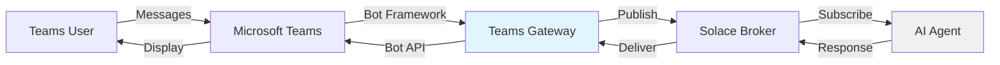

# Microsoft Teams Integration

Agent Mesh Enterprise enables you to deploy AI agents directly into Microsoft Teams, allowing users to interact with agents through familiar chat interfaces. This integration brings conversational AI capabilities to your organization's existing collaboration platform.

<Note>
  Teams integration requires Agent Mesh Enterprise. The Teams gateway component is not available in the community edition.
</Note>

## Overview

The Teams integration works through a gateway component that bridges Microsoft Teams with your Agent Mesh deployment. Users interact with agents through Teams messages, and the gateway handles message routing, authentication, and protocol translation.

### Key Features

- **Native Teams Experience**: Users chat with agents using standard Teams interface
- **Channel Integration**: Deploy agents to specific Teams channels
- **Rich Messaging**: Support for formatted text, cards, and interactive elements
- **File Sharing**: Agents can send and receive files through Teams
- **Authentication**: Leverages Teams identity for user authentication
- **Real-time Responses**: Streaming responses for interactive conversations

## Architecture



### Component Flow

1. **User Message**: User sends message in Teams channel
2. **Bot Framework**: Teams delivers message to gateway via Bot Framework
3. **Message Publishing**: Gateway publishes to Solace broker
4. **Agent Processing**: Agent receives message, processes with LLM, generates response
5. **Response Delivery**: Agent publishes response to broker
6. **Teams Update**: Gateway receives response and updates Teams conversation

## Prerequisites

Before configuring Teams integration, you need:

### Microsoft Azure Setup

1. **Azure Account**: Active Azure subscription
2. **Bot Registration**: Azure Bot Service registration
3. **App Registration**: Microsoft Entra ID app registration
4. **Teams Channel**: Configured Teams channel in Bot Service

### Required Credentials

- **App ID**: Microsoft App ID from bot registration
- **App Password**: Microsoft App Password (client secret)
- **Tenant ID**: Azure AD tenant ID (optional for single-tenant bots)

### Network Access

- **Inbound HTTPS**: Gateway must accept connections from Microsoft Bot Framework
- **Public Endpoint**: HTTPS endpoint accessible by Microsoft services
- **SSL Certificate**: Valid SSL certificate for production deployments

## Azure Bot Registration

### Create Bot Registration

1. **Navigate to Azure Portal**
   ```
   https://portal.azure.com
   ```

2. **Create Resource**
   - Search for "Azure Bot"
   - Click "Create"
   - Select "Azure Bot" resource type

3. **Configure Bot**
   - **Bot handle**: Unique identifier (e.g., `my-agent-bot`)
   - **Subscription**: Your Azure subscription
   - **Resource group**: Create new or select existing
   - **Pricing tier**: F0 (free) for development, S1 for production
   - **Microsoft App ID**: Create new

4. **Set Messaging Endpoint**
   ```
   https://your-gateway-domain.com/api/messages
   ```
   This endpoint receives messages from Microsoft Teams.

### Configure App Credentials

1. **Create Client Secret**
   - Navigate to "Configuration" in your bot resource
   - Click "Manage" next to Microsoft App ID
   - Go to "Certificates & secrets"
   - Click "New client secret"
   - Copy the secret value (you'll need this later)

2. **Note App ID**
   - Return to bot "Configuration"
   - Copy the "Microsoft App ID"
   - This is your `TEAMS_APP_ID`

### Enable Teams Channel

1. **Add Teams Channel**
   - In bot resource, go to "Channels"
   - Click "Microsoft Teams" icon
   - Accept terms and click "Agree"
   - Teams channel now enabled

2. **Verify Configuration**
   - Teams should show "Running" status
   - Messaging endpoint should be validated

## Gateway Configuration

Configure the Teams gateway component in Agent Mesh Enterprise.

### Configuration File

Create `teams_gateway.yaml`:

```yaml
log:
  stdout_log_level: INFO
  log_file_level: DEBUG
  log_file: teams_gateway.log

# Include shared broker configuration
!include ../shared_config.yaml

flows:
  - name: teams_gateway_flow
    components:
      # Teams Gateway Component
      - component_name: teams_gateway
        component_module: solace_agent_mesh_enterprise.gateway.teams
        component_config:
          # Bot credentials
          app_id: ${TEAMS_APP_ID}
          app_password: ${TEAMS_APP_PASSWORD}
          
          # Optional: Tenant ID for single-tenant bots
          tenant_id: ${TEAMS_TENANT_ID:}
          
          # Gateway settings
          gateway_id: teams_gateway_prod
          namespace: ${NAMESPACE:enterprise_prod}
          
          # Server configuration
          host: ${TEAMS_HOST:0.0.0.0}
          port: ${TEAMS_PORT:3978}
          
          # SSL/TLS (required for production)
          ssl_cert: ${TEAMS_SSL_CERT:}
          ssl_key: ${TEAMS_SSL_KEY:}
          
          # Agent routing
          default_agent: ${TEAMS_DEFAULT_AGENT:customer_support_agent}
          
          # Message settings
          max_message_length: 4096
          enable_streaming: true
          
          # Authentication (optional)
          authentication:
            type: teams_identity
            validate_tenant: true
          
          # Broker connection
          broker:
            <<: *broker_connection
```

### Environment Variables

Set these variables when launching the gateway:

```bash
# Bot credentials (required)
export TEAMS_APP_ID="your-microsoft-app-id"
export TEAMS_APP_PASSWORD="your-app-password"

# Optional tenant restriction
export TEAMS_TENANT_ID="your-tenant-id"

# Server settings
export TEAMS_HOST="0.0.0.0"
export TEAMS_PORT="3978"

# SSL certificates (production)
export TEAMS_SSL_CERT="/path/to/cert.pem"
export TEAMS_SSL_KEY="/path/to/key.pem"

# Agent routing
export TEAMS_DEFAULT_AGENT="customer_support_agent"

# Namespace
export NAMESPACE="enterprise_prod"
```

### Docker Deployment

```bash
docker run -d \
  --name teams-gateway \
  -p 3978:3978 \
  -e TEAMS_APP_ID="${TEAMS_APP_ID}" \
  -e TEAMS_APP_PASSWORD="${TEAMS_APP_PASSWORD}" \
  -e TEAMS_SSL_CERT="/app/certs/cert.pem" \
  -e TEAMS_SSL_KEY="/app/certs/key.pem" \
  -e NAMESPACE="enterprise_prod" \
  -v $(pwd)/config:/app/config \
  -v $(pwd)/certs:/app/certs \
  solace-agent-mesh-enterprise:<tag> \
  run config/teams_gateway.yaml
```

## Agent Configuration

Configure agents to work with Teams integration.

### Teams-Optimized Agent

```yaml
flows:
  - name: teams_support_agent
    components:
      - component_name: teams_agent
        component_module: solace_agent_mesh.agent.sac
        component_config:
          agent_name: customer_support_agent
          display_name: "Customer Support"
          
          # Instruction optimized for Teams
          instruction: |
            You are a customer support agent integrated with Microsoft Teams.
            Provide helpful, professional responses to customer inquiries.
            
            Guidelines:
            - Keep responses concise and well-formatted
            - Use bullet points for lists
            - Bold important information with **text**
            - Provide clear next steps
            - Ask clarifying questions when needed
          
          # LLM configuration
          llm:
            model_name: ${LLM_MODEL:gpt-4}
            temperature: 0.7
            max_tokens: 2000
          
          # Tools
          tools:
            - knowledge_base_search
            - ticket_creation
            - file_retrieval
```

### Message Formatting

Agents can use markdown for rich formatting in Teams:

```python
# In agent response
response = """
**Customer Request Received**

I've created ticket #12345 for your issue.

**Next Steps:**
1. Engineering team will review within 24 hours
2. You'll receive email updates
3. Check status at: https://support.example.com/12345

Need anything else?
"""
```

Teams renders this with proper formatting, bold text, and clickable links.

## User Authentication

The Teams gateway can leverage Microsoft Teams identity for authentication.

### Identity Extraction

The gateway automatically extracts user information from Teams messages:

```python
{
  "user_id": "29:1234567890abcdef",
  "name": "John Doe",
  "email": "john.doe@example.com",
  "tenant_id": "tenant-uuid",
  "aad_object_id": "user-uuid"
}
```

This identity flows through to agents for personalization and access control.

### RBAC Integration

Combine Teams identity with RBAC:

```yaml
# user-to-role-assignments.yaml
users:
  john.doe@example.com:
    roles: ["customer_support_rep"]
    description: "Support team member"
```

Agents enforce RBAC scopes based on Teams user identity.

### Tenant Validation

Restrict bot to specific tenant:

```yaml
component_config:
  authentication:
    type: teams_identity
    validate_tenant: true
    allowed_tenants:
      - "your-tenant-id"
```

Messages from other tenants are rejected.

## Advanced Features

### Adaptive Cards

Send rich, interactive cards to Teams:

```python
from solace_agent_mesh_enterprise.gateway.teams.cards import AdaptiveCard

card = AdaptiveCard(
    title="Support Ticket Created",
    body=[
        {"type": "TextBlock", "text": "Ticket #12345"},
        {"type": "TextBlock", "text": "Status: Open"},
    ],
    actions=[
        {
            "type": "Action.OpenUrl",
            "title": "View Ticket",
            "url": "https://support.example.com/12345"
        }
    ]
)

await gateway.send_card(conversation_id, card)
```

### File Handling

Receive files from Teams users:

```python
# Agent receives file attachment
attachment = message.attachments[0]
file_url = attachment.content_url
file_name = attachment.name

# Download and process
file_content = await gateway.download_file(file_url)
result = process_document(file_content)
```

Send files to Teams users:

```python
# Agent sends file
await gateway.send_file(
    conversation_id=conversation_id,
    file_path="/path/to/report.pdf",
    file_name="Monthly_Report.pdf"
)
```

### Proactive Messaging

Send messages without user initiation:

```python
# Requires conversation reference from previous interaction
await gateway.send_proactive_message(
    conversation_reference=stored_reference,
    message="Your support ticket has been resolved!"
)
```

Use cases:
- Notifications
- Alerts
- Scheduled reminders

## Monitoring & Troubleshooting

### Health Checks

Verify gateway health:

```bash
curl https://your-gateway-domain.com/health
```

Expected response:
```json
{
  "status": "healthy",
  "gateway_id": "teams_gateway_prod",
  "broker_connected": true,
  "uptime_seconds": 3600
}
```

### Logging

The gateway logs all Teams interactions:

```
INFO:teams_gateway: Message received from user john.doe@example.com
DEBUG:teams_gateway: Publishing to topic: enterprise/agent/customer_support_agent/request
INFO:teams_gateway: Response delivered to conversation 19:abc123
```

Enable debug logging for troubleshooting:

```yaml
log:
  stdout_log_level: DEBUG
  log_file_level: DEBUG
```

### Common Issues

#### Messages Not Received

**Symptom**: Bot doesn't respond to Teams messages

**Solutions**:
1. Verify messaging endpoint in Azure Bot configuration
2. Check firewall allows inbound HTTPS from Microsoft IPs
3. Confirm SSL certificate is valid
4. Review gateway logs for errors

#### Authentication Failures

**Symptom**: Bot returns 401 errors

**Solutions**:
1. Verify `TEAMS_APP_ID` matches Azure Bot app ID
2. Regenerate app password if expired
3. Check tenant ID if using tenant validation
4. Ensure app has correct permissions

#### Slow Responses

**Symptom**: Bot takes long time to respond

**Solutions**:
1. Enable streaming responses
2. Optimize agent LLM settings
3. Check broker latency
4. Review agent processing time in logs

## Security Best Practices

### SSL/TLS Configuration

Always use HTTPS in production:

```yaml
ssl_cert: "/app/certs/fullchain.pem"
ssl_key: "/app/certs/privkey.pem"
```

Use certificates from trusted CA (Let's Encrypt, DigiCert, etc.).

### Credential Management

- Store app password in secrets manager
- Rotate credentials regularly (every 90 days)
- Use different credentials per environment
- Never commit secrets to version control

### Network Security

- Restrict inbound traffic to Microsoft Bot Framework IPs
- Use Azure Private Link for enhanced security
- Enable DDoS protection
- Implement rate limiting

### Message Validation

Validate all incoming messages:

```yaml
authentication:
  type: teams_identity
  validate_tenant: true
  validate_signature: true
  allowed_tenants:
    - "your-tenant-id"
```

## Example Deployment

Complete example for production deployment:

```bash
#!/bin/bash
# deploy-teams-gateway.sh

# Load secrets from vault
export TEAMS_APP_ID=$(vault read -field=app_id secret/teams/bot)
export TEAMS_APP_PASSWORD=$(vault read -field=password secret/teams/bot)

# Deploy with Docker Compose
docker-compose up -d teams-gateway

# Verify health
sleep 10
curl -f https://teams.example.com/health || exit 1

echo "Teams gateway deployed successfully"
```

**docker-compose.yml:**
```yaml
version: '3.8'

services:
  teams-gateway:
    image: solace-agent-mesh-enterprise:latest
    container_name: teams-gateway
    restart: unless-stopped
    
    ports:
      - "3978:3978"
    
    environment:
      - TEAMS_APP_ID
      - TEAMS_APP_PASSWORD
      - NAMESPACE=production
      - TEAMS_SSL_CERT=/app/certs/cert.pem
      - TEAMS_SSL_KEY=/app/certs/key.pem
    
    volumes:
      - ./config:/app/config
      - ./certs:/app/certs
      - ./logs:/app/logs
    
    command: run config/teams_gateway.yaml
    
    healthcheck:
      test: ["CMD", "curl", "-f", "https://localhost:3978/health"]
      interval: 30s
      timeout: 10s
      retries: 3
```

## Next Steps

<CardGroup cols={2}>
  <Card title="Authentication" icon="lock" href="/enterprise/authentication">
    Configure OAuth2 and RBAC
  </Card>
  
  <Card title="Security" icon="shield" href="/enterprise/security">
    Implement security best practices
  </Card>
</CardGroup>