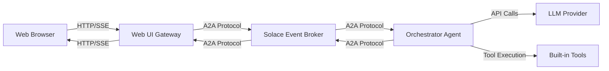

# Quickstart Guide

Get Solace Agent Mesh up and running in approximately 5 minutes. This guide will walk you through installation, project initialization, and running your first agent mesh.

<Note>
This quickstart uses a local development setup with in-memory queues. For production deployments, see the deployment documentation.
</Note>

## Prerequisites

Before you begin, ensure you have:

<Steps>
  <Step title="Python 3.10.16+">
    Check your Python version:
    ```bash
    python3 --version
    ```
    If you need to install or upgrade Python, visit [python.org](https://www.python.org/downloads/)
  </Step>
  
  <Step title="pip package manager">
    pip comes with Python. Verify it's installed:
    ```bash
    pip3 --version
    ```
  </Step>
  
  <Step title="LLM API Key">
    Obtain an API key from any major provider:
    - OpenAI (GPT-4, GPT-4o)
    - Anthropic (Claude Sonnet, Claude Opus)
    - Google (Gemini Pro, Gemini Flash)
    - Or any OpenAI-compatible endpoint (Ollama, LiteLLM, etc.)
  </Step>
</Steps>

## Installation Steps

### Step 1: Create a Project Directory

Create a new directory for your Agent Mesh project:

```bash
mkdir my-sam && cd my-sam
```

### Step 2: Set Up Python Virtual Environment

Create and activate a Python virtual environment:

<CodeGroup>
```bash macOS/Linux
python3 -m venv .venv && source .venv/bin/activate
```

```bash Windows (WSL)
python3 -m venv .venv && source .venv/bin/activate
```
</CodeGroup>

<Info>
Using a virtual environment isolates your project dependencies and prevents conflicts with other Python projects.
</Info>

### Step 3: Install Solace Agent Mesh

Check if you have a previous version installed:

```bash
sam -v
```

If you have an earlier version, uninstall it first:

```bash
pip3 uninstall solace-agent-mesh
```

<Warning>
Upgrading versions with `pip3 install --upgrade solace-agent-mesh` is not officially supported. Always uninstall and start from scratch when upgrading.
</Warning>

Install the latest version:

```bash
pip3 install solace-agent-mesh
```

Verify the installation:

```bash
sam -v
# or
solace-agent-mesh -v
```

## Initialize Your Project

### Step 4: Launch the GUI Initialization Tool

Solace Agent Mesh provides a web-based GUI for easy project setup:

```bash
sam init --gui
```

<Info>
The initialization UI runs on port 5002 by default. Navigate to `http://localhost:5002` in your browser if it doesn't open automatically.
</Info>

The GUI will guide you through:

<Tabs>
  <Tab title="Broker Setup">
    Choose your event broker configuration:
    - **New local Solace broker container**: Automatically downloads and runs a Solace container
    - **Existing Solace broker**: Connect to an existing broker
    - **Development mode**: Use in-memory queues (for quick testing only)
    
    For this quickstart, select "Development mode" for the fastest setup.
  </Tab>
  
  <Tab title="LLM Configuration">
    Configure your AI models:
    - **LLM Provider**: Select your provider (OpenAI, Anthropic, Google, etc.)
    - **API Endpoint**: Your LLM service endpoint URL
    - **API Key**: Your LLM API key
    - **Planning Model**: Model for complex planning tasks (e.g., `anthropic/claude-3-5-sonnet-20241022`)
    - **General Model**: Model for general tasks (e.g., `anthropic/claude-3-5-sonnet-20241022`)
  </Tab>
  
  <Tab title="Project Settings">
    Configure project-level settings:
    - **Namespace**: Topic namespace for A2A communication (e.g., `solace_app/`)
    - **Agent Name**: Name for your orchestrator agent (default: `OrchestratorAgent`)
    - **Session Service**: Choose memory, SQL, or Vertex RAG for session storage
    - **Artifact Service**: Choose memory, filesystem, GCS, or S3 for artifact storage
  </Tab>
  
  <Tab title="Web UI Gateway">
    Configure the web interface:
    - **Enable Web UI**: Toggle to include web interface
    - **Host**: Server host (default: `localhost`)
    - **Port**: Server port (default: `8000`)
    - **Welcome Message**: Custom greeting for users
    - **Bot Name**: Display name for your agent mesh
  </Tab>
</Tabs>

### Alternative: Command-Line Initialization

For automated setups or scripting, use the CLI directly:

```bash
sam init --skip \
  --llm-service-endpoint "https://api.anthropic.com/v1" \
  --llm-service-api-key "YOUR_API_KEY" \
  --llm-service-planning-model-name "anthropic/claude-3-5-sonnet-20241022" \
  --llm-service-general-model-name "anthropic/claude-3-5-sonnet-20241022" \
  --namespace "solace_app/" \
  --broker-type "dev" \
  --add-webui-gateway
```

<Tip>
Run `sam init --help` to see all available configuration options.
</Tip>

### What Gets Created

The initialization process creates:

<CodeGroup>
```plaintext Project Structure
my-sam/
├── .env                          # Environment variables
├── .solace/                      # Agent Mesh configuration
│   ├── agents/
│   │   └── orchestrator.yaml     # Main orchestrator agent
│   └── gateways/
│       └── webui_gateway.yaml    # Web UI gateway
└── shared_config.yaml            # Shared configuration
```

```yaml .env (Example)
NAMESPACE=solace_app/
SOLACE_DEV_MODE=true
SOLACE_BROKER_URL=ws://localhost:8008
SOLACE_BROKER_VPN=default
SOLACE_BROKER_USERNAME=default
SOLACE_BROKER_PASSWORD=default

LLM_SERVICE_ENDPOINT=https://api.anthropic.com/v1
LLM_SERVICE_API_KEY=YOUR_API_KEY
LLM_SERVICE_PLANNING_MODEL_NAME=anthropic/claude-3-5-sonnet-20241022
LLM_SERVICE_GENERAL_MODEL_NAME=anthropic/claude-3-5-sonnet-20241022

FASTAPI_HOST=localhost
FASTAPI_PORT=8000
SESSION_SECRET_KEY=your-secret-key-here
```
</CodeGroup>

## Run Your Agent Mesh

### Step 5: Start the Agent Mesh

Run all components (agents and gateways) in a single process:

```bash
sam run
```

You should see output similar to:

```plaintext
2026-03-04 - solace_agent_mesh.cli.commands.run_cmd - INFO - Loaded environment variables from: /path/to/my-sam/.env
2026-03-04 - solace_agent_mesh.cli.commands.run_cmd - INFO - Final list of configuration files to run:
  - /path/to/my-sam/.solace/agents/orchestrator.yaml
  - /path/to/my-sam/.solace/gateways/webui_gateway.yaml
2026-03-04 - INFO - Starting Solace AI Connector...
2026-03-04 - INFO - Agent Host initialized: OrchestratorAgent
2026-03-04 - INFO - Web UI Gateway started on http://localhost:8000
```

<Tip>
Use `sam run --help` to see additional options, including:
- `--skip` or `-s`: Skip specific configuration files
- `--system-env` or `-u`: Use system environment variables only
</Tip>

### Advanced: Running Specific Components

You can run specific configuration files:

```bash
# Run only the orchestrator agent
sam run .solace/agents/orchestrator.yaml

# Run orchestrator and web UI
sam run .solace/agents/orchestrator.yaml .solace/gateways/webui_gateway.yaml

# Run all configs except one
sam run -s orchestrator.yaml
```

## Verify and Test

### Step 6: Access the Web Interface

Once the agent mesh is running, open your browser to:

```
http://localhost:8000
```

<Info>
If you configured a different port during initialization, use that port instead.
</Info>

### Step 7: Test Your Agent Mesh

Try these example prompts in the web interface:

<CardGroup cols={2}>
  <Card title="Simple Query" icon="message">
    "Hello! What can you help me with?"
    
    Tests basic agent response and LLM connectivity.
  </Card>
  
  <Card title="Time Query" icon="clock">
    "What is the current time?"
    
    Tests built-in tool execution (get_current_time).
  </Card>
  
  <Card title="Artifact Creation" icon="file">
    "Create a simple to-do list for planning a vacation"
    
    Tests artifact management tools.
  </Card>
  
  <Card title="Data Analysis" icon="chart-line">
    "Create a sample sales dataset and visualize it"
    
    Tests data analysis and visualization tools.
  </Card>
</CardGroup>

## Understanding Your Setup

Your Agent Mesh consists of:

### Components Running

<Tabs>
  <Tab title="Orchestrator Agent">
    The main orchestrator agent that:
    - Processes tasks from gateways
    - Coordinates with other agents (when you add them)
    - Has access to built-in tools:
      - Artifact management (create, list, load files)
      - Data analysis (SQL, JQ, visualizations)
      - Time utilities
      - Peer agent delegation (when other agents are available)
  </Tab>
  
  <Tab title="Web UI Gateway">
    The web interface that:
    - Provides a browser-based chat interface
    - Translates HTTP requests to A2A protocol
    - Handles user sessions
    - Displays streaming responses and artifacts
    - Manages file uploads and downloads
  </Tab>
</Tabs>

### Communication Flow



## Next Steps

Now that you have a working Agent Mesh, explore these topics:

<CardGroup cols={2}>
  <Card title="Add Custom Agents" icon="plus">
    Create specialized agents for specific tasks:
    ```bash
    sam add agent --gui
    ```
    Learn more in the Architecture guide.
  </Card>
  
  <Card title="Install Plugins" icon="plug">
    Extend functionality with pre-built plugins:
    ```bash
    sam plugin add weather-agent --plugin weather
    ```
    Browse available plugins in the repository.
  </Card>
  
  <Card title="Add More Gateways" icon="window">
    Connect additional interfaces (Slack, REST API, etc.):
    ```bash
    sam add gateway --gui
    ```
  </Card>
  
  <Card title="Learn the Architecture" icon="sitemap" href="/architecture">
    Understand how Agent Mesh works under the hood and the event-driven architecture.
  </Card>
</CardGroup>

## Common CLI Commands

Here are the most useful commands for working with Agent Mesh:

<CodeGroup>
```bash Project Management
# Initialize a new project
sam init --gui

# Run the agent mesh
sam run

# Check version
sam -v
```

```bash Adding Components
# Add an agent (GUI)
sam add agent --gui

# Add a gateway (GUI)
sam add gateway --gui

# Add a component from plugin
sam plugin add <component-name> --plugin <plugin-name>
```

```bash Plugin Management
# List available plugins
sam plugin catalog

# Install a plugin
sam plugin install <plugin-name>

# Create a new plugin
sam plugin create
```

```bash Help & Documentation
# General help
sam --help

# Command-specific help
sam init --help
sam run --help
sam add --help
```
</CodeGroup>

## Troubleshooting

<AccordionGroup>
  <Accordion title="Port 8000 already in use">
    If port 8000 is already in use, you can:
    1. Stop the service using that port
    2. Or modify the `FASTAPI_PORT` in your `.env` file to use a different port
    
    ```bash
    # In .env
    FASTAPI_PORT=8001
    ```
  </Accordion>
  
  <Accordion title="LLM API key errors">
    Verify your API key is correct in the `.env` file:
    ```bash
    cat .env | grep LLM_SERVICE_API_KEY
    ```
    
    Ensure the endpoint URL matches your provider:
    - OpenAI: `https://api.openai.com/v1`
    - Anthropic: `https://api.anthropic.com/v1`
    - Google: `https://generativelanguage.googleapis.com/v1beta`
  </Accordion>
  
  <Accordion title="Import errors or module not found">
    Ensure you're in the correct virtual environment:
    ```bash
    which python3
    # Should show: /path/to/my-sam/.venv/bin/python3
    ```
    
    If not, reactivate the virtual environment:
    ```bash
    source .venv/bin/activate
    ```
  </Accordion>
  
  <Accordion title="Agent not responding">
    Check the logs for errors. Common issues:
    - Invalid model name format (should be `provider/model-name`)
    - Network connectivity to LLM provider
    - Insufficient API credits or rate limiting
    
    Enable debug logging by setting in your config:
    ```yaml
    log:
      stdout_log_level: DEBUG
      log_file_level: DEBUG
    ```
  </Accordion>
</AccordionGroup>

## Additional Resources

<CardGroup cols={3}>
  <Card title="GitHub Repository" icon="github" href="https://github.com/SolaceLabs/solace-agent-mesh">
    View source code, examples, and contribute
  </Card>
  
  <Card title="PyPI Package" icon="python" href="https://pypi.org/project/solace-agent-mesh">
    Package information and release history
  </Card>
  
  <Card title="Solace Platform" icon="cloud" href="https://solace.com">
    Learn about the Solace Event Broker
  </Card>
</CardGroup>
