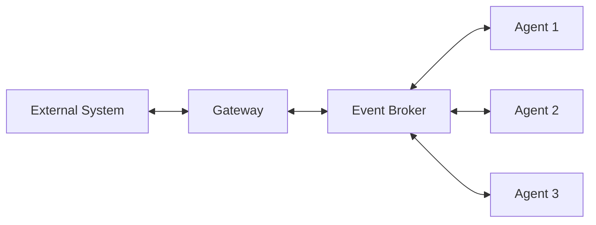

<Info>
  **What you'll build**: A custom gateway that connects agents to a messaging platform
  
  **Time**: ~25 minutes
  
  **Prerequisites**:
  - Completed the [Hello World tutorial](/tutorials/hello-world)
  - Python programming experience
  - Understanding of async/await in Python
</Info>

## What you'll learn

This tutorial demonstrates:
- Gateway architecture in SAM
- Creating custom gateway adapters
- Bidirectional communication patterns
- User identity management
- Message formatting and artifacts
- Deployment strategies

## Understanding gateways

Gateways are the bridge between external systems and your agent mesh:



### Built-in gateways

SAM includes several gateways:
- **WebUI Gateway**: Web-based chat interface
- **Slack Gateway**: Slack integration
- **REST Gateway**: HTTP API access
- **Webhook Gateway**: Incoming webhooks
- **MCP Gateway**: Model Context Protocol server

### Why build custom gateways?

Build custom gateways to:
- Integrate with proprietary systems
- Support custom protocols or interfaces
- Add specialized authentication
- Implement custom message routing
- Connect legacy systems

## Step-by-step guide

<Steps>
<Step title="Understand the gateway base classes">

SAM provides base classes to build upon:

```python
from solace_agent_mesh.gateway.base import BaseGatewayApp, BaseGatewayAdapter
```

**BaseGatewayApp**:
- Manages broker connections
- Handles agent discovery
- Routes messages to/from agents
- Manages user sessions

**BaseGatewayAdapter**:
- Interfaces with external systems
- Converts external messages to SAM format
- Formats agent responses for external system

</Step>

<Step title="Create a simple console gateway">

Let's build a console/terminal gateway as a learning example.

Create `console_gateway_adapter.py`:

```python console_gateway_adapter.py
import asyncio
import sys
from typing import Any, Dict, List, Optional
from solace_agent_mesh.gateway.generic.base_adapter import BaseGatewayAdapter


class ConsoleGatewayAdapter(BaseGatewayAdapter):
    """
    A simple console/terminal gateway adapter.
    Reads user input from stdin and prints agent responses to stdout.
    """

    def __init__(self, config: Dict[str, Any]):
        super().__init__(config)
        self.running = False
        self.input_task: Optional[asyncio.Task] = None

    async def initialize(self):
        """Initialize the console gateway."""
        print("\n" + "="*60)
        print("  SAM Console Gateway")
        print("="*60)
        print("Connected to Agent Mesh")
        print("Type your messages and press Enter")
        print("Type 'quit' or 'exit' to stop\n")
        self.running = True

    async def start(self):
        """Start reading user input."""
        self.input_task = asyncio.create_task(self._read_input_loop())

    async def stop(self):
        """Stop the gateway."""
        self.running = False
        if self.input_task:
            self.input_task.cancel()
            try:
                await self.input_task
            except asyncio.CancelledError:
                pass
        print("\nConsole gateway stopped.")

    async def _read_input_loop(self):
        """Read user input in a loop."""
        while self.running:
            try:
                # Read input (blocking, but in executor)
                loop = asyncio.get_event_loop()
                user_input = await loop.run_in_executor(
                    None, 
                    lambda: input("You: ")
                )

                # Check for exit commands
                if user_input.lower() in ['quit', 'exit']:
                    print("Exiting...")
                    self.running = False
                    break

                # Skip empty input
                if not user_input.strip():
                    continue

                # Send message to agents
                await self._handle_user_message(user_input)

            except EOFError:
                print("\nInput stream closed.")
                self.running = False
                break
            except Exception as e:
                print(f"Error reading input: {e}")

    async def _handle_user_message(self, message: str):
        """Process user message and send to agent."""
        # Create user identity
        user_id = "console_user"
        
        # Send to agent via gateway component
        await self.send_message_to_agent(
            user_id=user_id,
            message_text=message,
            agent_name=None,  # Use default agent
            artifacts=[],  # No file uploads from console
            metadata={}
        )

    async def handle_agent_response(
        self,
        user_id: str,
        response_text: Optional[str],
        artifacts: List[Any],
        metadata: Dict[str, Any]
    ):
        """Handle responses from agents."""
        print(f"\nAgent: {response_text}\n")
        
        # Show artifacts if any
        if artifacts:
            print("Attached artifacts:")
            for artifact in artifacts:
                print(f"  - {artifact.get('filename', 'unknown')}")
            print()

    async def handle_agent_status_update(
        self,
        user_id: str,
        status_text: str,
        metadata: Dict[str, Any]
    ):
        """Handle status updates from agents."""
        # Print status updates in a different format
        print(f"[Status: {status_text}]", end='\r')
        sys.stdout.flush()
```

</Step>

<Step title="Create the gateway configuration">

Create `console_gateway.yaml`:

```yaml console_gateway.yaml
log:
  stdout_log_level: INFO
  log_file_level: DEBUG
  log_file: console_gateway.log

!include shared_config.yaml

apps:
  - name: console_gateway_app
    app_base_path: .
    app_module: solace_agent_mesh.gateway.generic.app
    
    broker:
      <<: *broker_connection
    
    app_config:
      namespace: ${NAMESPACE}
      gateway_id: "console_gateway"
      
      # Point to our custom adapter
      gateway_adapter: console_gateway_adapter.ConsoleGatewayAdapter
      
      # Adapter configuration
      adapter_config:
        # Custom config for your adapter
        prompt_symbol: "You: "
      
      # Default agent to use
      default_agent_name: "OrchestratorAgent"
      
      # Artifact service
      artifact_service:
        type: "filesystem"
        base_path: "/tmp/samv2"
        artifact_scope: namespace
      
      # Enable embed resolution
      enable_embed_resolution: true
      
      # System purpose
      system_purpose: |
        You are a helpful AI assistant accessed via the console.
        Provide clear, concise responses.
```

</Step>

<Step title="Test your custom gateway">

Run the console gateway:

```bash
sam run -f console_gateway.yaml
```

You should see:
```
============================================================
  SAM Console Gateway
============================================================
Connected to Agent Mesh
Type your messages and press Enter
Type 'quit' or 'exit' to stop

You: _
```

Try some messages:

```
You: Hello, what can you help me with?
[Status: Processing your request...]
Agent: Hello! I'm your AI assistant. I can help you with...

You: What's 25 * 37?
[Status: Calculating...]
Agent: 25 * 37 = 925

You: exit
Exiting...
Console gateway stopped.
```

</Step>

<Step title="Add advanced features">

Enhance your gateway with more features:

### File upload support

```python
async def _handle_user_message(self, message: str):
    """Enhanced to support file attachments."""
    artifacts = []
    
    # Check for file attachment syntax: @file:/path/to/file.txt
    import re
    file_pattern = r'@file:(\S+)'
    files = re.findall(file_pattern, message)
    
    for file_path in files:
        try:
            with open(file_path, 'rb') as f:
                content = f.read()
                artifacts.append({
                    'filename': file_path.split('/')[-1],
                    'content': content,
                    'mime_type': 'application/octet-stream'
                })
            # Remove file reference from message
            message = message.replace(f'@file:{file_path}', '')
        except Exception as e:
            print(f"Error loading file {file_path}: {e}")
    
    await self.send_message_to_agent(
        user_id="console_user",
        message_text=message.strip(),
        artifacts=artifacts
    )
```

Usage:
```
You: Analyze this file @file:data.csv
```

### Multi-user support

```python
class ConsoleGatewayAdapter(BaseGatewayAdapter):
    def __init__(self, config: Dict[str, Any]):
        super().__init__(config)
        self.current_user = None
    
    async def initialize(self):
        """Initialize and prompt for username."""
        print("\nEnter your name: ", end='')
        loop = asyncio.get_event_loop()
        self.current_user = await loop.run_in_executor(
            None,
            lambda: input()
        )
        print(f"Welcome, {self.current_user}!\n")
    
    async def _handle_user_message(self, message: str):
        await self.send_message_to_agent(
            user_id=self.current_user,
            message_text=message
        )
```

### Rich formatting

```python
from rich.console import Console
from rich.markdown import Markdown
from rich.panel import Panel

class ConsoleGatewayAdapter(BaseGatewayAdapter):
    def __init__(self, config: Dict[str, Any]):
        super().__init__(config)
        self.console = Console()
    
    async def handle_agent_response(
        self,
        user_id: str,
        response_text: Optional[str],
        artifacts: List[Any],
        metadata: Dict[str, Any]
    ):
        """Display response with rich formatting."""
        # Render markdown
        md = Markdown(response_text or "")
        panel = Panel(
            md,
            title="Agent Response",
            border_style="blue"
        )
        self.console.print(panel)
```

Install rich:
```bash
pip install rich
```

</Step>
</Steps>

## Real-world gateway: Telegram bot

<AccordionGroup>
  <Accordion title="Complete Telegram gateway implementation">
    Here's a production-ready Telegram gateway:
    
    ```python telegram_gateway_adapter.py
    import asyncio
    from typing import Any, Dict, List, Optional
    from telegram import Update
    from telegram.ext import (
        Application,
        CommandHandler,
        MessageHandler,
        filters,
        ContextTypes
    )
    from solace_agent_mesh.gateway.generic.base_adapter import BaseGatewayAdapter
    
    
    class TelegramGatewayAdapter(BaseGatewayAdapter):
        """Telegram bot gateway adapter."""
    
        def __init__(self, config: Dict[str, Any]):
            super().__init__(config)
            self.bot_token = config['bot_token']
            self.application: Optional[Application] = None
        
        async def initialize(self):
            """Initialize Telegram bot."""
            self.application = (
                Application.builder()
                .token(self.bot_token)
                .build()
            )
            
            # Register handlers
            self.application.add_handler(
                CommandHandler("start", self._handle_start_command)
            )
            self.application.add_handler(
                MessageHandler(
                    filters.TEXT & ~filters.COMMAND,
                    self._handle_message
                )
            )
            self.application.add_handler(
                MessageHandler(
                    filters.Document.ALL,
                    self._handle_document
                )
            )
        
        async def start(self):
            """Start the bot."""
            await self.application.initialize()
            await self.application.start()
            await self.application.updater.start_polling()
            print("Telegram bot started")
        
        async def stop(self):
            """Stop the bot."""
            if self.application:
                await self.application.updater.stop()
                await self.application.stop()
                await self.application.shutdown()
            print("Telegram bot stopped")
        
        async def _handle_start_command(
            self,
            update: Update,
            context: ContextTypes.DEFAULT_TYPE
        ):
            """Handle /start command."""
            await update.message.reply_text(
                "Welcome to SAM! Send me a message and I'll help you."
            )
        
        async def _handle_message(
            self,
            update: Update,
            context: ContextTypes.DEFAULT_TYPE
        ):
            """Handle text messages."""
            user_id = str(update.effective_user.id)
            message_text = update.message.text
            
            # Send typing indicator
            await update.message.chat.send_action("typing")
            
            # Send to agent
            await self.send_message_to_agent(
                user_id=user_id,
                message_text=message_text,
                metadata={
                    'username': update.effective_user.username,
                    'chat_id': update.message.chat_id
                }
            )
        
        async def _handle_document(
            self,
            update: Update,
            context: ContextTypes.DEFAULT_TYPE
        ):
            """Handle file uploads."""
            user_id = str(update.effective_user.id)
            document = update.message.document
            
            # Download file
            file = await document.get_file()
            file_content = await file.download_as_bytearray()
            
            artifacts = [{
                'filename': document.file_name,
                'content': bytes(file_content),
                'mime_type': document.mime_type or 'application/octet-stream'
            }]
            
            # Send to agent with caption
            caption = update.message.caption or "Analyze this file"
            await self.send_message_to_agent(
                user_id=user_id,
                message_text=caption,
                artifacts=artifacts
            )
        
        async def handle_agent_response(
            self,
            user_id: str,
            response_text: Optional[str],
            artifacts: List[Any],
            metadata: Dict[str, Any]
        ):
            """Send agent response back to user."""
            chat_id = metadata.get('chat_id')
            
            if not chat_id:
                return
            
            # Send text response
            if response_text:
                await self.application.bot.send_message(
                    chat_id=chat_id,
                    text=response_text,
                    parse_mode='Markdown'
                )
            
            # Send artifacts as files
            for artifact in artifacts:
                await self.application.bot.send_document(
                    chat_id=chat_id,
                    document=artifact['content'],
                    filename=artifact['filename']
                )
        
        async def handle_agent_status_update(
            self,
            user_id: str,
            status_text: str,
            metadata: Dict[str, Any]
        ):
            """Show typing indicator for status updates."""
            chat_id = metadata.get('chat_id')
            if chat_id:
                # Keep showing typing indicator
                await self.application.bot.send_chat_action(
                    chat_id=chat_id,
                    action="typing"
                )
    ```
    
    Configuration:
    ```yaml
    adapter_config:
      bot_token: ${TELEGRAM_BOT_TOKEN}
    ```
    
    Get a bot token from [@BotFather](https://t.me/botfather) on Telegram.
  </Accordion>
</AccordionGroup>

## Gateway adapter patterns

### Message routing

```python
async def send_message_to_agent(
    self,
    user_id: str,
    message_text: str,
    agent_name: Optional[str] = None
):
    """Route messages to specific agents based on content."""
    
    # Route based on keywords
    if "weather" in message_text.lower():
        agent_name = "WeatherAgent"
    elif "database" in message_text.lower() or "query" in message_text.lower():
        agent_name = "DatabaseAgent"
    else:
        agent_name = self.default_agent_name
    
    # Send to agent
    await self.gateway_component.send_to_agent(
        user_id=user_id,
        message=message_text,
        agent_name=agent_name
    )
```

### Session management

```python
class MyGatewayAdapter(BaseGatewayAdapter):
    def __init__(self, config: Dict[str, Any]):
        super().__init__(config)
        self.user_sessions: Dict[str, Dict] = {}
    
    async def _handle_user_message(self, user_id: str, message: str):
        # Get or create session
        if user_id not in self.user_sessions:
            self.user_sessions[user_id] = {
                'created_at': asyncio.get_event_loop().time(),
                'message_count': 0,
                'preferences': {}
            }
        
        session = self.user_sessions[user_id]
        session['message_count'] += 1
        
        # Send with session context
        await self.send_message_to_agent(
            user_id=user_id,
            message_text=message,
            metadata={'session': session}
        )
```

### Error handling

```python
async def handle_agent_error(
    self,
    user_id: str,
    error: Exception,
    metadata: Dict[str, Any]
):
    """Handle errors from agents gracefully."""
    
    # Log the error
    self.logger.error(f"Agent error for user {user_id}: {error}")
    
    # Send user-friendly message
    user_message = (
        "I'm sorry, I encountered an error processing your request. "
        "Please try again or rephrase your question."
    )
    
    await self.send_user_message(user_id, user_message)
```

## Testing your gateway

Create comprehensive tests:

```python test_gateway.py
import pytest
import asyncio
from console_gateway_adapter import ConsoleGatewayAdapter


@pytest.mark.asyncio
async def test_gateway_initialization():
    """Test gateway initializes correctly."""
    config = {}
    adapter = ConsoleGatewayAdapter(config)
    
    await adapter.initialize()
    assert adapter.running is True


@pytest.mark.asyncio
async def test_message_handling():
    """Test message processing."""
    config = {}
    adapter = ConsoleGatewayAdapter(config)
    await adapter.initialize()
    
    # Mock send_message_to_agent
    messages_sent = []
    async def mock_send(user_id, message_text, **kwargs):
        messages_sent.append(message_text)
    
    adapter.send_message_to_agent = mock_send
    
    # Send test message
    await adapter._handle_user_message("test message")
    
    assert len(messages_sent) == 1
    assert messages_sent[0] == "test message"


@pytest.mark.asyncio
async def test_response_handling():
    """Test handling agent responses."""
    config = {}
    adapter = ConsoleGatewayAdapter(config)
    await adapter.initialize()
    
    # Test response with artifacts
    await adapter.handle_agent_response(
        user_id="test_user",
        response_text="Hello, world!",
        artifacts=[{'filename': 'test.txt'}],
        metadata={}
    )
    # Should print without errors
```

Run tests:
```bash
pytest test_gateway.py -v
```

## Deployment strategies

### Docker container

```dockerfile Dockerfile
FROM python:3.10-slim

WORKDIR /app

COPY requirements.txt .
RUN pip install --no-cache-dir -r requirements.txt

COPY console_gateway_adapter.py .
COPY console_gateway.yaml .
COPY shared_config.yaml .
COPY .env .

CMD ["sam", "run", "-f", "console_gateway.yaml"]
```

Build and run:
```bash
docker build -t my-gateway .
docker run -it my-gateway
```

### Kubernetes deployment

```yaml k8s/gateway-deployment.yaml
apiVersion: apps/v1
kind: Deployment
metadata:
  name: sam-console-gateway
spec:
  replicas: 1
  selector:
    matchLabels:
      app: sam-gateway
  template:
    metadata:
      labels:
        app: sam-gateway
    spec:
      containers:
      - name: gateway
        image: my-gateway:latest
        env:
        - name: SOLACE_BROKER_URL
          valueFrom:
            configMapKeyRef:
              name: sam-config
              key: broker-url
        - name: NAMESPACE
          value: "production"
```

## Next steps

<CardGroup cols={2}>

<Card title="Multi-Agent Collaboration" icon="users" href="/tutorials/multi-agent-collaboration">
  Create collaborative agent teams
</Card>

<Card title="Complex Workflows" icon="diagram-nested" href="/tutorials/complex-workflows">
  Build advanced workflow patterns
</Card>

<Card title="Production Deployment" icon="rocket" href="/tutorials/production-deployment">
  Deploy to production environments
</Card>

<Card title="Gateway Reference" icon="book" href="/essentials/gateways">
  Complete gateway documentation
</Card>

</CardGroup>

## Troubleshooting

<AccordionGroup>
  <Accordion title="Adapter not loading">
    **Problem**: "Module 'my_adapter' not found"
    
    **Solution**:
    1. Verify the module path is correct
    2. Ensure the file is in the `app_base_path` directory
    3. Check the class name matches exactly
    4. Add `__init__.py` if using package structure
  </Accordion>

  <Accordion title="Messages not reaching agents">
    **Problem**: Messages sent but no response
    
    **Solution**:
    1. Check broker connection in logs
    2. Verify `namespace` matches agent configuration
    3. Ensure `default_agent_name` is correct
    4. Check agent discovery is enabled
  </Accordion>

  <Accordion title="Async/await errors">
    **Problem**: "RuntimeError: Event loop is closed"
    
    **Solution**:
    ```python
    # Always use async/await properly
    async def my_method(self):
        # Correct
        await self.send_message_to_agent(...)
        
        # Incorrect - don't use .result() or run_until_complete()
        # self.send_message_to_agent(...).result()  # NO!
    ```
  </Accordion>
</AccordionGroup>

## Key concepts learned

<Check>
  - Gateway architecture and purpose
  - Creating custom gateway adapters
  - Bidirectional communication patterns
  - Message routing and session management
  - Error handling and testing
  - Deployment strategies
</Check>

You now have the knowledge to create custom gateways that connect your agents to any external system or interface!
