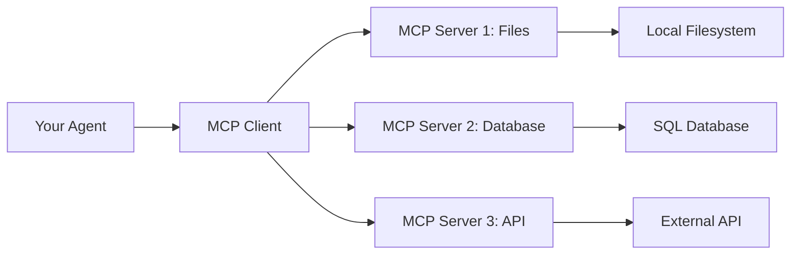

<Info>
  **What you'll build**: An agent that uses MCP servers to interact with external services
  
  **Time**: ~20 minutes
  
  **Prerequisites**:
  - Completed the [Hello World tutorial](/tutorials/hello-world)
  - Node.js installed (for npm-based MCP servers)
  - Understanding of agents from previous tutorials
</Info>

## What you'll learn

This tutorial demonstrates:
- What MCP (Model Context Protocol) is and why it matters
- Connecting agents to MCP servers (stdio and SSE)
- Using popular MCP servers (filesystem, web search, etc.)
- Creating multi-agent systems with MCP capabilities
- Authentication and configuration

## Understanding MCP

Model Context Protocol (MCP) is an open protocol that standardizes how AI applications connect to external data sources and tools.

### Why use MCP?

<CardGroup cols={2}>

<Card title="Standardized Integration" icon="plug">
  One protocol for all tools - no custom integrations needed
</Card>

<Card title="Growing Ecosystem" icon="globe">
  Access hundreds of pre-built MCP servers
</Card>

<Card title="Vendor Neutral" icon="shield-halved">
  Works with any LLM or AI framework
</Card>

<Card title="Easy to Build" icon="hammer">
  Create your own MCP servers simply
</Card>

</CardGroup>

### MCP architecture



## Step-by-step guide

<Steps>
<Step title="Example 1: Filesystem MCP server">

The filesystem MCP server gives your agent safe access to read and write files.

Create `filesystem_agent.yaml`:

```yaml filesystem_agent.yaml
log:
  stdout_log_level: INFO
  log_file_level: DEBUG
  log_file: filesystem_agent.log

!include shared_config.yaml

apps:
  - name: filesystem_agent_app
    app_base_path: .
    app_module: solace_agent_mesh.agent.sac.app
    broker:
      <<: *broker_connection

    app_config:
      namespace: ${NAMESPACE}
      agent_name: "FilesystemAgent"
      display_name: "File Manager Agent"
      model: *planning_model
      
      instruction: |
        You are a file management assistant. You can help users:
        - Read file contents
        - List directory contents
        - Create new files
        - Search for files
        
        You have access to a specific directory for file operations.
        Always confirm actions before modifying files.
      
      # Configure MCP filesystem server
      tools:
        - tool_type: mcp
          connection_params:
            type: stdio
            command: "npx"
            args:
              - "-y"
              - "@modelcontextprotocol/server-filesystem"
              - "/tmp/mcp-workspace"  # Allowed directory
        
        # Also include artifact management
        - tool_type: builtin-group
          group_name: "artifact_management"
      
      supports_streaming: true
      
      session_service:
        type: "memory"
        default_behavior: "PERSISTENT"
      
      artifact_service:
        type: "filesystem"
        base_path: "/tmp/samv2"
        artifact_scope: namespace
      
      agent_card:
        description: |
          Manages files and directories using the MCP filesystem server.
          Can read, write, and search files in allowed directories.
        defaultInputModes: ["text"]
        defaultOutputModes: ["text", "file"]
        skills:
          - id: "file_operations"
            name: "File Operations"
            description: "Read, write, and manage files"
            examples:
              - "List files in the workspace"
              - "Read the contents of config.txt"
              - "Create a new file called notes.md"
      
      agent_card_publishing: { interval_seconds: 10 }
      agent_discovery: { enabled: true }
```

Create the workspace directory:

```bash
mkdir -p /tmp/mcp-workspace
echo "Hello from MCP!" > /tmp/mcp-workspace/test.txt
```

Run the agent:

```bash
sam run -f filesystem_agent.yaml
```

Test it:
```
List all files in the workspace
```

```
Read the contents of test.txt
```

```
Create a new file called hello.md with "# Hello World" as content
```

</Step>

<Step title="Example 2: Remote MCP server with SSE">

SSE (Server-Sent Events) allows connecting to remote MCP servers. Let's use the Atlassian MCP server:

Create `atlassian_agent.yaml`:

```yaml atlassian_agent.yaml
log:
  stdout_log_level: INFO
  log_file_level: DEBUG
  log_file: atlassian_agent.log

!include shared_config.yaml

apps:
  - name: atlassian_agent_app
    app_base_path: .
    app_module: solace_agent_mesh.agent.sac.app
    broker:
      <<: *broker_connection

    app_config:
      namespace: ${NAMESPACE}
      agent_name: "AtlassianAgent"
      display_name: "Jira & Confluence Agent"
      model: *general_model
      
      instruction: |
        You can interact with Jira and Confluence. Available operations:
        
        **Jira**:
        - Search for issues
        - Create new issues
        - Update issue status
        - Add comments
        - Get issue details
        
        **Confluence**:
        - Search pages and spaces
        - Read page content
        - Create new pages
        - Update existing pages
        - Add comments
        
        When you need a cloudId, first use getAccessibleAtlassianResources.
        Do NOT use parallel tool calls.
      
      # MCP SSE connection to Atlassian
      tools:
        - tool_type: mcp
          connection_params:
            type: sse
            url: "https://mcp.atlassian.com/v1/sse"
          # Authentication handled via OAuth2
          auth:
            type: oauth2
      
      supports_streaming: true
      
      session_service:
        type: "memory"
        default_behavior: "PERSISTENT"
      
      artifact_service:
        type: "filesystem"
        base_path: "/tmp/samv2"
        artifact_scope: namespace
      
      agent_card:
        description: |
          Interacts with Jira and Confluence via MCP.
          Can search, create, and manage issues and pages.
        defaultInputModes: ["text"]
        defaultOutputModes: ["text", "file"]
        skills:
          - id: "jira_management"
            name: "Jira Issue Management"
            description: "Create and manage Jira issues"
            examples:
              - "Create a bug report in project ABC"
              - "Search for open issues assigned to me"
          - id: "confluence_docs"
            name: "Confluence Documentation"
            description: "Search and manage Confluence pages"
            examples:
              - "Find the onboarding documentation"
              - "Create a new page about our API"
      
      agent_card_publishing: { interval_seconds: 10 }
      agent_discovery: { enabled: true }
```

<Note>
  The Atlassian MCP server requires authentication. Follow the setup in your Atlassian account to configure OAuth2.
</Note>

</Step>

<Step title="Example 3: Multiple MCP servers">

You can combine multiple MCP servers in one agent:

```yaml multi_mcp_agent.yaml
log:
  stdout_log_level: INFO
  log_file_level: DEBUG
  log_file: multi_mcp_agent.log

!include shared_config.yaml

apps:
  - name: research_agent_app
    app_base_path: .
    app_module: solace_agent_mesh.agent.sac.app
    broker:
      <<: *broker_connection

    app_config:
      namespace: ${NAMESPACE}
      agent_name: "ResearchAgent"
      display_name: "Research Assistant"
      model: *planning_model
      
      instruction: |
        You are a research assistant with access to multiple tools:
        
        1. **Filesystem**: Save and organize research files
        2. **Web Search**: Find information online
        3. **Brave Search**: Alternative search engine
        
        When conducting research:
        1. Search for relevant information
        2. Save important findings to files
        3. Organize results in a structured format
        4. Provide citations and sources
      
      tools:
        # Filesystem MCP server
        - tool_type: mcp
          connection_params:
            type: stdio
            command: "npx"
            args:
              - "-y"
              - "@modelcontextprotocol/server-filesystem"
              - "/tmp/research-files"
        
        # Brave Search MCP server
        - tool_type: mcp
          connection_params:
            type: stdio
            command: "npx"
            args:
              - "-y"
              - "@modelcontextprotocol/server-brave-search"
          environment_variables:
            BRAVE_API_KEY: ${BRAVE_API_KEY}
        
        # Built-in tools
        - tool_type: builtin-group
          group_name: "artifact_management"
      
      supports_streaming: true
      
      session_service:
        type: "memory"
        default_behavior: "PERSISTENT"
      
      artifact_service:
        type: "filesystem"
        base_path: "/tmp/samv2"
        artifact_scope: namespace
      
      agent_card:
        description: |
          Research assistant with web search and file management.
          Conducts thorough research and organizes findings.
        defaultInputModes: ["text"]
        defaultOutputModes: ["text", "file"]
        skills:
          - id: "web_research"
            name: "Web Research"
            description: "Search the web and compile research"
          - id: "file_organization"
            name: "File Organization"
            description: "Organize research files"
      
      agent_card_publishing: { interval_seconds: 10 }
      agent_discovery: { enabled: true }
```

Create the research directory:
```bash
mkdir -p /tmp/research-files
```

Add your Brave API key to `.env`:
```bash
BRAVE_API_KEY=your_api_key_here
```

Test the research agent:
```
Research the latest developments in quantum computing and save 
your findings to a file called quantum_research.md
```

</Step>

<Step title="Popular MCP servers">

Here are commonly used MCP servers:

### Database servers

```yaml
# PostgreSQL
tools:
  - tool_type: mcp
    connection_params:
      type: stdio
      command: "npx"
      args:
        - "-y"
        - "@modelcontextprotocol/server-postgres"
    environment_variables:
      POSTGRES_CONNECTION_STRING: ${DATABASE_URL}

# SQLite
tools:
  - tool_type: mcp
    connection_params:
      type: stdio
      command: "npx"
      args:
        - "-y"
        - "@modelcontextprotocol/server-sqlite"
        - "/path/to/database.db"
```

### Web and API servers

```yaml
# Fetch (web scraping)
tools:
  - tool_type: mcp
    connection_params:
      type: stdio
      command: "npx"
      args:
        - "-y"
        - "@modelcontextprotocol/server-fetch"

# Playwright (browser automation)
tools:
  - tool_type: mcp
    connection_params:
      type: stdio
      command: "npx"
      args:
        - "-y"
        - "@playwright/mcp@latest"
        - "--headless"
```

### Cloud service servers

```yaml
# Google Drive
tools:
  - tool_type: mcp
    connection_params:
      type: stdio
      command: "npx"
      args:
        - "-y"
        - "@modelcontextprotocol/server-gdrive"
    environment_variables:
      GOOGLE_CLIENT_ID: ${GOOGLE_CLIENT_ID}
      GOOGLE_CLIENT_SECRET: ${GOOGLE_CLIENT_SECRET}

# GitHub
tools:
  - tool_type: mcp
    connection_params:
      type: stdio
      command: "npx"
      args:
        - "-y"
        - "@modelcontextprotocol/server-github"
    environment_variables:
      GITHUB_TOKEN: ${GITHUB_TOKEN}
```

</Step>
</Steps>

## MCP connection types

### STDIO (Standard Input/Output)

```yaml
connection_params:
  type: stdio
  command: "npx"              # Command to run
  args:                        # Arguments
    - "-y"                     # Install if needed
    - "@package/server-name"  # Package name
    - "argument1"             # Server arguments
  environment_variables:       # Optional env vars
    KEY: ${VALUE}
```

**Best for**: Local tools, command-line servers

### SSE (Server-Sent Events)

```yaml
connection_params:
  type: sse
  url: "https://api.example.com/mcp/v1/sse"
auth:                          # Optional authentication
  type: oauth2
```

**Best for**: Remote services, cloud APIs

### Docker containers

```yaml
connection_params:
  type: stdio
  command: "docker"
  args:
    - "run"
    - "-i"
    - "--rm"
    - "mcp-server-image"
  environment_variables:
    CONFIG: ${CONFIG_VALUE}
```

**Best for**: Isolated environments, complex dependencies

## Building your own MCP server

<AccordionGroup>
  <Accordion title="Simple Python MCP server">
    Create a custom MCP server in Python:
    
    ```python custom_mcp_server.py
    from mcp.server import Server, Tool
    from mcp.types import TextContent
    
    # Create server
    server = Server("my-custom-server")
    
    # Define a tool
    @server.tool()
    async def calculate_tax(
        amount: float,
        tax_rate: float = 0.10
    ) -> TextContent:
        """Calculate tax on an amount."""
        tax = amount * tax_rate
        total = amount + tax
        
        return TextContent(
            type="text",
            text=f"Amount: ${amount:.2f}\nTax: ${tax:.2f}\nTotal: ${total:.2f}"
        )
    
    # Run server
    if __name__ == "__main__":
        server.run()
    ```
    
    Use it in your agent:
    ```yaml
    tools:
      - tool_type: mcp
        connection_params:
          type: stdio
          command: "python"
          args:
            - "custom_mcp_server.py"
    ```
  </Accordion>

  <Accordion title="TypeScript MCP server">
    Create a custom MCP server in TypeScript:
    
    ```typescript custom-server.ts
    import { Server } from "@modelcontextprotocol/sdk";
    
    const server = new Server({
      name: "my-custom-server",
      version: "1.0.0"
    });
    
    server.tool({
      name: "calculate_tax",
      description: "Calculate tax on an amount",
      parameters: {
        type: "object",
        properties: {
          amount: { type: "number" },
          taxRate: { type: "number", default: 0.10 }
        },
        required: ["amount"]
      }
    }, async ({ amount, taxRate = 0.10 }) => {
      const tax = amount * taxRate;
      const total = amount + tax;
      
      return {
        content: [{
          type: "text",
          text: `Amount: $${amount}\nTax: $${tax}\nTotal: $${total}`
        }]
      };
    });
    
    server.run();
    ```
  </Accordion>
</AccordionGroup>

## Multi-agent MCP architecture

Create specialized agents with different MCP capabilities:

```yaml
apps:
  # Document agent with file access
  - name: document_agent
    tools:
      - tool_type: mcp
        connection_params:
          type: stdio
          command: "npx"
          args: ["-y", "@modelcontextprotocol/server-filesystem"]
  
  # Research agent with search
  - name: research_agent
    tools:
      - tool_type: mcp
        connection_params:
          type: stdio
          command: "npx"
          args: ["-y", "@modelcontextprotocol/server-brave-search"]
  
  # Data agent with database access
  - name: data_agent
    tools:
      - tool_type: mcp
        connection_params:
          type: stdio
          command: "npx"
          args: ["-y", "@modelcontextprotocol/server-postgres"]
```

Now you have a team of agents with specialized capabilities!

## Next steps

<CardGroup cols={2}>

<Card title="Custom Gateway" icon="door-open" href="/tutorials/custom-gateway">
  Build custom gateways for your agents
</Card>

<Card title="Multi-Agent Collaboration" icon="users" href="/tutorials/multi-agent-collaboration">
  Create collaborative agent teams
</Card>

<Card title="Complex Workflows" icon="diagram-nested" href="/tutorials/complex-workflows">
  Build advanced workflow patterns
</Card>

<Card title="MCP Documentation" icon="book" href="https://modelcontextprotocol.io">
  Official MCP protocol documentation
</Card>

</CardGroup>

## Troubleshooting

<AccordionGroup>
  <Accordion title="MCP server not starting">
    **Problem**: "Failed to start MCP server"
    
    **Solution**:
    1. Test the command manually:
    ```bash
    npx -y @modelcontextprotocol/server-filesystem /tmp/test
    ```
    2. Check Node.js is installed: `node --version`
    3. Verify the package name is correct
    4. Check logs for specific error messages
  </Accordion>

  <Accordion title="Tool not found errors">
    **Problem**: "Tool 'read_file' not found"
    
    **Solution**:
    1. Wait for MCP server initialization (check logs)
    2. Verify the MCP server provides that tool
    3. Restart the agent after configuration changes
    4. Check for tool name typos in instructions
  </Accordion>

  <Accordion title="Authentication failures">
    **Problem**: "OAuth2 authentication failed"
    
    **Solution**:
    1. Verify credentials in `.env` file
    2. Check token hasn't expired
    3. Ensure proper scopes are requested
    4. Review MCP server documentation for auth requirements
  </Accordion>

  <Accordion title="Permission errors">
    **Problem**: "Permission denied accessing /path"
    
    **Solution**:
    1. Ensure the path exists and is accessible
    2. Check file/directory permissions
    3. Use absolute paths instead of relative paths
    4. Verify the user running the agent has access
  </Accordion>
</AccordionGroup>

## Key concepts learned

<Check>
  - Understanding Model Context Protocol (MCP)
  - Configuring stdio and SSE MCP connections
  - Using popular MCP servers
  - Building multi-MCP-server agents
  - Authentication and security
  - Creating custom MCP servers
</Check>

You now know how to leverage the growing MCP ecosystem to give your agents powerful capabilities without writing custom integrations!
