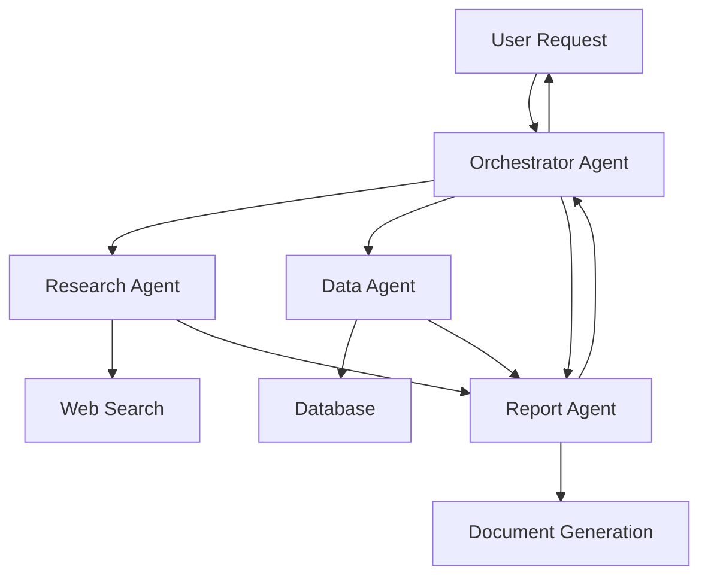

<Info>
  **What you'll build**: A team of agents that collaborate to conduct research and create reports
  
  **Time**: ~25 minutes
  
  **Prerequisites**:
  - Completed [Weather Agent tutorial](/tutorials/weather-agent)
  - Completed [Simple Workflow tutorial](/tutorials/simple-workflow)
  - Understanding of agent communication
</Info>

## What you'll learn

This tutorial demonstrates:
- Agent-to-agent (A2A) communication
- Agent discovery mechanisms
- Designing complementary agent capabilities
- Orchestration patterns
- Cross-agent artifact sharing

## The collaborative agent pattern

Multi-agent systems work best when each agent has specialized skills:



## Step-by-step guide

<Steps>
<Step title="Create specialized agents">

We'll build a research team with four specialized agents:

### 1. Web Research Agent

```yaml research_team.yaml
log:
  stdout_log_level: INFO
  log_file_level: DEBUG
  log_file: research_team.log

!include shared_config.yaml

apps:
  # Research Agent: Searches and analyzes web content
  - name: web_research_agent_app
    app_base_path: .
    app_module: solace_agent_mesh.agent.sac.app
    broker:
      <<: *broker_connection

    app_config:
      namespace: ${NAMESPACE}
      agent_name: "WebResearchAgent"
      display_name: "Web Research Specialist"
      model: *planning_model
      
      instruction: |
        You are a web research specialist. Your role is to:
        1. Search the web for relevant information
        2. Analyze and summarize findings
        3. Cite sources properly
        4. Save research findings as artifacts
        
        Always provide clear summaries with source citations.
        Focus on credible, recent sources.
      
      tools:
        - tool_type: builtin
          tool_name: "web_request"
        - tool_type: builtin-group
          group_name: "artifact_management"
      
      supports_streaming: true
      
      session_service:
        <<: *default_session_service
      artifact_service:
        <<: *default_artifact_service
      
      artifact_handling_mode: "reference"
      enable_embed_resolution: true
      
      agent_card:
        description: |
          Conducts web research and analysis.
          Searches multiple sources and provides summarized findings with citations.
        defaultInputModes: ["text"]
        defaultOutputModes: ["text", "file"]
        skills:
          - id: "web_research"
            name: "Web Research"
            description: "Search and analyze web content on any topic"
            examples:
              - "Research recent developments in AI"
              - "Find information about sustainable energy"
            tags: ["research", "web", "analysis"]
          - id: "fact_checking"
            name: "Fact Checking"
            description: "Verify facts and claims using web sources"
            examples:
              - "Verify this claim about climate change"
            tags: ["research", "verification"]
      
      agent_card_publishing: { interval_seconds: 10 }
      agent_discovery: { enabled: true }
      
      # Allow communication with other agents
      inter_agent_communication:
        allow_list: ["*"]
        request_timeout_seconds: 120
```

### 2. Data Analysis Agent

```yaml research_team.yaml (continued)
  # Data Agent: Analyzes structured data
  - name: data_analysis_agent_app
    app_base_path: .
    app_module: solace_agent_mesh.agent.sac.app
    broker:
      <<: *broker_connection

    app_config:
      namespace: ${NAMESPACE}
      agent_name: "DataAnalysisAgent"
      display_name: "Data Analysis Specialist"
      model: *planning_model
      
      instruction: |
        You are a data analysis specialist. Your role is to:
        1. Analyze datasets and identify patterns
        2. Create visualizations of data
        3. Generate statistical summaries
        4. Save analysis results as artifacts
        
        Provide clear explanations of your findings.
        Use visualizations to illustrate key insights.
      
      tools:
        - tool_type: builtin-group
          group_name: "data_analysis"
        - tool_type: builtin-group
          group_name: "artifact_management"
      
      supports_streaming: true
      
      session_service:
        <<: *default_session_service
      artifact_service:
        <<: *default_artifact_service
      
      artifact_handling_mode: "reference"
      enable_embed_resolution: true
      
      agent_card:
        description: |
          Analyzes structured data and creates visualizations.
          Provides statistical analysis and data insights.
        defaultInputModes: ["text", "file"]
        defaultOutputModes: ["text", "file"]
        skills:
          - id: "data_analysis"
            name: "Data Analysis"
            description: "Analyze datasets using SQL and statistical methods"
            examples:
              - "Analyze this sales data"
              - "Find trends in the dataset"
            tags: ["analysis", "data", "statistics"]
          - id: "visualization"
            name: "Data Visualization"
            description: "Create charts and graphs from data"
            examples:
              - "Create a chart showing sales trends"
            tags: ["visualization", "charts"]
      
      agent_card_publishing: { interval_seconds: 10 }
      agent_discovery: { enabled: true }
      
      inter_agent_communication:
        allow_list: ["*"]
        request_timeout_seconds: 120
```

### 3. Report Generation Agent

```yaml research_team.yaml (continued)
  # Report Agent: Creates comprehensive reports
  - name: report_generation_agent_app
    app_base_path: .
    app_module: solace_agent_mesh.agent.sac.app
    broker:
      <<: *broker_connection

    app_config:
      namespace: ${NAMESPACE}
      agent_name: "ReportGenerationAgent"
      display_name: "Report Writer"
      model: *planning_model
      
      instruction: |
        You are a report generation specialist. Your role is to:
        1. Compile information from other agents
        2. Structure content logically
        3. Write clear, professional reports
        4. Format reports in Markdown or HTML
        5. Include citations and references
        
        Create well-organized, professional documents.
        Use headings, lists, and formatting for clarity.
      
      tools:
        - tool_type: builtin-group
          group_name: "artifact_management"
      
      supports_streaming: true
      
      session_service:
        <<: *default_session_service
      artifact_service:
        <<: *default_artifact_service
      
      artifact_handling_mode: "reference"
      enable_embed_resolution: true
      
      agent_card:
        description: |
          Creates comprehensive reports from research and data.
          Formats professional documents with proper structure.
        defaultInputModes: ["text", "file"]
        defaultOutputModes: ["file"]
        skills:
          - id: "report_writing"
            name: "Report Writing"
            description: "Create structured, professional reports"
            examples:
              - "Write a report on market trends"
              - "Create an executive summary"
            tags: ["writing", "reports", "documentation"]
          - id: "document_formatting"
            name: "Document Formatting"
            description: "Format documents in various styles"
            tags: ["formatting", "documents"]
      
      agent_card_publishing: { interval_seconds: 10 }
      agent_discovery: { enabled: true }
      
      inter_agent_communication:
        allow_list: ["*"]
        request_timeout_seconds: 120
```

### 4. Orchestrator Agent

```yaml research_team.yaml (continued)
  # Orchestrator: Coordinates the team
  - name: orchestrator_app
    app_base_path: .
    app_module: solace_agent_mesh.agent.sac.app
    broker:
      <<: *broker_connection

    app_config:
      namespace: ${NAMESPACE}
      agent_name: "OrchestratorAgent"
      display_name: "Team Coordinator"
      model: *planning_model
      
      instruction: |
        You are the orchestrator for a research team. You coordinate:
        - WebResearchAgent: Web search and online research
        - DataAnalysisAgent: Data analysis and visualization
        - ReportGenerationAgent: Report writing and formatting
        
        When users request research:
        1. Break down the task into subtasks
        2. Assign subtasks to appropriate specialists
        3. Collect results from specialists
        4. Coordinate final report creation
        
        Use agent-to-agent communication to delegate work.
        Keep users updated on progress.
      
      tools:
        - tool_type: builtin-group
          group_name: "artifact_management"
      
      supports_streaming: true
      
      session_service:
        <<: *default_session_service
      artifact_service:
        <<: *default_artifact_service
      
      artifact_handling_mode: "reference"
      enable_embed_resolution: true
      
      agent_card:
        description: |
          Orchestrates a team of specialized agents.
          Coordinates complex research and analysis tasks.
        defaultInputModes: ["text"]
        defaultOutputModes: ["text", "file"]
      
      agent_card_publishing: { interval_seconds: 10 }
      agent_discovery: { enabled: true }
      
      # Can communicate with all agents
      inter_agent_communication:
        allow_list: ["*"]
        request_timeout_seconds: 300  # 5 minutes for complex tasks
```

</Step>

<Step title="Run the research team">

Start all agents:

```bash
sam run -f research_team.yaml
```

You should see all agents start and register:
```
[INFO] Starting WebResearchAgent...
[INFO] Starting DataAnalysisAgent...
[INFO] Starting ReportGenerationAgent...
[INFO] Starting OrchestratorAgent...
[INFO] All agents discovered and ready
```

</Step>

<Step title="Test agent collaboration">

Open the Web UI and try a complex request:

```
Research the impact of renewable energy on global CO2 emissions 
over the past 10 years and create a comprehensive report with 
data analysis and visualizations.
```

**What happens behind the scenes:**

1. **Orchestrator** receives request and plans the work:
   - Identify subtasks (research, data analysis, report writing)
   - Delegate to specialist agents

2. **WebResearchAgent** searches for information:
   - Finds relevant articles and data sources
   - Summarizes key findings
   - Saves research as artifacts

3. **DataAnalysisAgent** analyzes the data:
   - Processes emission statistics
   - Creates trend visualizations
   - Generates statistical summaries

4. **ReportGenerationAgent** compiles the final report:
   - Combines research and analysis
   - Structures the content
   - Formats as professional document

5. **Orchestrator** returns the complete report to user

</Step>

<Step title="Monitor agent interactions">

Watch the logs to see agent collaboration:

```bash
tail -f research_team.log
```

You'll see messages like:
```
[INFO] OrchestratorAgent: Delegating web research to WebResearchAgent
[INFO] WebResearchAgent: Received task from OrchestratorAgent
[INFO] WebResearchAgent: Research complete, returning results
[INFO] OrchestratorAgent: Received research from WebResearchAgent
[INFO] OrchestratorAgent: Requesting data analysis from DataAnalysisAgent
[INFO] DataAnalysisAgent: Received task from OrchestratorAgent
...
```

</Step>
</Steps>

## Agent-to-agent communication

### Discovery mechanism

Agents discover each other automatically:

```yaml
agent_card_publishing: { interval_seconds: 10 }
agent_discovery: { enabled: true }
```

The orchestrator can see all available agents and their capabilities (skills).

### Communication patterns

**Direct delegation:**
```
Orchestrator: "WebResearchAgent, research renewable energy trends"
WebResearchAgent: *performs research* "Here are my findings..."
Orchestrator: *receives results*
```

**Request/response:**
```yaml
inter_agent_communication:
  allow_list: ["WebResearchAgent", "DataAnalysisAgent"]
  request_timeout_seconds: 120
```

**Allow list patterns:**
```yaml
# Allow all agents
allow_list: ["*"]

# Allow specific agents
allow_list: ["ResearchAgent", "DataAgent"]

# Allow no one (isolated agent)
allow_list: []
```

## Sharing artifacts between agents

Agents can share files and data:

```yaml
artifact_service:
  type: "filesystem"
  base_path: "/tmp/samv2"
  artifact_scope: namespace  # Share within namespace
```

**Artifact scopes:**
- `namespace`: Shared across all agents in the same namespace
- `app`: Private to single agent
- `custom`: Custom scope with value

**Example workflow:**
1. ResearchAgent creates artifact: `research_findings.md`
2. Orchestrator references artifact in request to ReportAgent
3. ReportAgent loads and uses the artifact

## Advanced collaboration patterns

<AccordionGroup>
  <Accordion title="Parallel agent execution">
    Execute multiple agents simultaneously:
    
    ```yaml
    instruction: |
      When processing complex requests:
      1. Identify independent subtasks
      2. Delegate to multiple agents in parallel
      3. Wait for all responses
      4. Combine results
      
      Example:
      - Send research requests to WebResearchAgent AND DataAnalysisAgent
      - Both work in parallel
      - Combine their outputs
    ```
  </Accordion>

  <Accordion title="Agent chains">
    Create sequential processing chains:
    
    ```
    User Request
      ↓
    Agent A (Research)
      ↓
    Agent B (Analysis)
      ↓
    Agent C (Visualization)
      ↓
    Agent D (Report)
      ↓
    Final Output
    ```
    
    Each agent adds value to the previous agent's output.
  </Accordion>

  <Accordion title="Consensus building">
    Get multiple perspectives:
    
    ```yaml
    instruction: |
      For critical decisions:
      1. Send query to multiple expert agents
      2. Collect all responses
      3. Analyze agreements and disagreements
      4. Synthesize consensus or present different viewpoints
    ```
  </Accordion>

  <Accordion title="Iterative refinement">
    Improve quality through iteration:
    
    ```yaml
    instruction: |
      Quality improvement process:
      1. Agent A creates initial draft
      2. Agent B reviews and suggests improvements
      3. Agent A refines based on feedback
      4. Repeat until quality threshold met
    ```
  </Accordion>
</AccordionGroup>

## Real-world collaboration examples

### Example 1: Customer support system

```yaml
apps:
  - name: triage_agent
    instruction: |
      Categorize customer inquiries:
      - Technical issues → TechnicalSupportAgent
      - Billing questions → BillingAgent
      - General info → FAQAgent
  
  - name: technical_support_agent
    instruction: |
      Solve technical problems.
      Escalate to EngineerAgent if needed.
  
  - name: billing_agent
    instruction: |
      Handle billing inquiries.
      Can check AccountAgent for details.
```

### Example 2: Content creation pipeline

```yaml
apps:
  - name: topic_research_agent
    skills:
      - Research topics
      - Find trending content
  
  - name: content_writer_agent
    skills:
      - Write articles
      - Create social media posts
  
  - name: editor_agent
    skills:
      - Review and edit content
      - Check grammar and style
  
  - name: seo_agent
    skills:
      - Optimize for search engines
      - Suggest keywords
```

### Example 3: Code review system

```yaml
apps:
  - name: code_analyzer_agent
    tools:
      - Static analysis tools
      - Linting tools
  
  - name: security_agent
    skills:
      - Security vulnerability detection
      - Best practices checking
  
  - name: documentation_agent
    skills:
      - Check code documentation
      - Generate missing docs
  
  - name: review_coordinator_agent
    instruction: |
      Coordinate code review:
      1. Run CodeAnalyzerAgent for quality
      2. Run SecurityAgent for vulnerabilities
      3. Run DocumentationAgent for docs
      4. Compile comprehensive review
```

## Testing multi-agent systems

```python test_collaboration.py
import asyncio
import os
from solace_agent_mesh.client import SAMClient


async def test_research_team():
    """Test the research team collaboration."""
    client = SAMClient(
        broker_url=os.getenv("SOLACE_BROKER_URL"),
        namespace=os.getenv("NAMESPACE")
    )
    
    await client.connect()
    
    try:
        # Send complex research request
        result = await client.send_task(
            agent_name="OrchestratorAgent",
            task_input={
                "request": (
                    "Research AI developments in 2024 and create "
                    "a report with data analysis"
                )
            },
            timeout_seconds=300
        )
        
        print("Research completed!")
        print(f"Report: {result.get('report_artifact')}")
        
        # Verify all specialists were used
        assert 'research' in str(result).lower()
        assert 'analysis' in str(result).lower()
        
        print("\n✓ Multi-agent collaboration test passed!")
        
    finally:
        await client.disconnect()


if __name__ == "__main__":
    asyncio.run(test_research_team())
```

## Debugging collaboration

Enable detailed logging:

```yaml
log:
  stdout_log_level: DEBUG
  log_file_level: DEBUG
```

Common issues:

**Agent not found:**
```
[ERROR] Agent 'ResearchAgent' not discovered
```

Solution: Check agent_discovery is enabled and agent is running.

**Communication timeout:**
```
[ERROR] Request to DataAgent timed out
```

Solution: Increase timeout or optimize agent performance.

**Permission denied:**
```
[ERROR] Agent not in allow_list
```

Solution: Add agent to allow_list in inter_agent_communication.

## Next steps

<CardGroup cols={2}>

<Card title="Complex Workflows" icon="diagram-nested" href="/tutorials/complex-workflows">
  Build advanced workflow patterns
</Card>

<Card title="RAG Implementation" icon="brain" href="/tutorials/rag-implementation">
  Add retrieval-augmented generation
</Card>

<Card title="Production Deployment" icon="rocket" href="/tutorials/production-deployment">
  Deploy your agent team to production
</Card>

<Card title="Agent Architecture" icon="book" href="/essentials/agents">
  Deep dive into agent design
</Card>

</CardGroup>

## Troubleshooting

<AccordionGroup>
  <Accordion title="Agents not discovering each other">
    **Problem**: Agents can't find each other
    
    **Solution**:
    1. Verify all agents have same `namespace`
    2. Check `agent_discovery: { enabled: true }`
    3. Ensure agents are running
    4. Check logs for discovery messages
  </Accordion>

  <Accordion title="Circular communication loops">
    **Problem**: Agents keep calling each other infinitely
    
    **Solution**:
    1. Design clear responsibilities for each agent
    2. Use task context to track what's been done
    3. Set maximum recursion depth in instructions
    4. Implement circuit breakers
  </Accordion>

  <Accordion title="Performance issues with many agents">
    **Problem**: System slows down with multiple agents
    
    **Solution**:
    1. Profile agent performance
    2. Optimize expensive operations
    3. Use caching where appropriate
    4. Consider horizontal scaling
    5. Implement request throttling
  </Accordion>
</AccordionGroup>

## Key concepts learned

<Check>
  - Designing specialized agent teams
  - Agent-to-agent communication patterns
  - Agent discovery mechanisms
  - Artifact sharing across agents
  - Orchestration strategies
  - Testing multi-agent systems
</Check>

You now understand how to build collaborative multi-agent systems where specialized agents work together to solve complex problems!
