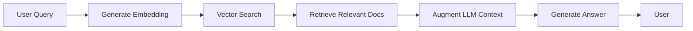

<Info>
  **What you'll build**: An agent that answers questions using your private knowledge base
  
  **Time**: ~30 minutes
  
  **Prerequisites**:
  - Completed [SQL Database tutorial](/tutorials/sql-database)
  - Understanding of embeddings and vector search
</Info>

## What is RAG?

Retrieval-Augmented Generation (RAG) combines:
- **Retrieval**: Finding relevant information from a knowledge base
- **Augmentation**: Adding that information to the LLM context
- **Generation**: LLM generates answers using retrieved information



## Why use RAG?

<CardGroup cols={2}>

<Card title="Up-to-date Information" icon="clock">
  Access current data without retraining models
</Card>

<Card title="Private Knowledge" icon="lock">
  Query internal documents securely
</Card>

<Card title="Source Attribution" icon="quote-left">
  Cite specific sources for answers
</Card>

<Card title="Reduced Hallucinations" icon="shield-check">
  Ground responses in real documents
</Card>

</CardGroup>

## Step-by-step implementation

<Steps>
<Step title="Set up vector database">

We'll use ChromaDB (other options: Pinecone, Weaviate, Qdrant).

```bash
pip install chromadb openai
```

Create `setup_vectordb.py`:

```python setup_vectordb.py
import chromadb
import openai
import os
from typing import List

# Initialize OpenAI for embeddings
openai.api_key = os.getenv("OPENAI_API_KEY")

# Create ChromaDB client
client = chromadb.PersistentClient(path="./chroma_db")

# Create or get collection
collection = client.get_or_create_collection(
    name="company_knowledge",
    metadata={"description": "Company documentation and policies"}
)

def generate_embedding(text: str) -> List[float]:
    """Generate embedding using OpenAI."""
    response = openai.embeddings.create(
        model="text-embedding-3-small",
        input=text
    )
    return response.data[0].embedding

def add_documents(documents: List[dict]):
    """Add documents to vector database."""
    for doc in documents:
        embedding = generate_embedding(doc["content"])
        
        collection.add(
            documents=[doc["content"]],
            embeddings=[embedding],
            metadatas=[{"source": doc["source"], "title": doc["title"]}],
            ids=[doc["id"]]
        )
    
    print(f"Added {len(documents)} documents to vector database")

# Sample company documents
documents = [
    {
        "id": "doc1",
        "title": "Remote Work Policy",
        "source": "hr/policies/remote-work.md",
        "content": """
        Remote Work Policy
        
        Employees may work remotely up to 3 days per week with manager approval.
        Core hours of 10 AM - 3 PM local time must be maintained.
        Equipment: Company provides laptop, monitor, and ergonomic chair.
        Internet: $50/month stipend for home internet.
        """
    },
    {
        "id": "doc2",
        "title": "PTO Policy",
        "source": "hr/policies/pto.md",
        "content": """
        Paid Time Off Policy
        
        - New employees: 15 days PTO per year
        - After 3 years: 20 days PTO per year
        - After 5 years: 25 days PTO per year
        - PTO rolls over up to 5 days annually
        - Submit PTO requests 2 weeks in advance
        """
    },
    {
        "id": "doc3",
        "title": "Health Insurance",
        "source": "hr/benefits/health.md",
        "content": """
        Health Insurance Benefits
        
        Coverage starts first day of employment.
        Three plan options: Basic, Plus, Premium.
        Company pays 80% of premium for employee.
        Dental and vision included in all plans.
        $1000 annual deductible for Basic plan.
        """
    },
    {
        "id": "doc4",
        "title": "401k Plan",
        "source": "hr/benefits/retirement.md",
        "content": """
        401k Retirement Plan
        
        Eligibility: After 90 days of employment
        Company match: 4% of salary
        Vesting: Immediate
        Contribution limit: IRS maximum
        Investment options: 20+ funds available
        """
    },
    {
        "id": "doc5",
        "title": "Development Environment Setup",
        "source": "engineering/setup.md",
        "content": """
        Development Environment Setup
        
        Required software:
        - Python 3.10+
        - Docker Desktop
        - VS Code or PyCharm
        - Git
        
        Installation:
        1. Clone main repository
        2. Run setup script: ./scripts/setup.sh
        3. Configure local.env file
        4. Start services: docker-compose up
        """
    }
]

if __name__ == "__main__":
    add_documents(documents)
    print("\nVector database ready!")
    print(f"Total documents: {collection.count()}")
```

Run the setup:
```bash
python setup_vectordb.py
```

</Step>

<Step title="Create RAG retrieval tool">

Create `rag_tools.py`:

```python rag_tools.py
import chromadb
import openai
import os
from typing import List, Dict, Any

# Initialize
client = chromadb.PersistentClient(path="./chroma_db")
collection = client.get_collection(name="company_knowledge")

openai.api_key = os.getenv("OPENAI_API_KEY")

def search_knowledge_base(
    query: str,
    num_results: int = 3
) -> Dict[str, Any]:
    """
    Search the knowledge base for relevant information.
    
    Args:
        query: The search query
        num_results: Number of results to return (default: 3)
    
    Returns:
        Dictionary containing:
        - documents: List of relevant document contents
        - sources: List of source file paths
        - titles: List of document titles
    """
    try:
        # Generate query embedding
        query_embedding = openai.embeddings.create(
            model="text-embedding-3-small",
            input=query
        ).data[0].embedding
        
        # Search vector database
        results = collection.query(
            query_embeddings=[query_embedding],
            n_results=num_results
        )
        
        # Extract results
        documents = results['documents'][0] if results['documents'] else []
        metadatas = results['metadatas'][0] if results['metadatas'] else []
        
        return {
            "status": "success",
            "documents": documents,
            "sources": [m.get('source', 'unknown') for m in metadatas],
            "titles": [m.get('title', 'Untitled') for m in metadatas],
            "num_results": len(documents)
        }
    
    except Exception as e:
        return {
            "status": "error",
            "message": f"Search failed: {str(e)}",
            "documents": [],
            "sources": [],
            "titles": []
        }
```

</Step>

<Step title="Create RAG agent">

Create `rag_agent.yaml`:

```yaml rag_agent.yaml
log:
  stdout_log_level: INFO
  log_file_level: DEBUG
  log_file: rag_agent.log

!include shared_config.yaml

apps:
  - name: rag_agent_app
    app_base_path: .
    app_module: solace_agent_mesh.agent.sac.app
    broker:
      <<: *broker_connection

    app_config:
      namespace: ${NAMESPACE}
      agent_name: "KnowledgeAgent"
      display_name: "Company Knowledge Assistant"
      model: *planning_model
      
      instruction: |
        You are a company knowledge assistant with access to internal 
        documentation through a RAG system.
        
        When answering questions:
        1. Use search_knowledge_base to find relevant information
        2. Base your answer ONLY on the retrieved documents
        3. Always cite sources using the format: [Source: file_path]
        4. If information is not in the knowledge base, say so clearly
        5. Do not make up or hallucinate information
        
        Be helpful and concise. Provide direct answers with source citations.
      
      tools:
        - tool_type: python
          component_module: rag_tools
          component_base_path: .
          function_name: search_knowledge_base
          tool_name: "search_knowledge_base"
        
        - tool_type: builtin-group
          group_name: "artifact_management"
      
      supports_streaming: true
      
      session_service:
        type: "memory"
        default_behavior: "PERSISTENT"
      
      artifact_service:
        type: "filesystem"
        base_path: "/tmp/samv2"
        artifact_scope: namespace
      
      agent_card:
        description: |
          Answers questions using the company knowledge base.
          Uses RAG to retrieve relevant information and cite sources.
        defaultInputModes: ["text"]
        defaultOutputModes: ["text"]
        skills:
          - id: "knowledge_search"
            name: "Knowledge Base Search"
            description: "Search internal documentation and policies"
            examples:
              - "What is the remote work policy?"
              - "How much PTO do I get?"
              - "What's covered by health insurance?"
            tags: ["rag", "knowledge", "search"]
      
      agent_card_publishing: { interval_seconds: 10 }
      agent_discovery: { enabled: true }
```

</Step>

<Step title="Test the RAG agent">

Start the agent:

```bash
sam run -f rag_agent.yaml
```

Test queries:

**Test 1: Direct policy question**
```
How many days of PTO do new employees get?
```

**Expected response:**
```
New employees receive 15 days of PTO (Paid Time Off) per year.

[Source: hr/policies/pto.md]
```

**Test 2: Multiple document search**
```
What benefits are available and when do they start?
```

**Expected response:**
```
The company offers several benefits:

1. Health Insurance: Coverage starts on your first day of employment. 
   Three plan options available (Basic, Plus, Premium) with company 
   paying 80% of employee premium. [Source: hr/benefits/health.md]

2. 401k Retirement Plan: Eligible after 90 days with 4% company match 
   and immediate vesting. [Source: hr/benefits/retirement.md]

3. PTO: New employees get 15 days per year. [Source: hr/policies/pto.md]
```

**Test 3: Out of scope**
```
What's the company's revenue last year?
```

**Expected response:**
```
I don't have information about the company's revenue in my knowledge 
base. This information may be available through other channels such as 
financial reports or your manager.
```

</Step>
</Steps>

## Advanced RAG techniques

<AccordionGroup>
  <Accordion title="Hybrid search (vector + keyword)">
    Combine semantic and keyword search:
    
    ```python
    def hybrid_search(query: str, num_results: int = 5):
        # Vector search
        vector_results = collection.query(
            query_embeddings=[get_embedding(query)],
            n_results=num_results
        )
        
        # Keyword search
        keyword_results = collection.query(
            query_texts=[query],
            n_results=num_results
        )
        
        # Merge and deduplicate
        all_results = merge_results(vector_results, keyword_results)
        return all_results
    ```
  </Accordion>

  <Accordion title="Document chunking strategies">
    Split large documents effectively:
    
    ```python
    from langchain.text_splitter import RecursiveCharacterTextSplitter
    
    splitter = RecursiveCharacterTextSplitter(
        chunk_size=500,
        chunk_overlap=50,
        separators=["\n\n", "\n", ". ", " ", ""]
    )
    
    def chunk_document(content: str):
        chunks = splitter.split_text(content)
        return chunks
    ```
  </Accordion>

  <Accordion title="Reranking results">
    Improve relevance with reranking:
    
    ```python
    from sentence_transformers import CrossEncoder
    
    reranker = CrossEncoder('cross-encoder/ms-marco-MiniLM-L-6-v2')
    
    def rerank_results(query: str, documents: List[str]):
        pairs = [[query, doc] for doc in documents]
        scores = reranker.predict(pairs)
        
        # Sort by score
        ranked = sorted(
            zip(documents, scores),
            key=lambda x: x[1],
            reverse=True
        )
        return [doc for doc, score in ranked]
    ```
  </Accordion>

  <Accordion title="Multi-query expansion">
    Generate multiple query variations:
    
    ```python
    def expand_query(original_query: str) -> List[str]:
        expansion_prompt = f"""
        Generate 3 variations of this query:
        {original_query}
        
        Variations (one per line):
        """
        
        response = openai.chat.completions.create(
            model="gpt-4",
            messages=[{"role": "user", "content": expansion_prompt}]
        )
        
        variations = response.choices[0].message.content.split("\n")
        return [original_query] + variations
    ```
  </Accordion>
</AccordionGroup>

## Document ingestion pipeline

```python document_ingestion.py
import os
from pathlib import Path
from typing import List
import chromadb
from langchain.text_splitter import RecursiveCharacterTextSplitter
from langchain.document_loaders import (
    TextLoader,
    PDFLoader,
    UnstructuredMarkdownLoader
)

class DocumentIngestion:
    def __init__(self, collection_name: str):
        self.client = chromadb.PersistentClient(path="./chroma_db")
        self.collection = self.client.get_or_create_collection(
            name=collection_name
        )
        self.splitter = RecursiveCharacterTextSplitter(
            chunk_size=500,
            chunk_overlap=50
        )
    
    def process_directory(self, directory: str):
        """Process all documents in a directory."""
        path = Path(directory)
        
        # Process all supported files
        for file_path in path.rglob("*"):
            if file_path.is_file():
                self.process_file(str(file_path))
    
    def process_file(self, file_path: str):
        """Process a single file."""
        ext = Path(file_path).suffix.lower()
        
        # Choose appropriate loader
        if ext == ".txt":
            loader = TextLoader(file_path)
        elif ext == ".pdf":
            loader = PDFLoader(file_path)
        elif ext == ".md":
            loader = UnstructuredMarkdownLoader(file_path)
        else:
            print(f"Unsupported file type: {ext}")
            return
        
        # Load and split
        documents = loader.load()
        chunks = self.splitter.split_documents(documents)
        
        # Add to vector database
        for i, chunk in enumerate(chunks):
            chunk_id = f"{file_path}_{i}"
            embedding = self.generate_embedding(chunk.page_content)
            
            self.collection.add(
                documents=[chunk.page_content],
                embeddings=[embedding],
                metadatas=[{
                    "source": file_path,
                    "chunk_index": i,
                    "total_chunks": len(chunks)
                }],
                ids=[chunk_id]
            )
        
        print(f"Processed: {file_path} ({len(chunks)} chunks)")

# Usage
ingestion = DocumentIngestion("company_knowledge")
ingestion.process_directory("./company_docs")
```

## Monitoring and evaluation

```python evaluate_rag.py
from typing import List, Dict
import json

def evaluate_rag_quality(
    test_queries: List[Dict[str, str]]
) -> Dict[str, float]:
    """
    Evaluate RAG system quality.
    
    test_queries format:
    [
        {"query": "...", "expected_source": "..."},
        ...
    ]
    """
    correct_retrievals = 0
    total_queries = len(test_queries)
    
    for test in test_queries:
        results = search_knowledge_base(test["query"])
        
        # Check if expected source is in top results
        if test["expected_source"] in results["sources"]:
            correct_retrievals += 1
    
    accuracy = correct_retrievals / total_queries
    
    return {
        "retrieval_accuracy": accuracy,
        "total_queries": total_queries,
        "correct_retrievals": correct_retrievals
    }

# Test cases
test_queries = [
    {
        "query": "How much PTO do employees get?",
        "expected_source": "hr/policies/pto.md"
    },
    {
        "query": "What is the 401k match?",
        "expected_source": "hr/benefits/retirement.md"
    },
    # Add more test cases...
]

results = evaluate_rag_quality(test_queries)
print(json.dumps(results, indent=2))
```

## Next steps

<CardGroup cols={2}>

<Card title="Production Deployment" icon="rocket" href="/tutorials/production-deployment">
  Deploy your RAG system
</Card>

<Card title="Vector Databases" icon="database" href="/essentials/vector-databases">
  Compare vector database options
</Card>

<Card title="Embeddings Guide" icon="brain" href="/essentials/embeddings">
  Understanding embeddings
</Card>

<Card title="RAG Optimization" icon="gauge-high" href="/essentials/rag-optimization">
  Improve RAG performance
</Card>

</CardGroup>

## Key concepts learned

<Check>
  - RAG architecture and benefits
  - Vector database setup
  - Embedding generation
  - Document chunking strategies
  - Source attribution
  - RAG agent implementation
</Check>
