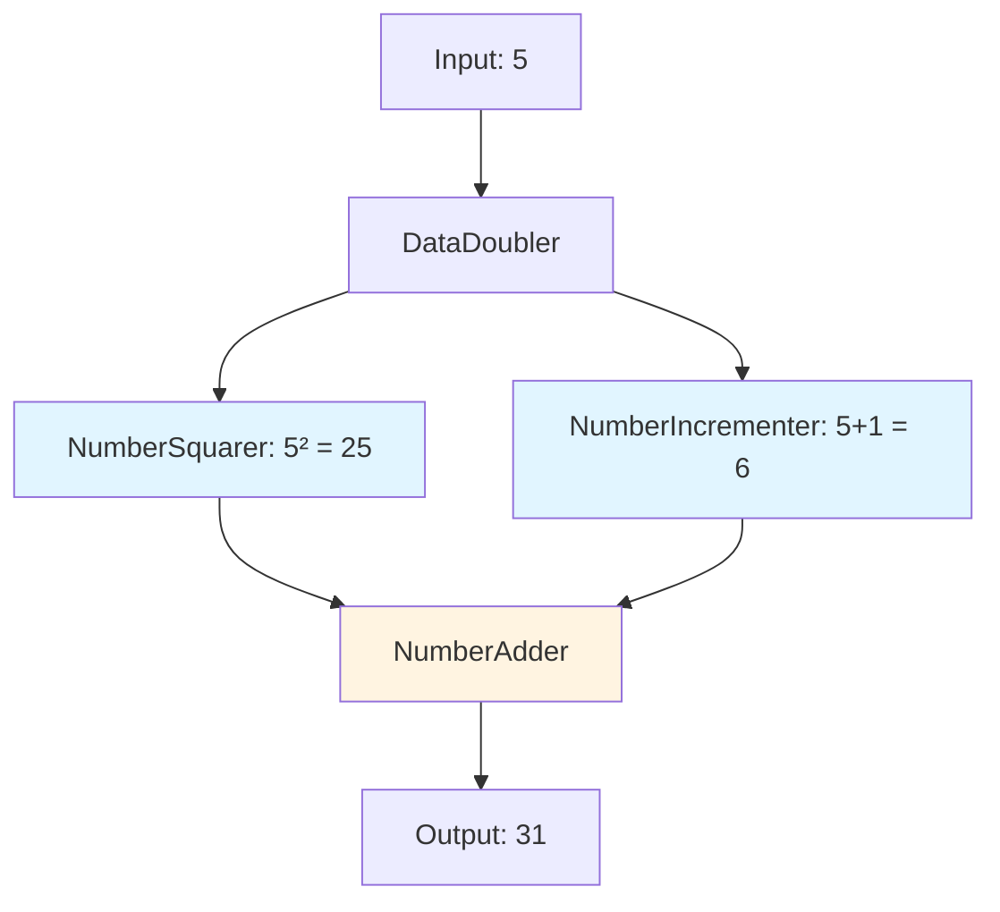

<Info>
  **What you'll build**: A workflow that processes data through multiple agents sequentially and in parallel
  
  **Time**: ~20 minutes
  
  **Prerequisites**:
  - Completed the [Hello World tutorial](/tutorials/hello-world)
  - Basic understanding of agents from the [Weather Agent tutorial](/tutorials/weather-agent)
</Info>

## What you'll learn

This tutorial covers:
- Creating workflow configurations
- Sequential agent execution
- Parallel agent execution
- Input/output mapping between workflow nodes
- Workflow orchestration patterns

## Understanding workflows

Workflows allow you to:
- Chain multiple agents together
- Execute agents in parallel for efficiency
- Map outputs from one agent as inputs to another
- Create reusable multi-step processes

<Frame>
  
</Frame>

## Step-by-step guide

<Steps>
<Step title="Create the workflow agents">

We'll build a data processing workflow with three agents:
1. **DataDoubler**: Doubles a numeric value
2. **NumberSquarer**: Squares a value (runs in parallel)
3. **NumberIncrementer**: Increments a value (runs in parallel)
4. **NumberAdder**: Adds two values together

Create `workflow_agents.yaml`:

```yaml workflow_agents.yaml
log:
  stdout_log_level: INFO
  log_file_level: DEBUG
  log_file: workflow_agents.log

!include shared_config.yaml

apps:
  # Agent 1: Data Doubler
  - name: data_doubler_app
    app_base_path: .
    app_module: solace_agent_mesh.agent.sac.app
    broker:
      <<: *broker_connection

    app_config:
      namespace: ${NAMESPACE}
      agent_name: "DataDoubler"
      model: *planning_model

      instruction: |
        You double numeric values.
        1. Read 'value' from input
        2. Calculate: doubled_value = value * 2
        3. Create a JSON artifact with: {"doubled_value": <result>}
        4. End with: «result:artifact=<artifact_name> status=success»
        
        IMPORTANT: When invoked by a workflow, use the exact output 
        filename specified in the workflow instructions.

      input_schema:
        type: object
        properties:
          value: {type: number}
        required: [value]

      output_schema:
        type: object
        properties:
          doubled_value: {type: number}
        required: [doubled_value]

      tools:
        - tool_type: builtin-group
          group_name: "artifact_management"

      session_service:
        <<: *default_session_service
      artifact_service:
        <<: *default_artifact_service

      agent_card:
        description: "Doubles numeric values"
        skills:
          - id: "double_value"
            name: "Double Value"
            description: "Doubles a number"
            tags: ["math"]
      
      agent_card_publishing: { interval_seconds: 10 }
      agent_discovery: { enabled: true }

  # Agent 2: Number Squarer
  - name: number_squarer_app
    app_base_path: .
    app_module: solace_agent_mesh.agent.sac.app
    broker:
      <<: *broker_connection

    app_config:
      namespace: ${NAMESPACE}
      agent_name: "NumberSquarer"
      model: *planning_model

      instruction: |
        You square numeric values.
        1. Read 'value' from input
        2. Calculate: squared_value = value * value
        3. Create a JSON artifact with: {"squared_value": <result>}
        4. End with: «result:artifact=<artifact_name> status=success»

      input_schema:
        type: object
        properties:
          value: {type: number}
        required: [value]

      output_schema:
        type: object
        properties:
          squared_value: {type: number}
        required: [squared_value]

      tools:
        - tool_type: builtin-group
          group_name: "artifact_management"

      session_service:
        <<: *default_session_service
      artifact_service:
        <<: *default_artifact_service

      agent_card:
        description: "Squares numeric values"
        skills:
          - id: "square_value"
            name: "Square Value"
            description: "Squares a number"
            tags: ["math"]
      
      agent_card_publishing: { interval_seconds: 10 }
      agent_discovery: { enabled: true }

  # Agent 3: Number Incrementer
  - name: number_incrementer_app
    app_base_path: .
    app_module: solace_agent_mesh.agent.sac.app
    broker:
      <<: *broker_connection

    app_config:
      namespace: ${NAMESPACE}
      agent_name: "NumberIncrementer"
      model: *planning_model

      instruction: |
        You increment numeric values by 1.
        1. Read 'value' from input
        2. Calculate: incremented_value = value + 1
        3. Create a JSON artifact with: {"incremented_value": <result>}
        4. End with: «result:artifact=<artifact_name> status=success»

      input_schema:
        type: object
        properties:
          value: {type: number}
        required: [value]

      output_schema:
        type: object
        properties:
          incremented_value: {type: number}
        required: [incremented_value]

      tools:
        - tool_type: builtin-group
          group_name: "artifact_management"

      session_service:
        <<: *default_session_service
      artifact_service:
        <<: *default_artifact_service

      agent_card:
        description: "Increments numeric values"
        skills:
          - id: "increment_value"
            name: "Increment Value"
            description: "Increments a number by 1"
            tags: ["math"]
      
      agent_card_publishing: { interval_seconds: 10 }
      agent_discovery: { enabled: true }

  # Agent 4: Number Adder
  - name: number_adder_app
    app_base_path: .
    app_module: solace_agent_mesh.agent.sac.app
    broker:
      <<: *broker_connection

    app_config:
      namespace: ${NAMESPACE}
      agent_name: "NumberAdder"
      model: *planning_model

      instruction: |
        You add two numeric values.
        1. Read 'value1' and 'value2' from input
        2. Calculate: sum = value1 + value2
        3. Create a JSON artifact with: {"sum": <result>}
        4. End with: «result:artifact=<artifact_name> status=success»

      input_schema:
        type: object
        properties:
          value1: {type: number}
          value2: {type: number}
        required: [value1, value2]

      output_schema:
        type: object
        properties:
          sum: {type: number}
        required: [sum]

      tools:
        - tool_type: builtin-group
          group_name: "artifact_management"

      session_service:
        <<: *default_session_service
      artifact_service:
        <<: *default_artifact_service

      agent_card:
        description: "Adds two numbers"
        skills:
          - id: "add_numbers"
            name: "Add Numbers"
            description: "Adds two numbers together"
            tags: ["math"]
      
      agent_card_publishing: { interval_seconds: 10 }
      agent_discovery: { enabled: true }
```

</Step>

<Step title="Create the workflow configuration">

Add this workflow configuration to the same file:

```yaml workflow_agents.yaml (continued)
  # Workflow: Parallel Math Operations
  - name: parallel_math_workflow
    app_base_path: .
    app_module: solace_agent_mesh.workflow.app
    broker:
      <<: *broker_connection

    app_config:
      namespace: ${NAMESPACE}
      name: "ParallelMathWorkflow"
      display_name: "Parallel Math Operations"

      # Timeout configurations
      max_workflow_execution_time_seconds: 300
      default_node_timeout_seconds: 60

      workflow:
        version: "1.0.0"
        description: |
          A workflow demonstrating sequential and parallel execution.
          
          Flow:
          1. Double the input value (sequential)
          2. Fork: Square AND increment the original value (parallel)
          3. Join: Add the squared and incremented values (sequential)

        # Define workflow inputs
        input_schema:
          type: object
          properties:
            value:
              type: number
              description: "The value to process"
          required: [value]

        # Define workflow outputs
        output_schema:
          type: object
          properties:
            final_sum: {type: number}
            squared: {type: number}
            incremented: {type: number}
            doubled: {type: number}
          required: [final_sum, squared, incremented, doubled]

        # Define workflow nodes (agents to execute)
        nodes:
          # Step 1: Double the value (runs first)
          - id: double_value
            type: agent
            agent_name: "DataDoubler"
            instruction: "Double the input value."
            input:
              value: "{{workflow.input.value}}"

          # Step 2a: Square the original value (parallel)
          - id: square_value
            type: agent
            agent_name: "NumberSquarer"
            depends_on: [double_value]
            instruction: "Square the original input value."
            input:
              value: "{{workflow.input.value}}"

          # Step 2b: Increment the original value (parallel)
          - id: increment_value
            type: agent
            agent_name: "NumberIncrementer"
            depends_on: [double_value]
            instruction: "Increment the original input value by 1."
            input:
              value: "{{workflow.input.value}}"

          # Step 3: Add results (runs after both parallel branches)
          - id: add_results
            type: agent
            agent_name: "NumberAdder"
            depends_on: [square_value, increment_value]
            instruction: "Add the squared and incremented values."
            input:
              value1: "{{square_value.output.squared_value}}"
              value2: "{{increment_value.output.incremented_value}}"

        # Map workflow outputs
        output_mapping:
          final_sum: "{{add_results.output.sum}}"
          squared: "{{square_value.output.squared_value}}"
          incremented: "{{increment_value.output.incremented_value}}"
          doubled: "{{double_value.output.doubled_value}}"

        skills:
          - id: "parallel_math"
            name: "Parallel Math Operations"
            description: "Performs parallel math operations and combines results"
            tags: ["workflow", "parallel", "math"]

      session_service:
        <<: *default_session_service
      artifact_service:
        <<: *default_artifact_service

      agent_card_publishing: { interval_seconds: 10 }
      agent_discovery: { enabled: true }
```

</Step>

<Step title="Run the workflow">

Start all agents and the workflow:

```bash
sam run -f workflow_agents.yaml
```

You should see all components start:
```
[INFO] Starting DataDoubler...
[INFO] Starting NumberSquarer...
[INFO] Starting NumberIncrementer...
[INFO] Starting NumberAdder...
[INFO] Starting ParallelMathWorkflow...
[INFO] All components running successfully
```

</Step>

<Step title="Test the workflow">

Open the Web UI and send a message to the workflow:

```
Process the number 5 through the parallel math workflow
```

The workflow will:
1. Double 5 → 10
2. Square 5 → 25 (parallel)
3. Increment 5 → 6 (parallel)
4. Add 25 + 6 → 31

**Expected output:**
```json
{
  "final_sum": 31,
  "squared": 25,
  "incremented": 6,
  "doubled": 10
}
```

<Tip>
  Watch the logs to see parallel execution. The square and increment operations will start at the same time!
</Tip>

</Step>

<Step title="Visualize workflow execution">

The workflow execution follows this pattern:



<Note>
  Nodes C and D (in blue) execute in parallel because they both depend only on B.
</Note>

</Step>
</Steps>

## Understanding workflow concepts

### Node types

Workflows support several node types:

```yaml
nodes:
  - id: agent_node
    type: agent              # Calls an agent
    agent_name: "MyAgent"
  
  - id: switch_node
    type: switch             # Conditional branching
    cases: [...]
  
  - id: map_node
    type: map                # Iterate over a list
    items: "{{data.list}}"
```

### Dependencies and parallelism

```yaml
nodes:
  - id: step1
    type: agent
    # No depends_on = runs immediately
  
  - id: step2
    type: agent
    depends_on: [step1]      # Waits for step1
  
  - id: step3
    type: agent
    depends_on: [step1]      # Also waits for step1
    # step2 and step3 run in parallel!
  
  - id: step4
    type: agent
    depends_on: [step2, step3]  # Waits for both
```

### Input/output mapping

**Accessing workflow inputs:**
```yaml
input:
  value: "{{workflow.input.value}}"
```

**Accessing node outputs:**
```yaml
input:
  value: "{{previous_node.output.field_name}}"
```

**Mapping workflow outputs:**
```yaml
output_mapping:
  result: "{{final_node.output.value}}"
  metadata: "{{intermediate_node.output.info}}"
```

### Input and output schemas

<Warning>
  Always define input and output schemas for workflows. This ensures type safety and enables validation.
</Warning>

```yaml
input_schema:
  type: object
  properties:
    value:
      type: number
      description: "The input value"
      minimum: 0              # Optional constraints
  required: [value]

output_schema:
  type: object
  properties:
    result: {type: number}
  required: [result]
```

## Advanced workflow patterns

<AccordionGroup>
  <Accordion title="Conditional branching with switch nodes">
    Route execution based on conditions:
    
    ```yaml
    nodes:
      - id: classify
        type: agent
        agent_name: "Classifier"
      
      - id: route
        type: switch
        depends_on: [classify]
        cases:
          - condition: "'{{classify.output.category}}' == 'A'"
            node: handle_a
          - condition: "'{{classify.output.category}}' == 'B'"
            node: handle_b
          - default: handle_default
      
      - id: handle_a
        type: agent
        depends_on: [route]
      
      - id: handle_b
        type: agent
        depends_on: [route]
    ```
  </Accordion>

  <Accordion title="Map iteration over lists">
    Process each item in a list:
    
    ```yaml
    nodes:
      - id: process_items
        type: map
        items: "{{workflow.input.items}}"
        node:
          id: process_single
          type: agent
          agent_name: "ItemProcessor"
          input:
            item: "{{item}}"
    ```
    
    This creates one agent execution per item, all in parallel.
  </Accordion>

  <Accordion title="Error handling and retries">
    Configure error handling per node:
    
    ```yaml
    nodes:
      - id: risky_operation
        type: agent
        agent_name: "RiskyAgent"
        retry_policy:
          max_attempts: 3
          retry_delay_seconds: 5
        on_error: continue    # or 'fail' (default)
    ```
  </Accordion>

  <Accordion title="Nested workflows">
    Call workflows from other workflows:
    
    ```yaml
    nodes:
      - id: sub_workflow
        type: workflow
        workflow_name: "SubWorkflow"
        input:
          data: "{{workflow.input.data}}"
    ```
  </Accordion>
</AccordionGroup>

## Testing workflows

Create a test script `test_workflow.py`:

```python test_workflow.py
import os
import asyncio
from solace_agent_mesh.client import SAMClient

async def test_workflow():
    # Connect to the mesh
    client = SAMClient(
        broker_url=os.getenv("SOLACE_BROKER_URL"),
        namespace=os.getenv("NAMESPACE")
    )
    
    await client.connect()
    
    try:
        # Send task to workflow
        result = await client.send_task(
            agent_name="ParallelMathWorkflow",
            task_input={"value": 5}
        )
        
        print("Workflow result:")
        print(f"  Final sum: {result['final_sum']}")
        print(f"  Squared: {result['squared']}")
        print(f"  Incremented: {result['incremented']}")
        print(f"  Doubled: {result['doubled']}")
        
        # Verify results
        assert result['final_sum'] == 31
        assert result['squared'] == 25
        assert result['incremented'] == 6
        assert result['doubled'] == 10
        
        print("\n✓ All assertions passed!")
        
    finally:
        await client.disconnect()

if __name__ == "__main__":
    asyncio.run(test_workflow())
```

Run the test:
```bash
python test_workflow.py
```

## Next steps

<CardGroup cols={2}>

<Card title="SQL Database" icon="database" href="/tutorials/sql-database">
  Connect workflows to databases
</Card>

<Card title="Complex Workflows" icon="diagram-nested" href="/tutorials/complex-workflows">
  Build advanced workflow patterns
</Card>

<Card title="Multi-Agent Collaboration" icon="users" href="/tutorials/multi-agent-collaboration">
  Create collaborative agent teams
</Card>

<Card title="Workflow Components" icon="book" href="/essentials/workflows">
  Deep dive into workflow features
</Card>

</CardGroup>

## Troubleshooting

<AccordionGroup>
  <Accordion title="Workflow not found">
    **Problem**: "Workflow 'ParallelMathWorkflow' not found"
    
    **Solution**:
    1. Check the workflow `name` in configuration matches what you're calling
    2. Verify the workflow started successfully in logs
    3. Check `agent_discovery: { enabled: true }` is set
  </Accordion>

  <Accordion title="Nodes executing in wrong order">
    **Problem**: Nodes run before their dependencies complete
    
    **Solution**:
    1. Check `depends_on` lists all required dependencies
    2. Verify node IDs are spelled correctly
    3. Review logs for execution order
  </Accordion>

  <Accordion title="Input/output mapping errors">
    **Problem**: "Field 'squared_value' not found in output"
    
    **Solution**:
    1. Check agent's `output_schema` matches what you're referencing
    2. Verify the agent creates artifacts with correct field names
    3. Use exact field names: `{{node.output.field_name}}`
  </Accordion>

  <Accordion title="Workflow timeout">
    **Problem**: "Workflow execution timed out"
    
    **Solution**:
    Increase timeout settings:
    ```yaml
    max_workflow_execution_time_seconds: 600  # 10 minutes
    default_node_timeout_seconds: 120         # 2 minutes per node
    ```
  </Accordion>
</AccordionGroup>

## Key concepts learned

<Check>
  - Creating multi-agent workflows
  - Sequential vs parallel execution
  - Input/output mapping between nodes
  - Workflow schemas and validation
  - Dependencies and execution order
  - Testing workflows programmatically
</Check>

You now understand how to build workflows that orchestrate multiple agents. This is essential for creating complex, multi-step AI applications!
