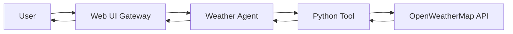

<Info>
  **What you'll build**: An agent that retrieves weather information for any city
  
  **Time**: ~15 minutes
  
  **Prerequisites**:
  - Completed the [Hello World tutorial](/tutorials/hello-world)
  - A free API key from [OpenWeatherMap](https://openweathermap.org/api)
</Info>

## What you'll learn

This tutorial demonstrates:
- Creating custom Python tools for agents
- Integrating external APIs
- Handling API responses and errors
- Tool schema definition
- Environment variable management

## Architecture overview



## Step-by-step guide

<Steps>
<Step title="Get your weather API key">

1. Visit [OpenWeatherMap](https://openweathermap.org/api)
2. Sign up for a free account
3. Navigate to "API keys" in your account
4. Copy your API key

Add it to your `.env` file:

```bash .env
OPENWEATHER_API_KEY=your_api_key_here
```

<Note>
  The free tier allows 1,000 API calls per day, which is plenty for development.
</Note>

</Step>

<Step title="Create the weather tool">

Create a new file called `weather_tools.py` in your project directory:

```python weather_tools.py
import os
import requests
from typing import Optional


def get_weather(
    city: str,
    country_code: Optional[str] = None,
    units: str = "metric"
) -> dict:
    """
    Fetches current weather information for a specified city.
    
    Args:
        city: The name of the city (e.g., "London", "New York")
        country_code: Optional ISO 3166 country code (e.g., "US", "GB")
        units: Temperature units - "metric" (Celsius), "imperial" (Fahrenheit), or "standard" (Kelvin)
    
    Returns:
        A dictionary containing weather information including:
        - temperature: Current temperature
        - feels_like: Feels like temperature
        - description: Weather description
        - humidity: Humidity percentage
        - wind_speed: Wind speed
        - city: City name
        - country: Country code
    """
    api_key = os.getenv("OPENWEATHER_API_KEY")
    
    if not api_key:
        return {
            "status": "error",
            "message": "OPENWEATHER_API_KEY not found in environment variables"
        }
    
    # Build location query
    location = city
    if country_code:
        location = f"{city},{country_code}"
    
    # Construct API request
    base_url = "https://api.openweathermap.org/data/2.5/weather"
    params = {
        "q": location,
        "appid": api_key,
        "units": units
    }
    
    try:
        response = requests.get(base_url, params=params, timeout=10)
        response.raise_for_status()
        
        data = response.json()
        
        # Extract relevant information
        weather_info = {
            "status": "success",
            "city": data["name"],
            "country": data["sys"]["country"],
            "temperature": data["main"]["temp"],
            "feels_like": data["main"]["feels_like"],
            "description": data["weather"][0]["description"],
            "humidity": data["main"]["humidity"],
            "wind_speed": data["wind"]["speed"],
            "units": units
        }
        
        return weather_info
        
    except requests.exceptions.HTTPError as e:
        if e.response.status_code == 404:
            return {
                "status": "error",
                "message": f"City '{city}' not found. Please check the spelling."
            }
        return {
            "status": "error",
            "message": f"API error: {str(e)}"
        }
    
    except requests.exceptions.RequestException as e:
        return {
            "status": "error",
            "message": f"Network error: {str(e)}"
        }
    
    except Exception as e:
        return {
            "status": "error",
            "message": f"Unexpected error: {str(e)}"
        }
```

Install the required dependency:

```bash
pip install requests
```

</Step>

<Step title="Create the weather agent configuration">

Create `weather_agent.yaml`:

```yaml weather_agent.yaml
log:
  stdout_log_level: INFO
  log_file_level: DEBUG
  log_file: weather_agent.log

!include shared_config.yaml

apps:
  - name: weather_agent_app
    app_base_path: .
    app_module: solace_agent_mesh.agent.sac.app
    broker:
      <<: *broker_connection

    app_config:
      namespace: ${NAMESPACE}
      agent_name: "WeatherAgent"
      display_name: "Weather Information Agent"
      model: *planning_model
      
      instruction: |
        You are a weather information agent. You can provide current weather
        information for any city in the world.
        
        When a user asks about weather:
        1. Use the get_weather tool to fetch current conditions
        2. Present the information in a friendly, conversational way
        3. Include temperature, conditions, humidity, and wind speed
        4. Suggest appropriate clothing or activities based on conditions
        
        If the city is not found, politely ask the user to check the spelling
        or provide the country code for disambiguation.
      
      # Register the Python tool
      tools:
        - tool_type: python
          component_module: weather_tools
          component_base_path: .
          function_name: get_weather
          tool_name: "get_weather"
      
      supports_streaming: true
      
      session_service:
        type: "memory"
        default_behavior: "PERSISTENT"
      
      artifact_service:
        type: "filesystem"
        base_path: "/tmp/samv2"
        artifact_scope: namespace
      
      agent_card:
        description: |
          Provides real-time weather information for cities worldwide.
          Can fetch current temperature, conditions, humidity, and wind data.
        defaultInputModes: ["text"]
        defaultOutputModes: ["text"]
        skills:
          - id: "get_weather"
            name: "Get Weather Information"
            description: "Fetches current weather data for any city"
            examples:
              - "What's the weather in London?"
              - "Tell me the temperature in Tokyo"
              - "How's the weather in New York, US?"
            tags: ["weather", "api", "external-data"]
      
      agent_card_publishing: { interval_seconds: 10 }
      agent_discovery: { enabled: true }
```

</Step>

<Step title="Run and test the weather agent">

Start your agent:

```bash
sam run
```

Open the Web UI at http://localhost:8000 and try these queries:

**Test 1: Basic weather query**
```
What's the weather in Paris?
```

**Expected response:**
```
The current weather in Paris, France:
- Temperature: 15°C (feels like 13°C)
- Conditions: partly cloudy
- Humidity: 72%
- Wind speed: 3.5 m/s

It's a bit cool and cloudy. I'd recommend bringing a light jacket!
```

**Test 2: Specific country**
```
What's the weather in London, GB?
```

**Test 3: Different units**
```
Tell me the temperature in New York in Fahrenheit
```

**Test 4: Invalid city**
```
What's the weather in Atlantis?
```

</Step>

<Step title="Verify tool execution">

Check the logs to see the tool being called:

```bash
tail -f weather_agent.log
```

You should see entries like:
```
[DEBUG] Tool called: get_weather
[DEBUG] Tool arguments: {"city": "Paris", "units": "metric"}
[DEBUG] Tool response: {"status": "success", "temperature": 15, ...}
```

</Step>
</Steps>

## Understanding Python tools

### Tool registration

In your agent configuration, you register the Python tool:

```yaml
tools:
  - tool_type: python
    component_module: weather_tools     # Python module name
    component_base_path: .              # Path to the module
    function_name: get_weather          # Function to call
    tool_name: "get_weather"            # Name the LLM uses
```

### Tool schema

The LLM automatically understands your tool from the function signature and docstring:

```python
def get_weather(
    city: str,                          # Required parameter
    country_code: Optional[str] = None, # Optional parameter
    units: str = "metric"               # Parameter with default
) -> dict:
    """
    Fetches current weather information...
    
    Args:
        city: The name of the city       # Parameter descriptions
        country_code: Optional ISO 3166 country code
        units: Temperature units...
    
    Returns:
        A dictionary containing...       # Return value description
    """
```

<Tip>
  Always use type hints and comprehensive docstrings. The LLM uses these to understand when and how to call your tool.
</Tip>

### Error handling

Always return structured error information:

```python
return {
    "status": "error",
    "message": "City 'Atlantis' not found. Please check the spelling."
}
```

This allows the agent to provide helpful feedback to users.

## Enhancing the weather agent

<AccordionGroup>
  <Accordion title="Add weather forecast">
    Create a new tool for multi-day forecasts:
    
    ```python
    def get_forecast(city: str, days: int = 5) -> dict:
        """Get weather forecast for the next N days."""
        # Use OpenWeatherMap forecast API
        base_url = "https://api.openweathermap.org/data/2.5/forecast"
        # ... implementation
    ```
  </Accordion>

  <Accordion title="Add air quality data">
    Extend with air quality information:
    
    ```python
    def get_air_quality(city: str) -> dict:
        """Get current air quality index for a city."""
        # Use OpenWeatherMap air pollution API
        base_url = "https://api.openweathermap.org/data/2.5/air_pollution"
        # ... implementation
    ```
  </Accordion>

  <Accordion title="Cache weather data">
    Reduce API calls by caching results:
    
    ```python
    from functools import lru_cache
    from datetime import datetime, timedelta
    
    @lru_cache(maxsize=100)
    def get_weather_cached(city: str, timestamp: int):
        # Timestamp ensures cache expires every hour
        return get_weather(city)
    
    # Usage
    current_hour = int(datetime.now().timestamp() // 3600)
    weather = get_weather_cached("Paris", current_hour)
    ```
  </Accordion>
</AccordionGroup>

## Multi-agent orchestration

Your weather agent can work with other agents. For example, create a travel advisor agent:

```yaml
instruction: |
  You are a travel advisor. Use the WeatherAgent to check weather
  conditions when users ask about travel plans.
  
  When suggesting destinations or packing lists, always check
  the current weather first.

inter_agent_communication:
  allow_list: ["WeatherAgent"]
```

Now users can ask: "I'm planning a trip to Barcelona next week. What should I pack?"

The orchestrator will:
1. Route the query to the travel advisor
2. The advisor calls WeatherAgent for current conditions
3. The advisor provides packing suggestions based on weather

## Testing your tool

<Warning>
  Always test tools independently before integrating with agents.
</Warning>

Create a test file `test_weather_tools.py`:

```python test_weather_tools.py
import os
from weather_tools import get_weather

# Set your API key
os.environ["OPENWEATHER_API_KEY"] = "your_key_here"

def test_valid_city():
    result = get_weather("London", "GB")
    assert result["status"] == "success"
    assert "temperature" in result
    print("✓ Valid city test passed")

def test_invalid_city():
    result = get_weather("InvalidCityName123")
    assert result["status"] == "error"
    print("✓ Invalid city test passed")

def test_units():
    # Test metric units
    metric = get_weather("Paris", units="metric")
    imperial = get_weather("Paris", units="imperial")
    
    assert metric["temperature"] != imperial["temperature"]
    print("✓ Units conversion test passed")

if __name__ == "__main__":
    test_valid_city()
    test_invalid_city()
    test_units()
    print("\nAll tests passed!")
```

Run the tests:

```bash
python test_weather_tools.py
```

## Next steps

<CardGroup cols={2}>

<Card title="Build workflows" icon="diagram-project" href="/tutorials/simple-workflow">
  Orchestrate multiple agents in a workflow
</Card>

<Card title="Add databases" icon="database" href="/tutorials/sql-database">
  Connect your agents to SQL databases
</Card>

<Card title="MCP integration" icon="plug" href="/tutorials/mcp-servers">
  Use Model Context Protocol servers
</Card>

<Card title="Built-in tools" icon="toolbox" href="/essentials/builtin-tools">
  Explore available built-in tools
</Card>

</CardGroup>

## Troubleshooting

<AccordionGroup>
  <Accordion title="Tool not found error">
    **Problem**: "Tool 'get_weather' not found"
    
    **Solution**:
    1. Verify `weather_tools.py` is in the correct directory
    2. Check `component_module: weather_tools` matches your filename
    3. Ensure `component_base_path: .` points to the right location
    4. Restart the agent after making changes
  </Accordion>

  <Accordion title="API key errors">
    **Problem**: "OPENWEATHER_API_KEY not found"
    
    **Solution**:
    1. Check your `.env` file has the key
    2. Verify the variable name is exactly `OPENWEATHER_API_KEY`
    3. Restart the agent to reload environment variables
  </Accordion>

  <Accordion title="Import errors">
    **Problem**: "ModuleNotFoundError: No module named 'requests'"
    
    **Solution**:
    ```bash
    pip install requests
    ```
    
    For production, add to `requirements.txt`:
    ```txt
    requests>=2.31.0
    ```
  </Accordion>

  <Accordion title="Agent doesn't use the tool">
    **Problem**: Agent responds without calling the tool
    
    **Solution**:
    1. Make your instruction more explicit about using the tool
    2. Ensure the tool docstring clearly describes when to use it
    3. Check the agent has the tool registered in the configuration
    4. Review logs to see if the LLM attempted to use the tool
  </Accordion>
</AccordionGroup>

## Key concepts learned

<Check>
  - Creating Python tools for agents
  - Integrating external REST APIs
  - Handling errors gracefully
  - Environment variable management
  - Tool schema definition with type hints
  - Testing tools independently
</Check>

You now know how to create agents that can interact with external services. This is a fundamental pattern you'll use throughout your agent mesh development!
